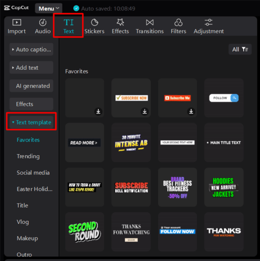
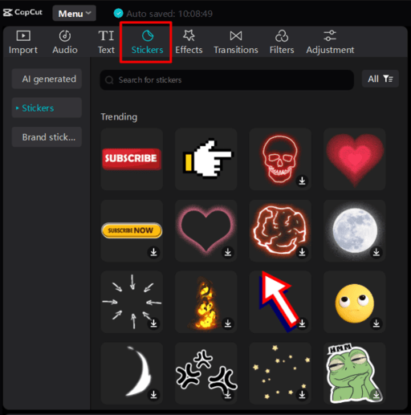

# Learn CAPCUT

Connect with me: [Youtube](https://www.youtube.com/yasirbhutta) \| [LinkedIn](https://www.linkedin.com/in/yasirbhutta/) \| [WhatsApp Channel](https://whatsapp.com/channel/0029VaC3BC160eBZZSs3CW0c) \| [Web](https://yasirbhutta.github.io/) \| [Facebook](https://www.facebook.com/yasirbhutta786) \| [Twitter](https://twitter.com/yasirbhutta)

- [Download PDF](#)  
- To access the updated Class Notes of CapCut, please click on the following link:
[index.html](../yasirbhutta.github.io/index.md)

[CapCut Slides](https://docs.google.com/presentation/d/16RD9W0v63801hLUyVx0jZZJwusgCxpZLqV9IpZb-YdI/edit?usp=sharing)

## CapCut Editing Mastery: From Beginner to Pro!

This course will transform you from a CapCut newbie to a confident video editor! We'll explore all the key features to create engaging and polished content for social media or any project.

**Module 1: CapCut Basics & Interface**

- **Introduction:** Dive into the world of CapCut and its potential.
- **Navigating the Interface:**  Become familiar with the workspace and tools.
- **Importing & Project Setup:** Learn to import your clips and set up your editing project.

**Module 2: Editing Fundamentals**

* **Trimming & Splitting:** Master precise cutting for focused storytelling.
* **Merging & Arranging Clips:**  Learn to combine clips seamlessly and structure your video.
* **Adding Text & Stickers:** Enhance your videos with titles, captions, and fun graphics.

**Module 3: Effects & Transitions**

* **Level Up with Transitions:** Apply smooth transitions for a polished look.
* **Eye-catching Effects:** Discover various effects to add personality and style.

**Module 4: Advanced CapCut Techniques**

* **Keyframe Animation:** Breathe life into your edits with dynamic animations.
* **Slow Motion & Speed Control:** Create dramatic slow-motion effects or speed things up.
* **Green Screen Editing:** Unleash your creativity with chroma key (green screen) editing.
* **Video Stabilization:** Fix shaky footage for a professional touch.

**Module 5: Audio & Music**

* **Adding Background Music:** Set the mood with royalty-free music or your own tunes.
* **Sound Effects & Voiceovers:**  Incorporate sound effects and voiceovers for a richer experience.

**Module 6: Export & Sharing**

- **Exporting Your Masterpiece:** Choose the perfect video format and resolution for your needs.
- **Sharing on Social Media:** Learn to export and share your creations on popular platforms.

**Module 7: Pro Tips & Tricks**

- **Trending Templates:** Leverage pre-made templates to create trendy videos quickly.
- **Color Correction:** Enhance the visual appeal of your videos with color adjustments.
- **CapCut Hacks & Shortcuts:** Discover hidden tips and shortcuts for efficient editing.

**Project-Based Learning:**

Throughout the course, you'll complete engaging projects that reinforce the learned skills. You'll build a portfolio of CapCut edits to showcase your newfound video editing expertise!

**By the end of this course, you'll be able to:**

* Confidently navigate the CapCut interface.
* Edit videos with precision using trimming, splitting, and merging techniques.
* Enhance your videos with text, stickers, transitions, and effects.
* Utilize advanced features like keyframe animation, slow motion, green screen editing, and stabilization.
* Add captivating audio elements like music and sound effects.
* Export and share your polished videos on social media or any platform.
* Explore creative possibilities with trending templates and color correction tools.

**Module 1: CapCut Basics & Interface**

## What is CapCut

CapCut is a free, all-in-one video editing tool available for mobile devices (Android and iOS) and computers (Windows and Mac) [https://www.capcut.com/](https://www.capcut.com/). It allows you to create and edit videos with a variety of features, making it popular for social media content.

Here are some reasons why people use CapCut:

- **Easy to use:**  CapCut is known for its user-friendly interface, making it a good option for beginners or those who don't want to deal with complex editing software [How to use CapCut Video Editing](https://m.youtube.com/watch?v=-BICb3IbEp0).

- **Rich features:** Despite being easy to use, CapCut offers a surprising amount of functionality. You can perform basic editing tasks like trimming, splitting, and merging videos, as well as add text, stickers, transitions, and effects

- **Advanced options:** CapCut also boasts some more advanced features, including keyframe animation, slow motion effects, chroma key (green screen) editing, and video stabilization  

- **Free to use:**  CapCut is completely free to use, with no in-app purchases required to access its features.

- **Trending features:** CapCut stays up-to-date with current trends, offering templates, effects, and music that are popular on social media platforms like TikTok and Instagram  

## Creating Videos with CapCut Templates: A Step-by-Step Guide

CapCut templates offer a fantastic way to jumpstart your video editing journey or create trendy content quickly. Here's how to use them:

**1. Open CapCut and Access Templates:**

* Launch the CapCut app on your mobile device.
* On the main screen, locate the "**Templates**" icon at the bottom (looks like a square with a folded corner).

**2. Find the Perfect Template:**

* Browse through the vast library of templates. You can explore by category or use the search bar to find something specific.
* Pay attention to the video length and the number of media slots each template offers.

**3. Apply the Template:**

* Once you find a template you like, simply tap on "**Use Template**" to begin editing.

**4. Replace Placeholder Media:**

* Each template will have designated sections (photos or videos) marked for replacement.
* Tap on a placeholder to select your own photos or videos from your device's storage.

**5. Export and Share Your Creation:**

* Once you're happy with your edits, tap the export button (arrow pointing right) at the top right corner.
* Choose your preferred video resolution and frame rate.
* You can then save the video to your device or directly share it on social media platforms.

## Interface

**Setting the Stage: The CapCut Workspace**

**1. Timeline:** 
- The timeline in CapCut is the main workspace where you arrange and edit your video project. It's essentially a visual representation of your video's structure and timing. 

**1.1. Displaying and Arranging Clips:**
  - When you import videos, photos, or audio files into your project, you drag and drop them onto the timeline. Each clip appears as a separate block.
  - By dragging and repositioning these clip blocks on the timeline, you determine the order in which they appear in your final video.

**1.2. Editing Clip Length:**
  - The length of each clip block on the timeline reflects the clip's duration.
  - You can adjust the clip's length by dragging its edges on the timeline. Dragging the right edge extends the clip, while dragging the left edge shortens it.

**1.3. Previewing and Playback:**
  - The timeline has a playhead (usually a vertical white line) that indicates the current playback position.
  - By dragging the playhead or using the playback controls, you can preview specific sections of your video project on the screen above the timeline.

**1.4. Multiple Tracks:**
  - The timeline typically has multiple tracks. This allows you to layer different elements of your video project, such as separate video clips, audio tracks, and text overlays.
  - By arranging elements on different tracks, you can control which ones appear on top of each other in the final video.

**1.5. Editing Tools:**
  - The timeline provides access to various editing tools. You can split clips, trim unwanted sections, adjust volume levels of audio tracks, and add transitions between clips.

**2. Editing Tools (Bottom):** This toolbar appears at the bottom of your screen whenever you don't have a clip selected on the timeline. It provides the main editing functions for your entire project.

**3. Preview Window (Center):** You can preview your edits in real-time as you make changes.
  - Use the play/pause button to preview your edits.

## Importing & Project Setup

**Creating a New Project:**

* Tap the "+ New project" button (usually on the main screen) to start a new project.

**Importing Your Media:**

* There are two ways to import your clips:

    1. **The Import Button:** Tap the "Import" button and browse your device's storage to select the photos and videos you want to use.
    2. **Drag & Drop (Desktop Only):** In the editing window, locate your media files in your device's file manager and drag them directly onto the CapCut editing window.

## Module 2: Editing Fundamentals

### Trimming & Splitting

Trimming and splitting in CapCut are two different ways to shorten or edit your video clips:

**Trimming:** This allows you to remove unwanted sections from the beginning or end of a clip. Imagine cutting off the "excess fat" at the edges.

**Splitting:** This cuts your clip into two separate clips at a specific point. 

**Uses for Trimming and Splitting:**

* **Removing unwanted sections:** Cut out mistakes, pauses, or irrelevant parts of your video.
* **Creating a faster-paced video:** Trim off unnecessary silence or slow moments to create a more dynamic video.
* **Creating multiple clips:** Split a long clip into smaller sections for easier editing or rearranging them in a different order.

**Trimming:**

1. **Select the clip** you want to trim in the timeline.
2. **Drag the white handles** at the beginning or end of the clip to shorten it.
    * Drag the left handle to remove the beginning.
    * Drag the right handle to remove the ending.

**Splitting (Mobile App):**

1. **Select the clip** you want to split. 
2. **Tap the "Split" icon** (scissors symbol) on the toolbar. 

Now you have two separate clips!

**How to split and remove an unwanted video (Mobile App)**

**Step 1: Import your video**

* Launch CapCut and tap the "+" button to start a new project.
* Import your video into the editing window.

**Step 2: Locate the unwanted section**

* Play the video in the preview window and identify the part you want to remove.

**Step 3: Split the clip (at the beginning of the unwanted section)**

* Tap on the video clip in the timeline to select it.
* Move the playhead to the exact point where the unwanted section starts.
* Tap the "Split" icon (scissors symbol) on the toolbar 

**Step 4: Split the clip again (at the end of the unwanted section)**

* Now you have two clips. Select the clip containing the unwanted section.
* Move the playhead to the exact point where the unwanted section ends.
* Tap "Split" again to create three separate clips.

**Step 5: Delete the unwanted section**

* Select the unwanted clip in the middle (the one you want to remove).
* Tap the **Delete** icon on the toolbar.

**Class Activity:**

1. **Import your video clip** into a new CapCut project.
2. **Trimming Time!** Identify any unnecessary sections at the beginning or end of your clip. 
    - **Task A:** Trim 3 seconds from the beginning of your clip. 
    - **Task B:** Trim any awkward pauses or silent moments at the end of your clip until the video cuts to the action.

3. **Splitting Scene!** Find a place in your clip where the action changes or a new scene begins. 
    - **Task A:** Split the clip at this point to create two separate clips.
    - **Task B:** Combine trimming and splitting to create a completely different narrative from your original clip.
    - **Task C:** Reverse Reel: Split your clip into small sections and then rearrange them in reverse order to create a unique rewind effect.

**Class Activity 2:**
   - **Edit Your Video:** Import your footage into the video editing software. Trim the clips to the best moments and arrange them in a way that tells your story. Add transitions, effects, and titles and subtitles.
   - **Audio:** Record audio for the clip
   - **Finalize:** Watch your video and make any final adjustments. Keep the total runtime at or below 30 second.
   - **Share:** Present your video to the class and upload in Teams. Discuss what story you were trying to tell and any challenges you faced.

   - **Videos for Editing**
   1. [School bag - pexels.com](https://www.pexels.com/video/children-walking-on-a-paved-pathway-with-their-backpacks-3191109/)
   2. [Smart Phone - pexels.com](https://www.pexels.com/video/smartphone-mobile-phone-mobile-cell-phone-4201543/)
   3. [Markup - pexels.com](https://www.pexels.com/video/woman-with-eyeshadow-holding-makeup-product-7291977/)
   4. [Vegetables - pexels.com](https://www.pexels.com/video/old-woman-buying-variety-of-vegetables-2016731/)
   5. [Video: Glass of Water - pexels.com](https://www.pexels.com/video/pouring-a-glass-of-water-2311965/)

### Merging & Arranging Clips  
- Learn to combine clips seamlessly and structure your video.

### Adding Text & Stickers
- Enhance your videos with titles, captions, and fun graphics.

**Add Text**

**Stickers**

- Stickers in video editing software are graphic elements you can add to your videos to enhance their visual appeal and convey information in a fun or informative way. They function like digital stickers you might use on photos but with the added benefit of animation in some cases.

Here's a breakdown of what stickers offer in video editing:

- **Visual Interest:** Stickers can add a playful or decorative touch to your video, grabbing attention and making it more visually engaging.
- **Highlight Information:** You can use stickers to point out key elements in your video, add emphasis to specific parts, or illustrate concepts in a creative way.
- **Brand Identity:** Stickers can incorporate your brand logo or mascot, subtly reinforcing your brand identity throughout the video.
- **Emotional Impact:** Stickers can be used to convey emotions or humor, depending on the design and how you use them in your video.

There are two main types of stickers you'll typically find in video editing software:

1.  **Static Stickers:** These are simple graphic images that don't move. They come in a wide variety of designs, from emojis and smileys to thematic stickers related to holidays, hobbies, or specific topics.

2.  **Animated Stickers:** These stickers incorporate animation, adding movement and bringing your visuals to life. This can be anything from simple animations like a bouncing emoji to more complex animations that interact with your video content.

**Text to Speech:**

- Text-to-speech (TTS) in video editing software allows you to convert written text into a voiceover that you can add to your video. This is a helpful feature for various scenarios:

**Creating a Voiceover:** If you don't want to record your own voiceover narration, TTS can generate a voice to read your script.
**Multiple Languages:** You can create videos with voiceovers in different languages using TTS options with various language support.
**Adding Emphasis or Narration:** TTS can be used for specific parts of your video, like adding narration to text overlays or highlighting key points.

**Auto Captions:**

- Autocaption in video editing is a feature that automatically generates captions (or subtitles) for your videos based on the audio content. This is a fantastic tool for several reasons:

**Accessibility:** It makes your videos more accessible to viewers who are deaf or hard of hearing, allowing them to follow along with the dialogue.
**Non-English Speakers:** Captions can also be helpful for viewers who speak a different language from the one spoken in the video.
**Watching Without Sound:** Captions are useful for people watching your video in situations where they can't turn on the sound, like on public transportation or in a library.

[Download audio to practice Auto Captions](docs/audio/audio%20for%20autocaption.mp3)

**How to Apply Animations on Captions:**

**Class Activity:**

- **Task A:**
  1. Generate Caption from Above audio.
  2. Apply Animations on All Captions **Border pop-up I**. 

**See also:**

- [Online Generative Voice AI tool](https://elevenlabs.io/)

**Text template**
**Auto lyrics**
**Draw**
**Basic:**

**Aspect ratio:**

Aspect ratio is the proportional relationship between the width and height of a rectangle. It's expressed as a colon-separated pair of numbers like width:height (e.g., 16:9, 4:3).
Common aspect ratios are used in various fields such as photography, videography, and graphic design.  For instance, a 16:9 aspect ratio is ideal for widescreen TVs and monitors, while a 4:3 ratio is suitable for standard-definition TVs and presentations.

Capcut allows you to choose from various aspect ratios to suit your video editing needs. The app supports popular ratios like 16:9 (widescreen), 9:16 (ideal for TikTok and Instagram stories), 4:3 (standard definition TV), 1:1 (square format for social media posts), and more.

**Speed:**
**Volume:**
**video Quality:**

## **Module 3: Effects & Transitions**

### Effects

1. **Video effects**

- Video effects refer to visual enhancements or alterations applied to video footage during the editing process. These effects can transform the look and feel of a video, adding creativity, mood, and impact.

2. **Body effects**

- Body effects refer to visual enhancements or animations applied to the human body within a video. These effects can add creativity, style, and impact to your clips. 

**Videos for the practice of Effects:**

- [Video: Man Stand - pexels.com](https://www.pexels.com/search/videos/man%20stand/)

### **Level Up with Transitions:** 
- Apply smooth transitions for a polished look.

###**Eye-catching Effects:** Discover various effects to add personality and style.

**Animations:**

- CapCut provides a library of pre-built animations you can apply to your text, stickers, and other elements. These animations can add things like fly-in effects, bounces, zooms, and more.

Learn more: [Animations](https://www.capcut.com/create/animation-maker)

**How can I create animated videos?**

CapCut is a video editor that can be used to create animated videos. Here are three steps to create an animated video using CapCut:
1. Choose your animation style: CapCut offers different animation styles to choose from, such as motion graphics, 2D animation, and more.
2. Create your animation: Use CapCut's animation tools to create your desired animation. You can add text, shapes, and images to create a visually appealing animation.
3. Export and share: Once you've finished creating your animated video, export it in the desired format and share it on your preferred platform, such as YouTube or Instagram.

**Transform:**

**Auto reframe:**

Auto reframe in CapCut is a feature that helps you adjust your video's aspect ratio to fit different social media platforms or project requirements. It essentially crops and resizes your video automatically, keeping the important content in focus.

Here's a breakdown of what auto reframe does:

**Saves Time:** It automates the resizing process, eliminating the need for manual cropping and zooming, which can be tedious.
**Adapts for Different Platforms:** Social media platforms like Instagram, TikTok, and YouTube have different aspect ratio requirements. Auto reframe helps you easily reformat your video for each platform without losing the core content.
**Focuses on the Subject:** CapCut's auto reframe (especially in the Pro version for PC) often uses artificial intelligence to detect the main subject in your video (people, objects) and prioritizes keeping that subject in the frame during resizing.

**Filters**

Filters in CapCut are essentially preset color adjustments that you can apply to your videos to completely transform their look and feel. They offer a quick and easy way to achieve specific visual styles or moods in your editing.

Here's a breakdown of what filters do in CapCut:

- **Change Color Style:** Filters can dramatically alter the color palette of your video. This can involve making it warmer, cooler, more vibrant, or even black and white.
- **Set the Mood:** Different filters can evoke various moods or atmospheres. For instance, a vintage filter might create a nostalgic feel, while a neon filter might lend an energetic vibe.
- **Theme Enhancement:** Filters can help you achieve a particular theme for your video. Maybe you're going for a cinematic look or a dreamy aesthetic - filters can provide a starting point for that.

**Benefits of using filters in CapCut:**

- **Simple and Efficient:** Applying filters is a quick and effortless way to enhance your videos without needing advanced color grading techniques.
- **Diverse Range:** CapCut offers a wide variety of filters, from subtle adjustments to dramatic effects, allowing you to explore different creative directions.
- **Customization:** While filters provide presets, you often have the option to fine-tune the intensity of the filter to achieve the exact look you desire.
  
**Camera tracking:**

CapCut's camera tracking isn't quite like physically moving a camera in the real world. Instead, it's a powerful **motion tracking** feature that utilizes artificial intelligence (AI). Here's how it works:

- **Tracks Objects:** You select a specific object (person, animal, item) in your video footage. 
- **AI Analyzes Movement:** CapCut's AI then tracks the movement of that chosen object throughout the video. 
- **Synchronized Effects:** This allows you to effortlessly add text, stickers, overlays, or even other video clips that will stay locked onto the tracked object. They'll move and adjust their position to seamlessly follow the object as it moves in your footage.

**Benefits of Camera Tracking in CapCut:**

- **Dynamic and Engaging Videos:** By having elements move in sync with objects, you can create a more dynamic and visually interesting video compared to static overlays.
- **Simplified Editing:**  Motion tracking saves time and effort.  Instead of manually animating elements to follow the object, CapCut automates it.
- **Creative Possibilities:**  This feature opens doors to creative applications. Imagine text bubbles appearing above someone's head as they talk, or a product logo hovering next to a highlighted item.
  
**Remove BG:**

CapCut's "Remove Background" feature allows you to remove the background from your videos or images, essentially making your subject transparent. This can be useful for various creative editing purposes:

- **Placing your subject on a new background:** You can replace the original background with a solid color, another video clip, or an image to create a completely new scene for your subject.
- **Creating overlays:** By removing the background, you can isolate your subject and use it as an overlay on top of another video. This is useful for things like picture-in-picture effects or creating composite scenes.
- **Green screen effect (limited):** By removing the background, you can achieve a similar effect if you filmed your subject in front of a green screen. You can then replace the green background with any other desired background image or video.

**Retouch:**

In CapCut, the retouch feature allows you to specifically enhance the appearance of faces in your videos. It essentially offers a set of beauty adjustments to smoothen skin, brighten features, and refine facial contours. 

**What retouch does in CapCut:**

- **Smooth Skin:** This reduces the appearance of wrinkles, blemishes, and imperfections, giving the skin a smoother and more even look. You can adjust the intensity of the smoothing effect to achieve a natural or more airbrushed appearance.
- **Skin Tone Adjustment:**  You can subtly change the overall skin tone of the face in the video. This might involve making it brighter, cooler, or warmer depending on your preference.
- **Facial Feature Refinement:**  CapCut offers options to adjust specific facial features like eyes (making them appear bigger) or slimming the face. It's important to use these adjustments sparingly to maintain a natural look.

**Benefits of Using Retouch in CapCut:**

- **Quick Enhancements:** It's a convenient way to improve the overall look of faces in your videos, particularly for minor imperfections or uneven skin tones.
- **Non-destructive Editing:**  CapCut's retouch adjustments are non-destructive, meaning the original video footage remains untouched. You can always revert the changes if needed.
- **Easy to Use:**  The retouch interface is user-friendly with sliders and options clearly labeled. It's a good option for beginners who want to add a touch of polish to their videos.

**Module 4: Advanced CapCut Techniques**

### **Keyframe Animations:** 

Keyframing is a feature that allows you to create motion graphics and smooth animation. To create a motion sequence, you need to define your object's starting and ending points. These markers are referred to as the keyframes. Use CapCut to employ video keyframes with our easy-to-use user interface. Besides keyframe effects, you can add speed curve to smooth your video clips. Learn more: [Keyframe Animations - capcut.com](https://www.capcut.com/tools/keyframe-animation)

Here are some examples of how keyframes can be used in CapCut:

 - Zoom in on a clip: You can use keyframes to create a zooming effect, where you gradually enlarge a specific part of your clip. This can be used to draw attention to a particular detail or create a sense of focus.

 - Rotate text: Keyframes can be used to rotate text elements in your CapCut project. This can be a fun way to add dynamism to your text overlays or create a more playful l[ook.

 - Fade in or out an image: You can use keyframes to control the opacity of an image overlay in your CapCut project. This allows you to fade an image in or out smoothly, creating a more polished look.

 - Create a bouncing effect: Keyframes can be used to animate the position of an element in your CapCut project, allowing you to create bouncing or moving elements. This can be a great way to add a touch of whimsy to your video.

 - Animate color changes: Keyframes can also be used to animate the color of elements in your CapCut project. This can be used to create a color shift effect or to match the colors of your video to the mood or theme you're going for.

**How to add keyframes in CapCut?**

**Step 1: Start a new project**
Access CapCut's well-rounded editor via a web browser. Click 'Create new video' and select the appropriate ratio for your project. Upload relevant media to the cloud or start with stock videos and add them to the multitrack editor. 

**Step 2: Add keyframes to video**
Select a video clip on the multitrack editor and go to the 'Basic' tab in the upper-right corner. Click the keyframe icon to add it to the clips as you want, and then adjust the parameters for perfect animation. Want to make your video stand out? Make the best of other robust editing tools. For instance, apply a speed curve to make your action movie gripping and thrilling.

**Step 3: Export and share**
After adding the final touch-ups to the video, download or share it with the audience with just one click. Be it for online presentations, team reviews, or social media promotion, CapCut has you covered.

**Videos for the the practice of keyframes:**

1. [Video of mother carring her daughter - pexels.com](https://www.pexels.com/video/video-of-mother-carrying-her-daughter-4812074/)
2. [Rabbits in the bed - pexels.com](https://www.pexels.com/video/rabbits-in-the-bed-6846016/)
3. [Video of a building interior - pexels.com](https://www.pexels.com/video/video-of-a-building-interior-6587490/)

## Class Activity: Creating a Mini-Documentary with CapCut

This activity lets students create a short documentary using CapCut, showcasing their creativity and storytelling skills.

**Materials:**

* Smartphone with CapCut installed
* Photos (10) related to the documentary topic (e.g., historical event, scientific process etc)

**Instructions:**

1. **Import Photos and Add Transitions:**
    - Open CapCut and tap "New Project."
    - Import all 10 photos into the project.
    - Tap on a photo and select "Transitions." Choose an appealing transition effect (e.g., Dissolve, Zoom) to connect the photos smoothly.

2. **Zoom in with Keyframes:**
    - Select a group photo where you want to zoom in on a specific person.
    - **How to use keyframes in Mobil App:**
      - Tap the photo and choose "Edit."
      - Drag the white line on the timeline to the point where you want the zoom to start. 
      - Tap the "Keyframes" icon (diamond)
      - Drag the white line to the end of the clip and Tap the "Keyframes" icon (diamond)
      - Pinch your fingers on the preview window to zoom in on the desired person to achieve the desired effect

3. **Add Subtitles:**
    - Tap on a photo and select "Text." 
    - Choose a subtitle style and type a short description or key point related to the photo.
    -  Adjust the position and duration of the subtitle as needed. Repeat for all photos.
    -  
4. **Record Voiceover:**
    - Tap the Audio and select "Record" 
    - Record your voiceover narration, following your script and keeping the pace consistent with the photos and transitions.

5. **Finalize and Export:**
    - Add background music (optional) using the "Audio" button. 
    - Preview your mini-documentary and make any adjustments.
    - Export the finished video by tapping the arrow icon and choosing the desired resolution.

## Class Activity: CapCut Feature Tutorial 

This activity is designed to help you learn and showcase a cool CapCut feature by creating a short tutorial video. 

**Materials:**

* Smartphones with CapCut App installed
* Short video clips

**Steps:**

1. **Pick a Feature:** 
    - Adding Text & Titles
    - Using Text-to-Speech
    - Applying Transitions & Effects 
    - Speed Adjustments (Slow-Mo & Fast-Mo)
    - Keyframe Editing
    - Adding Stickers & Overlays
    - Any other feature
2. **Teams:** Form two student teams. Each team will create a tutorial video focusing on a single chosen feature.
3. **Plan Your Tutorial:**  
    * **Script:** Each team writes a short script outlining the steps to use their chosen feature. Consider incorporating a mix of subtitles and text-to-speech.
4. **Filming & Editing:**  
    - **Filming:** Students can film short video clips showcasing the chosen feature in action. 
    - **Editing in CapCut:** Use CapCut to edit your footage.
      -  **Subtitles:** Use clear and concise subtitles to explain each step. 
      -  **Text-to-Speech:** Add Text-to-Speech narration for further explanation.
      -  **Keyframes:** Utilize keyframes to highlight specific moments or adjustments.  
      -  **Title:** Don't forget to add a catchy title using the video title feature!
      -  **Stickers** Enhance your video with `Emphasis` stickers.
  
[Sample Video](https://youtu.be/b2XNfD3xEwY?si=oCU2pfuTjcenzwuy)

1. **Class Presentations:** Each team presents their tutorial video to the class. Encourage classmates to ask questions and share their own CapCut tips.

### **Slow Motion & Speed Control:** Create dramatic slow-motion effects or speed things up.

### **Video Stabilization:** Fix shaky footage for a professional touch.

### Overlays

In CapCut, overlays are essentially extra layers of visuals that you can add on top of your main video clip. These overlays can be anything from text and stickers to images, animations, or even other video clips.

**Text behind object:**

Achieving a "text behind object" effect in CapCut with overlays involves a two-step process:

1. **Adding the Text:**

  * Start by importing your video clip into CapCut.
  * Tap on the "Text" option and write your desired text.
  * Customize the text using the available options for font, size, color, and animation (if desired).
  * Position the text where you want it to appear behind the object in the video.

2. **Creating the Overlay with Background Removal:**

  There are two main approaches for this step:

    **a) Overlay with a Duplicate Video (Works best for static objects):**
    **b) Overlay with an Image (More flexible for various objects):**

**Video in Text:***

**Sample videos for practice overlays:**

- [mon and daughter walking on dirt road - pexels.com](https://www.pexels.com/video/mom-and-daughter-walking-on-dirt-road-4812188/)
- [Video: Flowing water - pexels.com](https://www.pexels.com/video/flowing-water-1291114/)
- [Video: Sunset view at the sea - pexels.com](https://www.pexels.com/video/sunset-view-at-the-sea-8346425/)

**See also:**

- [3 Ways To Add Text Behind OBJECTS in CapCut 2024 (NOT Only Humans)](https://www.youtube.com/watch?v=rk2JciT0GS0)
- [Advanced CapCut Tutorial: How To Make Pro Level Edits](https://www.youtube.com/watch?v=TnnQRfQafVA)
- [How to Overlay a Video on a Video with CapCut - capcut.com](https://www.capcut.com/resource/overlay-video-on-video)

### **Green Screen Editing:** Unleash your creativity with chroma key (green screen) editing.

**Sample videos for practice Green Screen:**

1. [A beautiful beach - pexels.com](https://www.pexels.com/video/a-beautiful-beach-with-turquoise-water-1739010/)
2. [Video: Cabs passing through the streets - pexels.com](https://www.pexels.com/video/cabs-passing-through-the-streets-of-new-york-city-5834623/)

**See also

- [How to Remove Green Screen on Capcut PC](https://www.youtube.com/watch?v=zDsEoEKDrrA)
- [Video: Green Screen WITHOUT a Green Screen on Mobile! CapCut Background Removal](https://www.youtube.com/watch?v=17QZwUN1o7s)
- [How to Do a Green Screen in CapCut | Chroma Key](https://www.youtube.com/watch?v=KpHyqKoNOjs)

### Tracking

**videos to practice tracking:**

- [Video: A man running happily in a sand - pexels.com](https://www.pexels.com/video/a-man-running-happily-in-a-sand-hill-of-the-dessert-3015482/)

## **Module 5: Audio & Music**

### **Adding Background Music:** Set the mood with royalty-free music or your own tunes.

**Sounds:**
**Extract Audio:**

The audio extract feature in CapCut is a handy tool that allows you to isolate and save the audio portion from a video clip within your editing project. This extracted audio can then be used for various purposes:

* **Separate Audio Editing:**  Extracting the audio lets you edit it independently from the video. You can trim unwanted parts, adjust volume levels, add effects, or even create a standalone audio file. 
* **Replacing Original Audio:** Perhaps you don't like the original audio in your video clip. You can extract it, remove it from the video, and then replace it with a different audio track like music, sound effects, or your own narration.
* **Creating Audio Overlays:**  If you have a video with existing audio but want to add another audio layer on top (like commentary), extracting audio from another clip can provide that additional audio track. 

Here's how to use the audio extract feature in CapCut:

1. **Import your video clip:** Add the video containing the audio you want to extract to your CapCut project timeline.
2. **Locate the video clip:**  On the timeline, tap on the video clip to select it.
3. **Access the audio extraction options:** There are two main ways to access the extract audio feature depending on your device:
    - **Mobile app:** Tap on the audio track (the waveform) below the video clip. You should see an "Extract audio" option displayed.
    - **PC version:** Right-click on the video clip in the timeline and select "Extract audio" from the context menu.
4. **Extracted audio track:** Once you choose "Extract audio," CapCut will process the video and create a separate audio track containing the extracted audio. This new audio track will appear in your timeline alongside the original video clip.

**Here are some additional things to keep in mind about audio extract:**

* **Original video is muted:**  When you extract the audio, the original video clip itself will be muted. You can choose to keep it in the timeline for reference or delete it if you no longer need the video portion.
* **Extracted audio format:** The extracted audio will be saved in a commonly used audio format like AAC, which is compatible with most devices and editing software.
* **Multiple extractions:** You can extract audio from multiple video clips in your project following the same steps.

**Isolate voice:**

The "Isolate Voice" feature in CapCut is a relatively new and powerful tool designed to separate vocals from the background music or instrumental tracks in your videos. Here's what it does:

**Function:** It utilizes advanced audio processing algorithms to try and isolate the vocal track from the rest of the audio in your video clip. 

**Benefits:**

* **Karaoke Creation:** Isolate the voice and  the background music to create a karaoke-style version of your video song.
* **Focus on Vocals:** If your video features someone speaking with background music, isolating the voice can make their speech clearer and easier to understand.
* **Creative Remixes:** You can use the isolated vocals to create remixes or mashups by combining them with different backing music. 

**How it Works:**

1. **Import your video:** Add the video containing the audio you want to isolate to your CapCut project.
2. **Access "Isolate Voice":** Locate the audio track (the waveform) below the video clip. You should see an "Edit" or "Adjust" option. Tap on it. 
3. **Choose "Isolate Voice":** Within the audio editing options, you'll find an "Isolate Voice" function (depending on your CapCut version, the wording might be slightly different).
4. **Processing and Results:** CapCut will analyze the audio and attempt to separate the vocals. This processing might take a few seconds depending on the video length.
5. **Two Options:** Once processing is complete, CapCut will present you with two choices:
    - **Keep Vocal:** This keeps the isolated vocals and removes the background music. 
    - **Keep Background Music:** This removes the vocals and keeps the background music (essentially creating an instrumental track).

**Keep in mind:**

* **Accuracy may vary:** The effectiveness of isolating vocals depends on the complexity of the original audio. Clean recordings with clear separation between vocals and music will yield better results. 
* **Not perfect isolation:**  Background noise or instruments with similar frequencies to vocals might be partially removed alongside the vocals. 
* **Limited adjustments:**  CapCut's "Isolate Voice" is a one-click function and doesn't offer advanced controls to fine-tune the separation process. 

**Creating Karaoke Tracks: **This involves taking an existing song and producing a version specifically for karaoke use. This means removing the lead vocals while keeping the instrumental backing track. This can be done through various methods, like live instrument recording or using MIDI instruments.

**See also:**

- [Download Free Sound Effects - pixabay.com](https://pixabay.com/sound-effects/search/free%20sound/)
- [Download Sound Effects Educatinal - chosic.com](https://www.chosic.com/free-music/educational/)

### **Sound Effects & Voiceovers:**  Incorporate sound effects and voiceovers for a richer experience.

**Record:**

In CapCut, "Sound recording" refers to the functionality that allows you to record your own voice directly within the app and add it as a narration or commentary track to your vid eo project.  Here's a breakdown of how it works:

**Using Sound Recording in CapCut:**

1. **Access the Recording Feature:** 
   - **Mobile app:** Within the `audio` options, tap on the function labeled `Record` (represented by a microphone icon). 
   - **PC version:** Click on the `Voiceover` (represented by a microphone icon), usually located on the timeline or toolbar. 
2. **Positioning the Playhead:**  It's helpful to position the playhead on the timeline where you want your voiceover to start in the video. This ensures your narration is synchronized with the visuals.
3. **Tap to Record:** Tap the record button once. This might initiate a countdown before recording starts, allowing you to prepare. Tap the button again to stop recording.
4. **Preview and Editing:** Once you've recorded your voiceover, you can preview it by playing back the video. CapCut allows you to edit the recording like any other audio track in your project. You can trim unwanted parts, adjust volume levels, or even add effects like echo or reverb.

**Benefits of Sound Recording in CapCut:**

- **Convenience:**  It eliminates the need for a separate audio recording device. You can narrate and edit your video entirely within CapCut.
- **Synchronization:**  Easily aligning your narration with the visuals is simpler compared to recording externally and then importing the audio track.
- **Multiple Takes:**  If you make a mistake during recording, you can simply re-record that section within CapCut without needing to re-record the entire video.

**Tips:**

- **Device Microphone:** The recording quality will depend on the microphone on your device (phone or tablet). Using an external microphone can improve audio quality if needed.
- **Background Noise:**  Minimizing background noise in your recording environment is recommended for clearer narration.
- **Script or Outline:**  Having a script or outline for your narration can help you stay focused and ensure you cover all the desired points during recording.

**Module 6: Export & Sharing**

- **Exporting Your Masterpiece:** Choose the perfect video format and resolution for your needs.
- **Sharing on Social Media:** Learn to export and share your creations on popular platforms.

## CapCut AI Voiceover Generator

CapCut is a robust text to voice over generator that is making waves in the content creation world, offering an easy way for anyone to add a professional touch to their videos.

Step by Step guide: [Text to AI voice over generator](https://www.capcut.com/resource/ai-voiceover-generator-free)

## Key Terms

- Key frames

## True/False (Mark T for True and F for False)

**Answer Key (True/False):**

## Multiple Choice (Select the best answer)

**Basics:**
**Video:** 
**Audio:**

What is the process of separating the vocal track from a song, leaving the instrumental music behind?

- a) Audio mixing
- b) Vocal isolation
- c) Sound equalization
- d) Track duplication

Which of the following is NOT a basic editing function available in CapCut?

- a. Trimming video clips
- b. Adding video overlays
- c. Adjusting video speed (slow motion/fast motion)
- d. Live streaming directly from the app

CapCut offers a library of pre-made video templates to simplify the editing process. These templates typically include:

- a. Only basic video transitions
- b. Only pre-selected music tracks
- c. A combination of transitions, effects, text styles, and music
- d. None of the above, templates are just blank video projects

Which feature of CapCut allows you to remove the background from a video?

- A) Chromakey
- B) Background Eraser
- C) Overlay
- D) Masking

In CapCut, which tool is used to speed up or slow down video playback?

- A) Animation
- B) Speed
- C) Transition
- D) Filter

What is the primary function of the ‘Overlay’ feature in CapCut?

- A) To add text to the video
- B) To add another video or image on top of the main video
- C) To apply filters to the video
- D) To adjust the video’s brightness and contrast

Which CapCut feature is used to apply predefined movements to text or objects?

- A) Animation
- B) Keyframe
- C) Transition
- D) Motion Blur

What does the ‘Keyframe’ feature in CapCut allow you to do?

- A) Apply color grading to the video
- B) Create smooth transitions between video clips
- C) Adjust specific points for animations within the video
- D) Add subtitles to the video

How can you split a video clip into two parts in CapCut?

- A) By using the ‘Trim’ tool
- B) By using the ‘Split’ tool
- C) By using the ‘Cut’ tool
- D) By using the ‘Crop’ tool

What does the ‘Effects’ feature in CapCut primarily do?

- A) Adds text to the video
- B) Adds sound effects
- C) Adds visual effects like glitches, blurs, and lighting effects
- D) Adjusts the speed of the video

Which CapCut feature allows you to create smooth transitions between video clips?

- A) Transition
- B) Animation
- C) Filter
- D) Speed

How can you add subtitles to your video in CapCut?

- A) Using the ‘Text’ tool
- B) Using the ‘Overlay’ tool
- C) Using the ‘Effects’ tool
- D) Using the ‘Speed’ tool

Which feature in CapCut allows you to stabilize shaky footage?

- A) Speed
- B) Stabilize
- C) Transition
- D) Trim

Which CapCut feature can be used to create a green screen effect?

- A) Chromakey
- B) Background Blur
- C) Masking
- D) Overlay

How can you adjust the brightness and contrast of a video in CapCut?

- A) Using the ‘Filter’ tool
- B) Using the ‘Effects’ tool
- C) Using the ‘Adjustment’ tool
- D) Using the ‘Split’ tool

How can you add a voiceover to your video in CapCut?

- A) Using the ‘Music’ tab
- B) Using the ‘Text’ tab
- C) Using the ‘Voiceover’ tool
- D) Using the ‘Effects’ tab

Which feature in CapCut allows you to create a picture-in-picture effect?

- A) Overlay
- B) Split
- C) Trim
- D) Keyframe

What is the purpose of the ‘Masking’ feature in CapCut?

- A) To apply filters
- B) To hide or reveal parts of the video
- C) To add text
- D) To change video speed

Which tool in CapCut lets you adjust the audio levels of your video?

- A) Music
- B) Audio
- C) Volume
- D) Effects

How can you reverse a video clip in CapCut?

- A) Using the ‘Reverse’ tool
- B) Using the ‘Speed’ tool
- C) Using the ‘Split’ tool
- D) Using the ‘Overlay’ tool

Which feature in CapCut allows you to apply predefined visual effects to your video?

- A) Transition
- B) Effects
- C) Filter
- D) Overlay

Which tool would you use to create slow-motion effects in CapCut?

- A) Speed
- B) Transition
- C) Overlay
- D) Animation

What does the ‘Trim’ tool in CapCut allow you to do?

- A) Add music
- B) Cut out parts of the video from the beginning or end
- C) Add text
- D) Adjust speed

Which CapCut feature helps you to split a video into multiple parts?

- A) Trim
- B) Split
- C) Cut
- D) Crop

What is the main purpose of the ‘Text’ feature in CapCut?

- A) To change video speed
- B) To add subtitles or titles
- C) To apply color effects
- D) To trim the video

Which feature allows you to adjust the opacity of an overlay in CapCut?

- A) Filter
- B) Effects
- C) Opacity
- D) Transition

How can you apply a black and white effect to your video in CapCut?

- A) Using the ‘Trim’ tool
- B) Using the ‘Effects’ tool
- C) Using the ‘Filter’ tool
- D) Using the ‘Split’ tool

Which feature in CapCut allows you to change the aspect ratio of your video?

- A) Trim
- B) Crop
- C) Aspect Ratio
- D) Overlay

Which tool would you use to highlight a specific part of your video in CapCut?

- A) Masking
- B) Trim
- C) Overlay
- D) Effects

Which feature in CapCut allows you to remove the background from a video?

- A) Chromakey
- B) Background Remover
- C) Overlay
- D) Masking

Which feature in CapCut helps in creating a mirror effect in a video?

- A) Transition
- B) Mirror
- C) Effects
- D) Overlay

Which tool in CapCut can be used to add pre-designed stickers to a video?

- A) Text
- B) Effects
- C) Sticker
- D) Overlay

How can you apply a blur effect to a part of a video in CapCut?

- A) Use the 'Filter' tool
- B) Use the 'Effects' tool
- C) Use the 'Blur' tool
- D) Use the 'Crop' tool

Which CapCut feature allows you to combine multiple clips into one video?

- A) Trim
- B) Merge
- C) Split
- D) Overlay

Which feature in CapCut allows you to add a border around your video?

- A) Overlay
- B) Effects
- C) Border
- D) Frame

**Photos:**

## Fill in the Blanks

**Answer Key (Fill in the Blanks):**

## Exercises

## Review Questions

- Differentiate between aspect ratios (e.g., 16:9 vs. 9:16) and their impact on video composition and audience targeting.
- Explain the concept of keyframing and its applications for creating dynamic visual effects within CapCut.

**Basics:**

**Video:**

- Discuss the concept of pacing in video editing and how CapCut tools like trimming and speed adjustments can be used to control the flow of information in your video.
- - Analyze the strengths and limitations of using templates in CapCut for video creation. When might a template be a good choice, and when might it hinder creativity?

**Voice:**

- Explain the concept of vocal isolation in audio recordings.  In the context of vocal isolation, differentiate between the goals of "keeping vocals" and "removing vocals."
- Discuss the advantages and disadvantages of using CapCut's text-to-speech feature compared to recording your own voiceover.
- Explain how CapCut's text-to-speech functionality can improve the accessibility of your videos for viewers with hearing impairments.

## References and Bibliography
