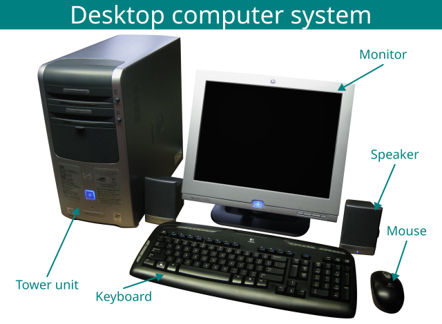
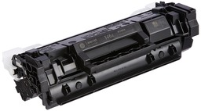
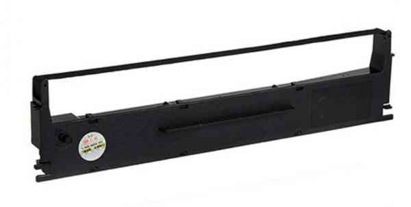
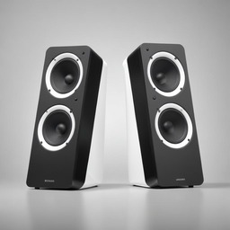
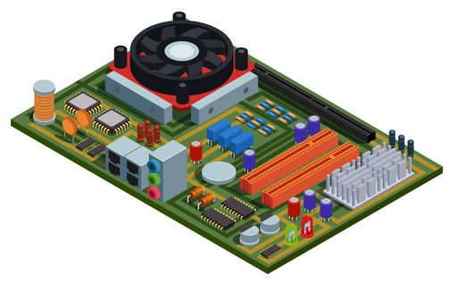
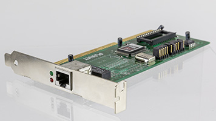
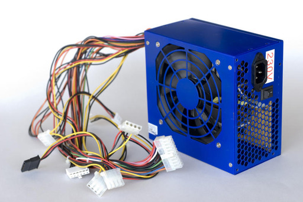
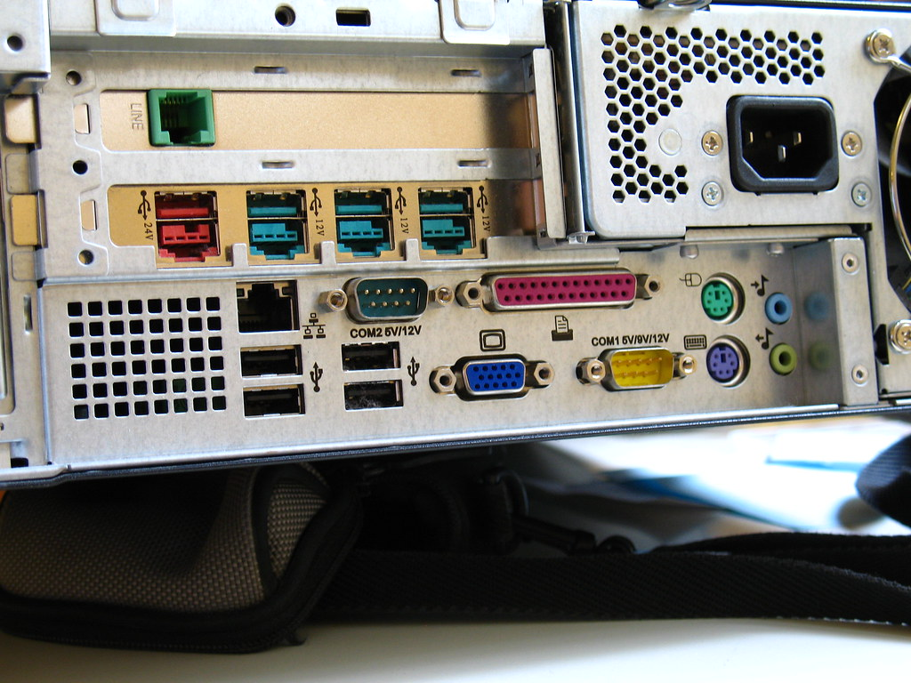

# Computer Basics: Hardware components

Connect with me: [Youtube](https://www.youtube.com/yasirbhutta) \| [LinkedIn](https://www.linkedin.com/in/yasirbhutta/) \| [WhatsApp Channel](https://whatsapp.com/channel/0029VaC3BC160eBZZSs3CW0c) \| [Web](https://yasirbhutta.github.io/) \| [Facebook](https://www.facebook.com/yasirbhutta786) \| [Twitter](https://twitter.com/yasirbhutta)

- [Download PDF](https://yasirbhutta.github.io/computer-basics/docs/hardware.pdf)
- To access the updated handouts, please click on the following link:
[https://yasirbhutta.github.io/computer-basics/docs/hardware.html](https://yasirbhutta.github.io/computer-basics/docs/hardware.html)

- [Computer Basics: Hardware components](#computer-basics-hardware-components)
  - [Computer Hardware](#computer-hardware)
    - [Input Devices](#input-devices)
      - [Keyboard](#keyboard)
      - [Mouse](#mouse)
      - [Trackball](#trackball)
      - [Touchpad](#touchpad)
      - [Touchscreen](#touchscreen)
      - [Joystick](#joystick)
      - [Imaging and Video input devices](#imaging-and-video-input-devices)
        - [Web Cams](#web-cams)
        - [Image Scanner](#image-scanner)
        - [Fingerprint Scanner](#fingerprint-scanner)
        - [Barcode reader](#barcode-reader)
      - [Audio Input Devices](#audio-input-devices)
        - [Microphone](#microphone)
    - [Output Devices](#output-devices)
      - [Hard Copy \& Soft Copy](#hard-copy--soft-copy)
      - [1. Monitor](#1-monitor)
      - [2. Printer](#2-printer)
      - [3. Speakers](#3-speakers)
      - [4. Headphone](#4-headphone)
      - [5. Data Projector](#5-data-projector)
    - [CPU or Processor](#cpu-or-processor)
      - [ALU (Arithmetic and Logic Unit)](#alu-arithmetic-and-logic-unit)
      - [Control Unit](#control-unit)
    - [Motherboard](#motherboard)
    - [Computer Peripherals](#computer-peripherals)
      - [System Unit](#system-unit)
      - [Sound Card](#sound-card)
      - [Video Graphic Adapter](#video-graphic-adapter)
      - [Network Interface Card](#network-interface-card)
      - [Power Supply](#power-supply)
      - [Uninterrupted Power Supply](#uninterrupted-power-supply)
    - [Ports](#ports)
  - [True/False (Mark T for True and F for False)](#truefalse-mark-t-for-true-and-f-for-false)
  - [Multiple Choice](#multiple-choice)
  - [Review Questions](#review-questions)
  - [References and Bibliography](#references-and-bibliography)

 

## Computer Hardware

- The physical parts of a computer are called hardware.
- The user can see and touch hardware. computer is a collection of several different parts

**Fig. 1.** Desktop computer sytem [5].

**Types of computer hardware:**

- **Internal hardware:** Internal hardware is the hardware that is located inside the computer case. It includes the following components:
  - **Motherboard:** The motherboard is the main circuit board of a computer. It connects all of the other internal components together.
  - **CPU:** The CPU is the brain of the computer. It is responsible for processing instructions and performing calculations.
  - **Memory:** Memory is used to store data and programs that the CPU is currently using. There are two main types of memory: random access memory (RAM) and read-only memory (ROM).
  - **Storage devices:** Storage devices are used to store data permanently. Common storage devices include hard disk drives (HDDs), solid-state drives (SSDs), and optical drives (such as CD-ROM and DVD drives).
  - Expansion cards: Expansion cards are used to add new features to a computer, such as a graphics card, sound card, or network card.
- **External hardware:** External hardware is the hardware that is connected to the computer but is located outside of the computer case. It includes the following devices:
  - **Input devices:** Input devices are used to enter data into the computer. Common input devices include keyboards, mice, trackpads, touchscreens, and scanners.
  - **Output devices:** Output devices are used to display or print data from the computer. Common output devices include monitors, printers, and speakers.
  - **Networking hardware:** Networking hardware is used to connect a computer to a network. Common networking devices include routers, switches, and modems.
  
Other types of computer hardware include:

- Power supply unit (PSU): The PSU provides power to all of the other components in the computer.
- Cooling system: The cooling system keeps the computer from overheating.
- Case/System Unit: The case houses all of the internal components of the computer and protects them from damage.

**See also:**

- [Video: Computer Basics- Inside a Computer](https://youtu.be/HB4I2CgkcCo?si=rexzU0om0nweOy0r)
- [Video: What are internal components of CPU? Animated E learning Video](https://youtu.be/s_Jv2k27A9U?si=9Z5QPUnhgAsF3tsb)

<ins class="adsbygoogle"
     style="display:block; text-align:center;"
     data-ad-layout="in-article"
     data-ad-format="fluid"
     data-ad-client="ca-pub-1602443888929206"
     data-ad-slot="6296238623"></ins>

### Input Devices

- A hardware component that is used to enter data and instruction into computer is called input device.

- Keyboards
- Pointing Devices
  - Mouse
  - Trackball
  - Touchpad
  - Touchscreen
  - Joystick
- Imaging and Video input devices
  - Webcam
  - Image scanner
  - Fingerprint scanner
  - Barcode Reader
- Audio input devices
  - Microphone

#### Keyboard

- keyboard is used to type text and numbers into a word processor, text editor or other program[3]. It contains alphabetic, numeric and other keys for entering different type of data.

#### Mouse

- Mouse is a pointing device.
- It controls the pointer on the screen.
- Pointer on the screen is used to apply different commands.
- Mouse mostly have two buttons.

#### Trackball

- A trackball is a pointing device consisting of a ball to move the cursor on the screen.

Image source: [wikipedia.org](https://en.wikipedia.org/wiki/File:Touch_mouse.jpg)

#### Touchpad

- A touchpad or trackpad is a flat surface.
- The movement of the finger moves the cursor on the screen.
- A touch pad also has one or more buttons. These button work like mouse buttons.
- Most used in laptop/notebooks.

#### Touchscreen

- Touch screen is video display screen that receives input from the touch of finger.

#### Joystick

- A joystick consists of a base and a stick.
- The most common use of a joystick is for playing computer games.
  
#### Imaging and Video input devices

##### Web Cams

- A webcam is a video capture device connected to a computer.
- It is used for video conferencing, video Calling, recording of video files or even still images.

##### Image Scanner

- In computing, a scanner is a device that optically scans images, printed text, handwriting, or an object, and converts it to a digital image. [6]

How it works:

- **Light It Up:** The scanner shines a light onto the document you placed on it.
- **Capturing the Reflection:** A sensor captures the reflected light, which creates information about the colors and brightness of the image.
- **Building the Digital Image:** This information is converted into a digital format, like a JPG or PDF file.

##### Fingerprint Scanner

- Fingerprint scanner is used to scan the fingerprint of human.
- Fingerprints are one of many forms of biometrics used to identify an individual and verify their identity.

##### Barcode reader

A barcode reader (or barcode scanner) is an electronic device for reading barcodes printed on various surfaces.

How it works:

- **Reading the Stripes:** It uses a light source and sensor to scan the barcode.
- **Decoding the Message:** The scanner translates the pattern of bars and spaces into electrical signals.
- **Understanding the Code:** A decoder chip then figures out the data hidden in the barcode.
- **Sending the Information:** Finally, it sends this information, like a product code, to a computer.

#### Audio Input Devices

##### Microphone

- A microphone is a piece of computer hardware that converts sound waves into electrical signals. These electrical signals can then be used by the computer to record sound, or to use voice recognition software.

Microphones are essential for a variety of tasks on a computer, including:

- Recording audio for podcasts, videos, or music
- Using video conferencing software to chat with friends, family, or colleagues
- Using voice recognition software to dictate text or control your computer with your voice

Most computers have a built-in microphone, but you can also purchase external microphones that offer better sound quality. 

<ins class="adsbygoogle"
     style="display:block; text-align:center;"
     data-ad-layout="in-article"
     data-ad-format="fluid"
     data-ad-client="ca-pub-1602443888929206"
     data-ad-slot="6296238623"></ins>

### Output Devices

- The hardware components that are used to receive information from the computer are called output devices.
- Output devices take information from the computer and convert it in a form that is understandable by the users.

#### Hard Copy & Soft Copy

**Hard Copy:** material printed by a computer on paper.

**Soft Copy:** technical information stored in a computer’s memory or shown on a screen rather than printed on paper.

#### 1. Monitor

A computer monitor is an essential output device for a computer. It visually displays the information processed by the computer, allowing you to see text, images, videos, and graphics.  

- **Displays Information:** Monitors translate the electronic signals from the computer's graphics card into a visual format on the screen.
- **Types of Monitors:** Modern monitors are typically flat-panel displays, using technologies like LCD (Liquid Crystal Display) with LED backlight. Older monitors used CRT (Cathode Ray Tube) technology.
- **Connection to Computer:** Monitors connect to the computer through various ports like HDMI, DisplayPort, DVI, or VGA.
- **Resolution:** Monitors come in various sizes and resolutions, which determine the sharpness and detail of the displayed image.

There are several types of computer monitors:

1.1 **LCD (liquid crystal display) monitors**

- LCD monitors are the most common type of monitor available today.
- They are thin, lightweight, and energy-efficient.
- LCD monitors use liquid crystals to create images on the screen.

1.2 **LED (light-emitting diode) monitors**

- LED monitors are a type of LCD monitor that uses light-emitting diodes (LEDs) as the backlight instead of fluorescent lamps.
- LEDs are more energy-efficient and have a longer lifespan than fluorescent lamps.
- LED monitors also tend to have `better image quality than LCD monitors`, with higher `contrast ratios` and `brighter colors`.

The contrast ratio (CR) is a property of a display system, defined as the ratio of the luminance of the brightest shade (white) to that of the darkest shade (black) that the system is capable of producing. A high contrast ratio is a desired aspect of any display. [^3]

1.3 **CRT (cathode ray tube) monitors**

- CRT monitors are the oldest type of computer monitor.
- They are bulky and heavy, and they consume a lot of power.
- CRT monitors are also known for their excellent image quality and wide viewing angles.
- CRT monitors are no longer commonly used, but they are still available for some specialized applications.

#### 2. Printer

- A printer is an output device that prints characters, symbols and graphics on paper. The Printed output is called hard copy.

**Types of the Printers:**

- **Inkjet printers:** Affordable and good for home use, offering decent print quality for documents and photos.
  - Inkjet printers use ink cartridges filled with tinted liquid ink and additives. [4]
- **Laser printers:** Laser printers use toner for fast prints at a lower cost per page, ideal for high-volume black and white printing.
  - Laser printers use powdered toner.[4]

Image source: [amazon.in](https://www.amazon.in/HP-146A-Laserjet-Toner-Cartridge/dp/B0BZPX76WG)

- **Dot-matrix printers:** Less common today, they were known for their reliability and ability to print multiple carbon copies, but with `noisier operation` and `lower print quality`.
  - Dot-matrix printers use an ink-soaked ribbon. The print head strikes the ribbon against the paper to form characters and images. This type of ink delivery is known as impact printing. [4]

Image source: [shopse.pk](https://shopse.pk/product/print-rate-printer-ribbon-lq-1000-print-rite/)

#### 3. Speakers

- A computer speaker, also sometimes called a multimedia speaker, is a type of output device for your computer. 
- Its main function is to convert electrical signals from your computer into audible sound waves that you can hear.

There are different types of computer speakers available, each catering to various needs:

- **External speakers:** These are the most common type. They come in various sizes and configurations, from simple two-speaker stereo systems to surround sound setups for an immersive audio experience.

Image source: [freepik.com](https://www.freepik.com/free-vector/realistic-3d-black-speaker-background_4471533.htm#fromView=search&page=1&position=2&uuid=3b85517e-6f61-4e9e-a512-e2a49829f4b8)

- **Built-in speakers:** Many laptops and monitors have built-in speakers for basic audio output. While convenient, they typically offer lower sound quality compared to external speakers.

#### 4. Headphone

- A headphone is designed to hear the sound on a computer system.
- Headphones is a pair of small loudspeakers.

#### 5. Data Projector

- A device that projects computer output onto a larger screen.
- Widely used in classrooms and auditoriums etc

How they work:

**Input:** Connects to your computer, laptop, smartphone, or other devices through various ports like HDMI, VGA, or even wirelessly.
**Processing:** Receives the digital data, which can be presentations, videos, images, or even your computer screen itself.
**Projection:** Uses a powerful light source and a lens system to project an enlarged image of the received data onto the screen.

**Data projectors are commonly used for:**

- **Presentations:** Businesses and educators often use them to display presentations, charts, and other visual aids for a larger audience.
- **Movies and entertainment:** They can be used for home entertainment to watch movies or play video games on a bigger screen.
- **Public displays:** In some cases, they might be used for public displays of information or advertising in spaces like airports or train stations.

### CPU or Processor

- CPU stands for `Central Processing Unit`.
- It is the brain of the computer.
- It is also called processor.
- CPU continually receives instructions to execute. CPU performs all operations according to the given instructions. It executes instructions and tells other parts of computer what to do.
  
CPU consists of two main units:

- **ALU (Arithmetic and logic Unit)**
- **CU (Control Unit)**

#### ALU (Arithmetic and Logic Unit)

- ALU is a part of CPU. Actual  execution of the instructions takes place in this part.

It Consists two units:

- **Arithmetic Unit :** Arithmetic unit of the ALU `performs basic arithmetic functions` such as additions, subtraction, multiplications and division.
- **Logic Unit :** Logic unit of the ALU `performs logical operations` like comparing two data items to find which data item is greater than ,equal to or less than the other.

#### Control Unit

- It controls all activities of computer system.
- It is also called the `supervisor` of the computer.

The CPU (Central Processing Unit) performs a variety of operations, typically classified into several types:

1. Arithmetic Operations: These include basic mathematical operations such as addition, subtraction, multiplication, and division. The Arithmetic Logic Unit (ALU) handles these tasks.
2. Logical Operations: The CPU performs logical operations like AND, OR, NOT, and XOR, used in decision-making processes.
3. Data Transfer Operations: The CPU moves data from one location to another, such as from memory to registers, registers to memory, or between different registers.
4. Control Operations: These involve decision-making instructions, such as comparing values and jumping to different instructions based on conditions (e.g., branch instructions).
5. Input/Output Operations: The CPU manages communication with external devices, reading input from devices like a keyboard or writing output to devices like a monitor or printer.

**Machine Cycles**

- Each time the CPU executes an instructions, It takes a series of steps. The complete series of steps is called machine cycle. 
- A machine cycle itself can be broken down into two smaller cycles: the instruction cycle and the execution cycle.

**1. Instruction cycle**

1. **Fetching**: The CPU retrieves an instruction from the computer's memory (RAM).
2. **Decoding**: The CPU interprets (decodes) the fetched instruction to understand what needs to be done (breaks the command into instuction set the CPU can handle)

**2. Execution cycle**

3. **Executing**: The CPU performs the operation specified by the instruction (e.g., arithmetic operations like addition, multiplication, etc.).
4. **Storing**: The CPU stores the result of the operation back into memory, registers, or sends it to an output device. For more details, see [1, p. 130].

The performance of your CPU significantly impacts how fast your computer can run programs and perform tasks. Here are some key factors that affect CPU performance:

- **Clock speed:** Measured in Gigahertz (GHz), it indicates the number of cycles the CPU can perform per second. Higher clock speeds generally mean faster performance.
- **Number of cores:** Modern CPUs typically have multiple cores, allowing them to handle multiple tasks simultaneously. More cores can improve performance for multitasking and programs that can leverage multiple cores.
- **Cache:** A small amount of high-speed memory built into the CPU that stores frequently accessed data and instructions. Faster access to this data can improve processing speed. for more details, see [Appendix A](#appendix-a-cpu-clock-speed-and-cycles)

### Motherboard

- The motherboard is `main circuit board` of a computer, usually containing the central processing unit and main system memory as well as circuitry that controls the disk drives, keyboard, monitor, and other peripheral devices.
- It is also known as a mainboard, baseboard, system board.

**Motherboard's key functions:**

- **Connectivity:** It provides sockets and slots for essential components like the CPU, RAM (memory), graphics card, storage drives (hard drive or SSD), and other peripherals.
- **Communication:** The motherboard has electrical pathways (buses) that enable all these components to transfer data and instructions between each other.
- **Control Center:** It houses the chipset, a group of specialized chips that manage communication between different parts and control functions like USB ports, audio, and network connectivity.
- **Power Delivery:** The motherboard distributes power from the power supply unit (PSU) to all the connected components.

Image by [macrovector](https://www.freepik.com/free-vector/system-plate-pc-isometric-illustration-with-semiconductor-elements-slots-microchips-capacitors-diodes-transistors_7496526.htm#query=ram%20primary%20memory&position=18&from_view=search&track=ais&uuid=fa5ec5b5-0f6c-45d6-b8ec-a91050618307) on Freepik

[Video:Motherboards Explained](https://youtu.be/b2pd3Y6aBag?si=__bg3hplHR-CdkkU)

**Buses:** Buses on a motherboard are electrical pathways that allow different components on the motherboard to communicate with each other.

<ins class="adsbygoogle"
     style="display:block; text-align:center;"
     data-ad-layout="in-article"
     data-ad-format="fluid"
     data-ad-client="ca-pub-1602443888929206"
     data-ad-slot="6296238623"></ins>

### Computer Peripherals

#### System Unit

- System unit is a box that contains different components of computer system.
- It is also called casing.

Types of system units:

- Desktop model
- Tower model

#### Sound Card

- A circuit board/Card that gives the computer the ability to accept audio input, play sound files, and produce audio output through speakers or headphones.

#### Video Graphic Adapter

- A display screen must have a video display adapter attached with the computer to display graphics.
- It is also called video graphics card.

#### Network Interface Card

- A Network Interface Card (NIC), also known as a network adapter or network interface controller, is a hardware component that allows a computer or device to connect to a network. 
- It facilitates communication between the device and the network, enabling data transfer and network connectivity.

Image source: [denny.id](https://denny.id/komponen-jaringan-komputer/)

#### Power Supply

- Power supply is used to provide electric circuit to different computer hardware components. Like Motherboard, Hard disk, CD Rom.

Image source: [freeimageslive.co.uk](https://www.freeimageslive.co.uk/free_stock_image/computeratxpsujpg)

#### Uninterrupted Power Supply

- It is also called UPS.
- UPS is used to provide continuous power supply for computers and other devices during electricity break down.
- UPS has batteries to store electricity powers.

<ins class="adsbygoogle"
     style="display:block; text-align:center;"
     data-ad-layout="in-article"
     data-ad-format="fluid"
     data-ad-client="ca-pub-1602443888929206"
     data-ad-slot="6296238623"></ins>

### Ports

- A port is an interface on a computer to which other devices are connected.
- It is used to connect peripheral devices with computer such as printers, keyboards or mouse.

Image source: [www.flickr.com](https://www.flickr.com/photos/befuddledsenses/7708696538)

**USB (Universal Serial Bus):**

- USB is a type of port that is used to connect a wide variety of devices to a computer, including external hard drives, printers, scanners, and keyboards.
- There are several types of USB ports available, including USB-A (Type A), USB-B (Type B), and USB-C (Type C) but but the most common type is the USB Type-A port. [^1] [^2]

**HDMI:**

- HDMI (High-Definition Multimedia Interface) is a type of port that is used to connect high-definition video and audio devices to a computer, such as monitors, televisions, and projectors.
- HDMI ports are capable of carrying both high-definition video and audio signals over a single cable.

**DisplayPort:**

DisplayPort is another type of port that is used to connect high-definition video and audio devices to a computer. DisplayPort ports are similar to HDMI ports, but they offer some additional features, such as the ability to support multiple monitors over a single cable.

**Ethernet:**

- Ethernet ports are used to connect computers to a network, such as a home network or a business network.
- Ethernet ports use a standard RJ-45 connector.

**VGA:**

- VGA (Video Graphics Array) ports are used to connect analog monitors to a computer.
- VGA ports are the oldest type of video port, but they are still commonly used on older computers and monitors.

**Audio ports:**

- Audio ports are used to connect speakers and microphones to a computer.

## True/False (Mark T for True and F for False)

1. A printer is an input device because it produces a physical copy of digital information.
2. USB and HDMI are examples of common types of computer ports.
3. Monitors are used to input data into the computer.
4. Buses on a motherboard have no role in data transmission between the CPU and RAM.
5. The motherboard is also known as the central processing unit (CPU).
6. The CMOS battery on a motherboard is responsible for maintaining the system time and BIOS settings, even when the computer is turned off.
7. Input devices, such as keyboards and mice, are used to send data to the computer.
8. The BIOS (Basic Input/Output System) is software that is permanently stored on a computer's motherboard.
9.  Network cards are used to connect computers to a network.
10. Power supplies are used to cool the CPU and other components of the computer.
11. Software is the physical components of a computer.
12. Ports are used to connect input and output devices to a computer.
13. The data bus is responsible for transmitting data between the CPU and RAM.
14. Buses on a motherboard are responsible for connecting components within a computer, facilitating communication.
15. A USB (Universal Serial Bus) port on a motherboard is considered a type of bus.

**Answer Key (True/False):**

1. False
2. True
3. False
4. False
5. False
6. True
7. True
8. True
9. True
10. False
11. False
12. True
13. True
14. True
15. False
    
## Multiple Choice

> Which of the following is NOT a hardware component?

1. [x] Word
2. [ ] CPU
3. [ ] Motherboard
4. [ ] RAM

> Which of the following is the brain of the computer?

1. [x] CPU
2. [ ] Motherboard
3. [ ] RAM
4. [ ] Hard drive

> What does CPU stand for?

1. [x] Central Processing Unit
2. [ ] Computer Power Unit
3. [ ] Central Power Unit
4. [ ] Central Peripheral Unit

- **Ports** are physical connectors on the computer that allow input and output devices to be connected. Examples of ports include USB, HDMI, and Ethernet ports.
- **Buses** are electrical pathways that allow data to be transferred between different components of the computer, including input and output devices. Examples of buses include the PCI Express bus and the USB bus.
- **Expansion cards** are circuit boards that can be installed in the computer to add new capabilities, such as support for new input and output devices. Examples of expansion cards include graphics cards and sound cards.

> Which of the following is a type of input device?

1. [ ] Keyboard
2. [ ] Mouse
3. [ ] Scanner
4. [x] All of the above

> Which of the following is used to store data and programs that the CPU is currently using?

1. [x] RAM
2. [ ] ROM
3. [ ] Hard drive
4. [ ] Optical drive

> Which component supplies power to all the other components in a computer?

1. [ ] CPU
2. [ ] RAM
3. [x] PSU (Power Supply Unit)
4. [ ] GPU

> Which of the following is an example of an input device?

1. [ ] Monitor
2. [x] Keyboard
3. [ ] Printer
4. [ ] Speaker

> Which port is commonly used to connect a keyboard and mouse to a computer?

1. [x] USB
2. [ ] HDMI
3. [ ] Ethernet
4. [ ] VGA

> What is the purpose of a CPU heatsink and fan?

1. [ ] To increase CPU performance
2. [ ] To cool the motherboard
3. [x] To prevent the CPU from overheating
4. [ ] To enhance graphics rendering

> Which of the following is a type of output device?

1. [ ] Monitor
2. [ ] Printer
3. [ ] Speakers
4. [x] All of the above

> What is the primary function of a motherboard in a computer?

1. [ ] Storing data
2. [ ] Processing data
3. [x] Connecting and coordinating hardware components
4. [ ] Displaying images on the screen

> What is the main purpose of a power supply unit (PSU) in a computer?

1. [ ] Cooling the components
2. [ ] Providing electricity to the CPU
3. [x] Supplying power to all computer components
4. [ ] Controlling the CPU speed

> What is the purpose of an expansion slot on a motherboard?

1. [ ] To connect to the internet
2. [ ] To increase CPU speed
3. [x] To add additional hardware components
4. [ ] To improve display quality

> Which part of a computer is responsible for initializing the hardware and booting the operating system?

1. [ ] CPU
2. [ ] RAM
3. [x] BIOS
4. [ ] GPU

> Which of the following is not an example of a common input/output port on a computer?

1. [ ] USB
2. [ ] HDMI
3. [x] WiFi
4. [ ] Ethernet

> What is the purpose of a CMOS battery on a motherboard?

1. [ ] It powers the CPU.
2. [x] It maintains the system time and BIOS settings.
3. [ ] It controls the GPU.
4. [ ] It stores application data.

> What is a "driver" in the context of computer hardware?

1. [ ] A person who operates the computer
2. [x] A piece of software that allows hardware to work with the operating system
3. [ ] A hardware component in a computer
4. [ ] A type of power supply unit

## Review Questions

**Basics:**

- What is the difference between hardware and software?
- What are the two main categories of computer hardware? Briefly describe each category.
  
**Input and Output Devices:**

- What are the different types of monitors?
- What are the different types of printers?
- What is the function of input devices? Give some examples.
- What is the function of output devices? Give some examples.
- What are the different types of input and output devices?
- Differentiate between a pointing device and a touchscreen.
- Write note on input devices and output devices and examples of four devices with usage of each type?
    
**Central Processing Unit (CPU):**

- What is the CPU and what does it do?
- Define the CPU and describe the functions of the ALU and the control unit.
- What is the cache memory of a CPU?
- What is the CPU and what is its role in a computer system?
- What are some of the things to consider when choosing a CPU?
- single core vs multi-core CPU

**Answer:**

A single-core CPU has only one processing unit, while a multi-core CPU has multiple processing units. In other words, a single-core CPU can only execute one instruction at a time, while a multi-core CPU can execute multiple instructions simultaneously. [read more...](https://www.networkworld.com/article/971425/single-core-vs-multi-core-cpus.html)

- What is the clock speed of a CPU?

**Answer:**

The clock speed of a processor refers to the number of cycles it can execute per second, essentially acting like its heartbeat. It's measured in hertz (Hz), with common units being:

**MHz (megahertz):** Millions of cycles per second. Used for older processors.
**GHz (gigahertz):** Billions of cycles per second. Standard for modern processors, ranging from around 2 GHz to 4 GHz or even higher.

- What is the difference between a 32-bit and a 64-bit CPU?

**Answer:**

Data Handling:

- 32-bit CPU: Can process 32 bits of data at a time, which equals 4 bytes. 
- 64-bit CPU: Can process 64 bits of data at a time, which equals 8 bytes. This allows them to handle much larger numbers and complex calculations more efficiently.

Memory Access:

- 32-bit CPU: Can address a maximum of 4GB of RAM (random access memory). This means they can only use up to 4GB of RAM at a time.
- 64-bit CPU: Can address a vast amount of RAM, theoretically up to 18 quintillion gigabytes. In practice, the actual limit depends on the specific CPU and operating system, but it's significantly higher than 32-bit CPUs.

**Motherboard:**

- What is the motherboard and what is its function in a computer?
- What are some of the key components connected to the motherboard?
- What is the purpose of a motherboard in a computer, and what components are typically connected to it?
- What is a motherboard? List the key components typically connected to it.
 
**Other Components:**

- What is the function of a power supply unit (PSU)?
- What is a graphics card and when might you need one?
- What are some different types of computer ports, and what devices do they connect to?
- What is a network card (NIC) and how does it function?
- What is the purpose of the CMOS battery in a computer, and what happens if it fails?
- What is a network card (NIC), and how does it facilitate network connectivity in a computer?
  
## References and Bibliography

- [1] P. Norton, Peter Norton’s Introduction to Computers. 7th Edition. Simon & Schuster Books For Young Readers, 2021.
- [2] [USB Explained: All the Different Types (and What They're Used for)](https://www.howtogeek.com/53587/usb-explained-all-the-different-types-and-what-theyre-used-for/)
- [3] [Contrast ratio](https://en.wikipedia.org/wiki/Contrast_ratio)
- [4] “Different Types of Printer Ink: The Ultimate Guide,” CDW.com. <https://www.cdw.com/content/cdw/en/articles/hardware/types-of-ink-for-printers.html>
- [5] Wikipedia Contributors, “Desktop computer,” Wikipedia, Nov. 01, 2024. <https://en.wikipedia.org/wiki/Desktop_computer#/media/File:Desktop_computer_system_diagram_(English).svg>
- [6] S. Sirois, “What is Processor Speed and Why Does It Matter?,” www.hp.com, Dec. 18, 2018. <https://www.hp.com/us-en/shop/tech-takes/what-is-processor-speed> (accessed Mar. 06, 2025).
- [7] “Clock Cycle Definition,” techterms.com. <https://techterms.com/definition/clockcycle> (accessed Mar. 06, 2025).
- [8] S. Harding, “What Is a CPU’s Clock Speed? A Basic Definition,” Tom’s Hardware, Aug. 24, 2018. <https://www.tomshardware.com/news/clock-speed-definition%2C37657.html> (accessed Mar. 06, 2025).
- [9] [What Is a USB Port? - LifeWire](https://www.lifewire.com/what-is-a-usb-port-818166)

‌
‌
‌
‌
‌
‌

- <http://en.wikipedia.org/wiki/Input_device>
- <http://en.wikipedia.org/wiki/Computer_keyboard>
- <http://en.wikipedia.org/wiki/Touchscreen>
- <http://en.wikipedia.org/wiki/Webcam>
- <http://en.wikipedia.org/wiki/Image_scanner>
- <http://www.southerncompany.com/learningpower/glossary.aspx>
- <http://en.wikipedia.org/wiki/Line_printer>

- [http://en.wikipedia.org/wiki/Pointing_device](http://en.wikipedia.org/wiki/Pointing_device)
  

  9.	A ______________ is an output device that prints characters, symbols and graphics on paper.
10.	In computing, a _____________ is a device that optically scans images, printed text, handwriting, or an object, and converts it to a digital image.

## **Appendices**

### **Appendix A: CPU Clock Speed and Cycles**

The term **GHz (Gigahertz)** in CPU specifications refers to the processor's clock speed, indicating how many cycles it can complete per second. Specifically, **1 GHz equals 1 billion cycles per second**. [6]

A **clock cycle**, or simply a "cycle," is the fundamental unit of time for a CPU's operations. During each cycle, the CPU can perform basic tasks such as fetching an instruction, accessing memory, or writing data. However, most CPU processes require multiple clock cycles to complete complex instructions. [7]

While a higher clock speed generally means the CPU can process more cycles per second, overall performance also depends on other factors, such as the number of instructions the CPU can execute per cycle (known as Instructions Per Cycle or IPC), the number of cores, and the processor's architecture. [8] 

### **Appendix B: Definitions**
This section contains the key definitions used throughout the notes...

### **Appendix C: Extended Quotations**
Here are the extended quotations referenced in the main body...