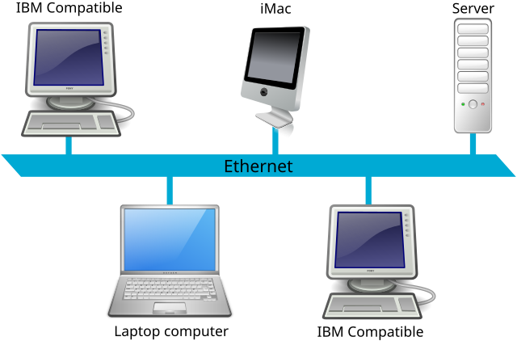
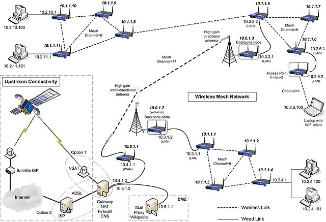

# Computer Basics: Networking Basics

Connect with me: [Youtube](https://www.youtube.com/yasirbhutta) \| [LinkedIn](https://www.linkedin.com/in/yasirbhutta/) \| [WhatsApp Channel](https://whatsapp.com/channel/0029VaC3BC160eBZZSs3CW0c) \| [Web](https://yasirbhutta.github.io/) \| [Facebook](https://www.facebook.com/yasirbhutta786) \| [Twitter](https://twitter.com/yasirbhutta)

- [Download PDF](https://yasirbhutta.github.io/computer-basics/docs/networks.pdf)
- To access the updated handouts, please click on the following link:
[https://yasirbhutta.github.io/computer-basics/docs/networks.html](https://yasirbhutta.github.io/computer-basics/docs/networks.html)

- [Computer Basics: Networking Basics](#computer-basics-networking-basics)
  - [What is a Computer Network?](#what-is-a-computer-network)
  - [Types of networks](#types-of-networks)
    - [Local Area Network (LAN)](#local-area-network-lan)
    - [Wide Area Network (WAN)](#wide-area-network-wan)
  - [Network components](#network-components)
  - [Network Switch](#network-switch)
  - [Router](#router)
  - [Basic network protocols](#basic-network-protocols)
  - [The internet: How it works and how to access it](#the-internet-how-it-works-and-how-to-access-it)
    - [Internet](#internet)
  - [Network topology](#network-topology)
    - [1. **Bus Topology**](#1-bus-topology)
    - [2. **Star Topology**](#2-star-topology)
    - [3. **Ring Topology**](#3-ring-topology)
    - [4. **Mesh Topology**](#4-mesh-topology)
    - [Conclusion](#conclusion)
  - [True/False (Mark T for True and F for False)](#truefalse-mark-t-for-true-and-f-for-false)
  - [Multiple Choice (Select the best answer)](#multiple-choice-select-the-best-answer)
  - [Exercises](#exercises)
  - [Review Questions](#review-questions)
  - [References and Bibliography](#references-and-bibliography)

##  What is a Computer Network?

- A computer network is a group of two or more devices or nodes that can communicate with each other. 
- These devices can be connected by physical or wireless connections. 

**See also:**

- [Computer Network - techtarget.com](https://www.techtarget.com/searchnetworking/definition/network)

## Types of networks

### Local Area Network (LAN) 

- A local area network (LAN) is a collection of devices connected together in one physical location, such as a building, office, or home.

Image Source: [cloudflare.com](https://www.cloudflare.com/learning/network-layer/what-is-a-lan/)

Image source: [pynetlabs.com](https://www.pynetlabs.com/what-is-lan-local-area-network/)

**See also:**

- [What Is a LAN? - cisco](https://www.cisco.com/c/en/us/products/switches/what-is-a-lan-local-area-network.html)
- [What is a LAN (local area network)? - cloudflare](https://www.cloudflare.com/learning/network-layer/what-is-a-lan/)

### Wide Area Network (WAN)

- A wide-area network (WAN) is a collection of local-area networks (LANs) or other networks that communicate with one another.
- A WAN is essentially a `network of networks`, with the `Internet` the world's largest WAN.
- These connect LANs across geographically dispersed locations, often using the internet as the backbone. Think of connecting all the branches of a bank across different cities – that's a WAN!

Image source: [cloudflare](https://www.cloudflare.com/learning/network-layer/what-is-a-wan)

**See also:**

- [What Is a WAN? Wide-Area Network - cisco.com](https://www.cisco.com/c/en/us/products/switches/what-is-a-wan-wide-area-network.html)
- [What is a wide area network (WAN)?](https://www.cloudflare.com/learning/network-layer/what-is-a-wan)
  
## Network components

## Network Switch

- A network switch forwards data packets between devices. Switches send packets directly to devices, rather than sending them to networks like a router does.
- Unlike a router, a switch only sends data to the single device it is intended for (which may be another switch, a router, or a user's computer), not to networks of multiple devices.

Image by [victor217](https://www.freepik.com/free-photo/network-switch-with-cables_902013.htm#query=network%20switches&position=0&from_view=search&track=ais&uuid=cdaf5dd0-21d6-4bab-bf91-f89e3a022611) on Freepik

**See also:**

- [What is a network switch? - cloudflare.com](https://www.cloudflare.com/learning/network-layer/what-is-a-network-switch/)
  

<ins class="adsbygoogle"
     style="display:block; text-align:center;"
     data-ad-layout="in-article"
     data-ad-format="fluid"
     data-ad-client="ca-pub-1602443888929206"
     data-ad-slot="6296238623"></ins>

## Router

- A router is a device that connects two or more IP networks or subnetworks.

It serves two primary functions: 

1. Managing traffic between these networks by forwarding data packets to their intended IP addresses
2. Allowing multiple devices to use the same Internet connection.

Image by [Freepik](https://www.freepik.com/free-psd/3d-rendering-graphic-design-element_26433059.htm#query=router&position=9&from_view=search&track=sph&uuid=c7502cab-12a8-4c75-a9a5-5393a0cf5354)

**See also:** 

- [What is a router? - https://www.cloudflare.com/](https://www.cloudflare.com/learning/network-layer/what-is-a-router/)

## Basic network protocols

- the set of rules that governs how data is transmitted across networks.

**TCP/IP:** This suite of protocols defines how data is formatted, addressed, transmitted, and received across networks. It's like the set of rules that everyone on the network follows to communicate effectively.

## The internet: How it works and how to access it

### Internet

- The Internet is a network of networks.
- The internet is a global network of interconnected computers, servers, phones, and other devices.
- The internet works by using a packet routing network that follows Internet Protocol (IP) and Transport Control Protocol (TCP). 

Image Source: [cloudinary.com](https://dev.to/jryther/how-does-the-internet-work-h65)

**Understanding the Web:**

Imagine the internet as a massive highway system, but instead of cars, it's data packets zipping back and forth. These packets carry information like emails, videos, and website content. Here's the basic flow:

- **Your Action:** You search for something online, type an email, or watch a video.
- **Data Breakdown:** Your device converts your action into digital data and breaks it into smaller packets.
- **Addressing:** Each packet gets a unique IP address, like a street address, identifying its origin and destination.
- **Routing:** Routers, acting as traffic cops, guide the packets through the network of interconnected computers and cables.
- **Reaching the Destination:** The packets arrive at the targeted server (a computer storing the information you requested).
- **Reassembly:** The server reassembles the packets back into the original data.
- **Delivery:** You receive the information on your device – website content loads, email displays, or video plays.

**Accessing the Internet:**

- **Connection:** Wi-Fi, Ethernet cable, cellular data, or satellite.
- **Device:** Smartphone, computer, tablet, smart TV, etc.
- **Internet Service Provider (ISP):** A company that grants you access to the internet for a fee.

**Ways to Connect:**

- **Wi-Fi:** Most convenient, connects wirelessly to a router.
- **Ethernet:** Faster and more reliable, uses cables for direct connection.
- **Cellular Data:** Access the internet anywhere with mobile network coverage.
- **Satellite:** Reaches remote areas but can be slower and expensive.

**See also:**

- [Internet Basics: What is the Internet? - GCFGlobal](https://edu.gcfglobal.org/en/internetbasics/what-is-the-internet/1/)

<ins class="adsbygoogle"
     style="display:block; text-align:center;"
     data-ad-layout="in-article"
     data-ad-format="fluid"
     data-ad-client="ca-pub-1602443888929206"
     data-ad-slot="6296238623"></ins>

## Network topology

Network topology refers to the arrangement of different elements (links, nodes, etc.) in a computer network. There are several types of network topologies, each with its own advantages and disadvantages. Here, we'll discuss some common network topologies:

### 1. **Bus Topology**
In a bus topology, all devices are connected to a single central cable, known as the bus or backbone. Data sent by any device travels along the bus and is received by all devices, but only the intended recipient accepts and processes the message.

**Advantages:**
- Easy to install and extend.
- Requires less cable than other topologies.

**Disadvantages:**
- If the main cable fails, the entire network goes down.
- Difficult to troubleshoot.

Image source: [wikimedia.org](https://upload.wikimedia.org/wikipedia/commons/thumb/d/db/Ethernet_LAN.svg/640px-Ethernet_LAN.svg.png)

### 2. **Star Topology**
In a star topology, all devices are connected to a central hub or switch. Each device has a dedicated point-to-point connection to the hub/switch.

**Advantages:**
- Easy to install and manage.
- Failure of one device doesn’t affect the others.
- Easy to detect and isolate faults.

**Disadvantages:**
- Requires more cable than bus topology.
- If the central hub fails, the entire network is inoperative.
- Can be expensive due to the hub/switch and cabling costs.

Image source: [wikipedia.org](https://en.wikipedia.org/wiki/Star_network#/media/File:Star_Topology.png)

### 3. **Ring Topology**
In a ring topology, each device is connected to two other devices, forming a circular network structure. Data travels in one direction (or both directions in a dual-ring topology) and passes through each device until it reaches its destination.

**Advantages:**
- Data packets travel at high speed.
- No data collisions (because of the unidirectional flow).

**Disadvantages:**
- A failure in any cable or device breaks the loop and can disable the entire network.
- Difficult to troubleshoot and reconfigure.

### 4. **Mesh Topology**
In a mesh topology, each device is connected to every other device in the network. This can be a full mesh (every device is connected to every other device) or a partial mesh (some devices are connected to all, while others are connected to only a few).

**Advantages:**
- Provides high redundancy and reliability.
- Failure of one link doesn't affect the entire network.

**Disadvantages:**
- Expensive due to the large number of cables and ports required.
- Complex installation and maintenance.

Image source: [wikimedia.org](https://upload.wikimedia.org/wikipedia/commons/thumb/8/83/Wireless_mesh_network_diagram.jpg/640px-Wireless_mesh_network_diagram.jpg)

### Conclusion

Each network topology has its own specific use cases, advantages, and drawbacks. The choice of topology depends on factors like the size and scale of the network, budget, desired performance, and ease of maintenance. Understanding the characteristics of each topology helps in designing efficient and robust networks.

## Fill in the blanks

A _________ is a device that connects two or more IP networks or subnetworks.

## True/False (Mark T for True and F for False)

1. A star topology connects each node directly to a central hub.
2. Wi-Fi is a standard for wired networking.
3. The main function of a firewall is to monitor and control incoming and outgoing network traffic.
4. HTTPS is used for secure communication over a computer network.
5. HTTP is used for secure communication over a computer network.
6. In a bus topology, all devices are connected to a single central cable.
7. A mesh topology has a central hub where all nodes are connected.
8. Ethernet is a standard for wireless networking.

**Answers:**

1. True
2. False
3. True
4. True
5. False
6. True
7. False
8. False

<ins class="adsbygoogle"
     style="display:block; text-align:center;"
     data-ad-layout="in-article"
     data-ad-format="fluid"
     data-ad-client="ca-pub-1602443888929206"
     data-ad-slot="6296238623"></ins>

## Multiple Choice (Select the best answer)

What is the primary function of a network in computing?

A. To store large amounts of data
B. To enable communication between different devices
C. To execute complex mathematical operations
D. To manage user authentication and authorization

Which of the following topologies connects each node to a central hub/switch?

A. Ring topology
B. Mesh topology
C. Star topology
D. Bus topology

Which type of network is typically used within a single building or campus?

A. WAN (Wide Area Network)
B. LAN (Local Area Network)
C. MAN (Metropolitan Area Network)
D. PAN (Personal Area Network)

Which device is used to connect different networks together?

A. Switch
B. Hub
C. Router
D. Repeater

What does the acronym "IP" stand for in networking?

A. Internet Protocol
B. Internal Program
C. Interface Packet
D. Interconnected Process

Which of the following is a wireless networking standard?

A. Ethernet
B. Token Ring
C. Wi-Fi
D. Fiber Optic

Which device regenerates and amplifies signals in a network?

A. Router
B. Hub
C. Repeater
D. Switch

What is the primary function of a firewall in a network?

A. To manage user passwords
B. To encrypt data
C. To monitor and control incoming and outgoing network traffic
D. To provide a wireless connection

What type of network spans a large geographic area, such as a city or country?

A. LAN
B. WAN
C. PAN
D. CAN

What does SSL stand for?

A. Secure Socket Layer
B. Standard Security Layer
C. Secure Shell Layer
D. Simple Secure Layer

Which type of network cable uses light to transmit data?

A. Coaxial cable
B. Twisted pair cable
C. Fiber optic cable
D. Ethernet cable

## Exercises

## Review Questions

1. What is a Computer Network?
2. What is a wide area network (WAN)?
   - **Answer:** A WAN, or wide area network, is a collection of connected LANs. It is a widespread network of local networks. A WAN can be any size, even thousands of miles wide; it is not restricted to a given area.
3. What is a LAN (local area network)?
4. Write a note on Local Area Networks (LAN) and Wide Area Networks (WAN).
5. What is a Network switch?
6. What is a router?
7. What is the difference between a LAN and a WAN?
8. Can you explain what the internet is and how it allows computers to connect and share information?
9. What is Internet?
10. Explain how the Internet works.
11. What is network topology and why is it important?
12. Describe the star topology.
13. What are the advantages and disadvantages of a bus topology?
14. What are the advantages and disadvantages of Star Topology
15. Define Star Topology and discuss its advantages and disadvantages.
16. Define Star and Bus Topologies, illustrate each with a diagram, and discuss their advantages and disadvantages in detail.
17. What are the benefits of a mesh topology?
18. What are the advantages and disadvantages of Mesh Topology
19. What is TCP/IP and why is it significant in networking
20. What are some common ways to connect to the internet?
21. What is the primary function of a firewall in a network
    - **Answer:** The primary function of a firewall is to monitor and control incoming and outgoing network traffic based on predetermined security rules.

## References and Bibliography

- [What Is a LAN? - cisco](https://www.cisco.com/c/en/us/products/switches/what-is-a-lan-local-area-network.html)
- [What is a LAN (local area network)? - cloudflare](https://www.cloudflare.com/learning/network-layer/what-is-a-lan/)
- [What Is a WAN? Wide-Area Network - cisco.com](https://www.cisco.com/c/en/us/products/switches/what-is-a-wan-wide-area-network.html)
- [What is a wide area network (WAN)?](https://www.cloudflare.com/learning/network-layer/what-is-a-wan)
- [What is a network switch? - cloudflare.com](https://www.cloudflare.com/learning/network-layer/what-is-a-network-switch/)
- [What is a router? - www.cloudflare](https://www.cloudflare.com/learning/network-layer/what-is-a-router/)
- [Internet Basics: What is the Internet? - GCFGlobal](https://edu.gcfglobal.org/en/internetbasics/what-is-the-internet/1/)