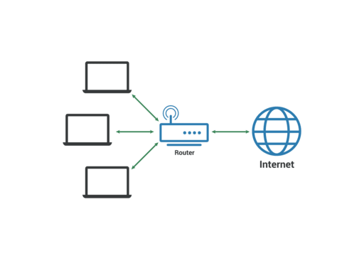
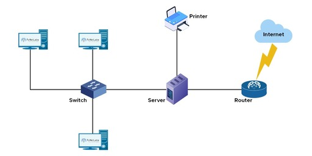
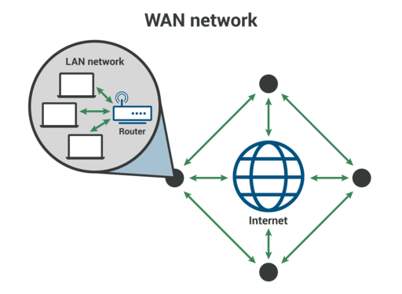
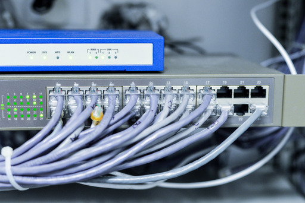
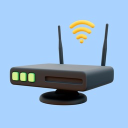
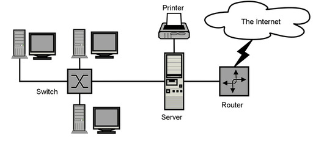

# Computer Basics: Networking Basics

Connect with me: [Youtube](https://www.youtube.com/yasirbhutta) \| [LinkedIn](https://www.linkedin.com/in/yasirbhutta/) \| [WhatsApp Channel](https://whatsapp.com/channel/0029VaC3BC160eBZZSs3CW0c) \| [Web](https://yasirbhutta.github.io/) \| [Facebook](https://www.facebook.com/yasirbhutta786) \| [Twitter](https://twitter.com/yasirbhutta)

- [Download PDF](https://yasirbhutta.github.io/computer-basics/docs/networks.pdf)
- To access the updated handouts, please click on the following link:
[https://yasirbhutta.github.io/computer-basics/docs/networks.html](https://yasirbhutta.github.io/computer-basics/docs/networks.html)

##  What is a Computer Network?

- A computer network is a group of two or more devices or nodes that can communicate with each other. 
- These devices can be connected by physical or wireless connections. 

**See also:**

- [Computer Network - techtarget.com](https://www.techtarget.com/searchnetworking/definition/network)

## Types of networks

### Local Area Network (LAN) 

- A local area network (LAN) is a collection of devices connected together in one physical location, such as a building, office, or home.

Image Source: [cloudflare.com](https://www.cloudflare.com/learning/network-layer/what-is-a-lan/)

Image source: [pynetlabs.com](https://www.pynetlabs.com/what-is-lan-local-area-network/)

**See also:**

- [What Is a LAN? - cisco](https://www.cisco.com/c/en/us/products/switches/what-is-a-lan-local-area-network.html)
- [What is a LAN (local area network)? - cloudflare](https://www.cloudflare.com/learning/network-layer/what-is-a-lan/)

### Wide Area Network (WAN)

- A wide-area network (WAN) is a collection of local-area networks (LANs) or other networks that communicate with one another.
- A WAN is essentially a `network of networks`, with the `Internet` the world's largest WAN.
- These connect LANs across geographically dispersed locations, often using the internet as the backbone. Think of connecting all the branches of a bank across different cities – that's a WAN!

Image source:[cloudflare.com](https://www.cloudflare.com/learning/network-layer/what-is-a-wan)

**See also:**

- [What Is a WAN? Wide-Area Network - cisco.com](https://www.cisco.com/c/en/us/products/switches/what-is-a-wan-wide-area-network.html)
- [What is a wide area network (WAN)?](https://www.cloudflare.com/learning/network-layer/what-is-a-wan)
  
## Network components

## Network Switch

- A network switch forwards data packets between devices. Switches send packets directly to devices, rather than sending them to networks like a router does.
- Unlike a router, a switch only sends data to the single device it is intended for (which may be another switch, a router, or a user's computer), not to networks of multiple devices.

Image by [victor217](https://www.freepik.com/free-photo/network-switch-with-cables_902013.htm#query=network%20switches&position=0&from_view=search&track=ais&uuid=cdaf5dd0-21d6-4bab-bf91-f89e3a022611) on Freepik

**See also:**

- [What is a network switch? - cloudflare.com](https://www.cloudflare.com/learning/network-layer/what-is-a-network-switch/)
  

## Router

- A router is a device that connects two or more IP networks or subnetworks.

It serves two primary functions: 

1. Managing traffic between these networks by forwarding data packets to their intended IP addresses
2. Allowing multiple devices to use the same Internet connection.

Image by [Freepik](https://www.freepik.com/free-psd/3d-rendering-graphic-design-element_26433059.htm#query=router&position=9&from_view=search&track=sph&uuid=c7502cab-12a8-4c75-a9a5-5393a0cf5354)

**See also:** 

- [What is a router? - https://www.cloudflare.com/](https://www.cloudflare.com/learning/network-layer/what-is-a-router/)

## Basic network protocols

- the set of rules that governs how data is transmitted across networks.

**TCP/IP:** This suite of protocols defines how data is formatted, addressed, transmitted, and received across networks. It's like the set of rules that everyone on the network follows to communicate effectively.

## The internet: How it works and how to access it

### Internet

- The Internet is a network of networks.
- The internet is a global network of interconnected computers, servers, phones, and other devices.
- The internet works by using a packet routing network that follows Internet Protocol (IP) and Transport Control Protocol (TCP). 

Image Source: [cloudinary.com](https://dev.to/jryther/how-does-the-internet-work-h65)

**Understanding the Web:**

Imagine the internet as a massive highway system, but instead of cars, it's data packets zipping back and forth. These packets carry information like emails, videos, and website content. Here's the basic flow:

**Your Action:** You search for something online, type an email, or watch a video.
**Data Breakdown:** Your device converts your action into digital data and breaks it into smaller packets.
**Addressing:** Each packet gets a unique IP address, like a street address, identifying its origin and destination.
**Routing:** Routers, acting as traffic cops, guide the packets through the network of interconnected computers and cables.
**Reaching the Destination:** The packets arrive at the targeted server (a computer storing the information you requested).
**Reassembly:** The server reassembles the packets back into the original data.
**Delivery:** You receive the information on your device – website content loads, email displays, or video plays.

**Accessing the Internet:**

**Connection:** Wi-Fi, Ethernet cable, cellular data, or satellite.
**Device:** Smartphone, computer, tablet, smart TV, etc.
**Internet Service Provider (ISP):** A company that grants you access to the internet for a fee.

**Ways to Connect:**

**Wi-Fi:** Most convenient, connects wirelessly to a router.
**Ethernet:** Faster and more reliable, uses cables for direct connection.
**Cellular Data:** Access the internet anywhere with mobile network coverage.
**Satellite:** Reaches remote areas but can be slower and expensive.

**See also:**

- [Internet Basics: What is the Internet? - GCFGlobal](https://edu.gcfglobal.org/en/internetbasics/what-is-the-internet/1/)

## True/False (Mark T for True and F for False)

## Multiple Choice (Select the best answer)

## Exercises

## Review Questions

- What is a wide area network (WAN)?

**Answer:**
A WAN, or wide area network, is a collection of connected LANs. It is a widespread network of local networks. A WAN can be any size, even thousands of miles wide; it is not restricted to a given area.
- What is a LAN (local area network)?
- What is a Network switch?
- What is a router?
- What is the difference between a LAN and a WAN?

## References and Bibliography

- [What Is a LAN? - cisco](https://www.cisco.com/c/en/us/products/switches/what-is-a-lan-local-area-network.html)
- [What is a LAN (local area network)? - cloudflare](https://www.cloudflare.com/learning/network-layer/what-is-a-lan/)
- [What Is a WAN? Wide-Area Network - cisco.com](https://www.cisco.com/c/en/us/products/switches/what-is-a-wan-wide-area-network.html)
- [What is a wide area network (WAN)?](https://www.cloudflare.com/learning/network-layer/what-is-a-wan)
- [What is a network switch? - cloudflare.com](https://www.cloudflare.com/learning/network-layer/what-is-a-network-switch/)
- [What is a router? - www.cloudflare](https://www.cloudflare.com/learning/network-layer/what-is-a-router/)
- [Internet Basics: What is the Internet? - GCFGlobal](https://edu.gcfglobal.org/en/internetbasics/what-is-the-internet/1/)