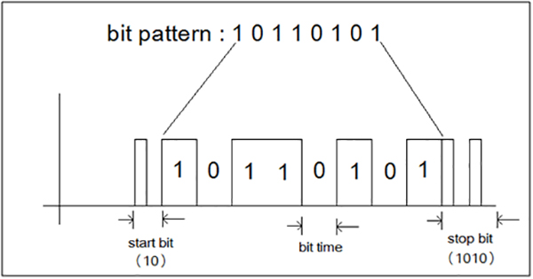

- [Download PDF](https://yasirbhutta.github.io/computer-basics/docs/number-systems.pdf)
- To access the updated handouts, please click on the following link:
[https://yasirbhutta.github.io/computer-basics/docs/number-systems.html](https://yasirbhutta.github.io/computer-basics/docs/number-systems.html)

- [Number System](#number-system)
  - [Module 1: Bits](#module-1-bits)
  - [Module 1: bits](#module-1-bits-1)
    - [What is a bit?](#what-is-a-bit)
    - [How are bits represented?](#how-are-bits-represented)
    - [How are bits used?](#how-are-bits-used)
  - [Units of measurement for storage data](#units-of-measurement-for-storage-data)
  - [Patterns Using Bits](#patterns-using-bits)
  - [ASCII code](#ascii-code)
    - [Module 2: Boolean Operations](#module-2-boolean-operations)
      - [What are Boolean operations?\*\*](#what-are-boolean-operations)
      - [Boolean expressions](#boolean-expressions)
      - [Truth tables](#truth-tables)
      - [Examples of Boolean expressions](#examples-of-boolean-expressions)
      - [Applications of Boolean operations](#applications-of-boolean-operations)
    - [Module 3: Hexadecimal Notation](#module-3-hexadecimal-notation)
      - [What is hexadecimal notation?](#what-is-hexadecimal-notation)
      - [Why use hexadecimal notation?](#why-use-hexadecimal-notation)
      - [How to convert between hexadecimal and binary](#how-to-convert-between-hexadecimal-and-binary)
      - [Applications of hexadecimal notation](#applications-of-hexadecimal-notation)
    - [Module 14: Storing a Bit](#module-14-storing-a-bit)
      - [How are bits stored in memory?](#how-are-bits-stored-in-memory)
      - [Types of memory](#types-of-memory)
  - [True/False (Mark T for True and F for False)](#truefalse-mark-t-for-true-and-f-for-false)
  - [Multiple Choice (Select the best answer)](#multiple-choice-select-the-best-answer)
  - [Review Questions](#review-questions)
  - [Excercises](#excercises)
  - [References](#references)

<script async src="https://pagead2.googlesyndication.com/pagead/js/adsbygoogle.js?client=ca-pub-1602443888929206"
     crossorigin="anonymous"></script>
<ins class="adsbygoogle"
     style="display:block; text-align:center;"
     data-ad-layout="in-article"
     data-ad-format="fluid"
     data-ad-client="ca-pub-1602443888929206"
     data-ad-slot="6296238623"></ins>
<script>
     (adsbygoogle = window.adsbygoogle || []).push({});
</script>

## Module 1: Bits

A bit is the smallest unit of information in a computer. It can be either 0 or 1. Bits are used to represent all of the data that is stored and processed on a computer, including text, images, audio, and video.

- What is a bit?
- How are bits represented?
- How are bits used?
- Patterns using Bits

Module 12: Boolean Operations

Boolean operations are used to manipulate bits. The two most common Boolean operations are AND and OR. The AND operation returns 1 if both bits are 1, and 0 otherwise. The OR operation returns 1 if either bit is 1, and 0 otherwise.

Module 13: Hexadecimal Notation

Hexadecimal notation is a way of representing numbers using 16 symbols instead of 10. The hexadecimal symbols are 0, 1, 2, 3, 4, 5, 6, 7, 8, 9, A, B, C, D, E, and F.

Module 14: Storing a Bit

Bits are stored in memory using electrical charges. A bit is stored as a high voltage if it is a 1, and a low voltage if it is a 0.

## Module 1: bits

### What is a bit?

- A bit is the smallest unit of information in a computer.
- It can be either 0 or 1.
- Bits are used to represent all of the data that is stored and processed on a computer, including text, images, audio, and video.

### How are bits represented?

- Bits can be represented in a variety of ways, including electronically, optically, and magnetically.
- In most computers, bits are represented electronically using transistors.
- A transistor is a semiconductor device that can be switched to either a conducting or non-conducting state. When a transistor is conducting, it represents a 1 bit. When a transistor is non-conducting, it represents a 0 bit.

### How are bits used?

Bits are used in a variety of ways in computers. For example, bits are used to:

**Represent text characters:** Each character in the English alphabet is represented by a unique sequence of bits.
**Represent images:** Images are represented by a grid of pixels. Each pixel is represented by a combination of red, green, and blue bits.
**Represent audio:** Audio is represented by a series of samples. Each sample is represented by a combination of bits.
**Represent video:** Video is represented by a series of images. Each image is represented by a grid of pixels. Each pixel is represented by a combination of red, green, and blue bits.
Examples of bits in use

Here are some examples of how bits are used in the real world:

- When you type a letter on your keyboard, the computer converts the letter to a sequence of bits. These bits are then sent to the monitor, which displays the letter on the screen.
- When you take a photo with your digital camera, the camera converts the image to a grid of pixels. Each pixel is represented by a combination of red, green, and blue bits. These bits are then stored on the camera's memory card.
- When you listen to a song on your MP3 player, the player converts the song to a series of samples. Each sample is represented by a combination of bits. These bits are then played through the player's speakers.
- When you watch a video on your computer, the computer converts the video to a series of images. Each image is represented by a grid of pixels. Each pixel is represented by a combination of red, green, and blue bits. These bits are then displayed on the computer's monitor.

## Units of measurement for storage data

| Sr. No. | Units | Abbr. | Description | Approximate Size |
| --- | --- | --- | --- | ---|
| 1       | Bit |  | Computer works with binary digits in 0’s and 1’s form. A binary digit is called bit. |  |
| 2       | Nibble |  | 4 bit |  |
| 3       | Byte |  | 8 bit  (Store single character) | 1 character |
| 4       | Kilobyte | KB | 1024 Bytes | 1 page |
| 5       | Megabyte | MB | 1024 KB (1 millon bytes) | 1000 pages |
| 6       | Gigabyte | GB | 1024 MB(1 billion bytes) | 1 million pages |
| 7       | Terabyte | TB | 1024 GB(1 trillion bytes) | 1 billion pages |

## Patterns Using Bits

- A bit pattern is a sequence of bits, which are the smallest unit of data in computing. A bit can have two values: 0 or 1. Bit patterns are used to represent all kinds of data, including numbers, letters, symbols, and images.

- Bit patterns can be of any length, but they are typically represented as strings of binary digits. For example, the bit pattern "01000001" represents the letter "A" in ASCII code. [^1]

- Bit patterns are used in a wide variety of computing applications. For example, they are used to store and transmit data, to encode and decode information, and to perform mathematical and logical operations.



Image source: [engineersgarage.com](https://www.engineersgarage.com/programmable-bit-pattern-generator/)

Here are some examples of bit patterns:

- The bit pattern "00110001" represents the number 1 in ASCII code.
- The bit pattern "01001000 01100101 01101100 01101100 01101111" represents the word "Hello" in ASCII code.

Bit patterns are a powerful tool for representing and manipulating information in computing.

<script async src="https://pagead2.googlesyndication.com/pagead/js/adsbygoogle.js?client=ca-pub-1602443888929206"
     crossorigin="anonymous"></script>
<ins class="adsbygoogle"
     style="display:block; text-align:center;"
     data-ad-layout="in-article"
     data-ad-format="fluid"
     data-ad-client="ca-pub-1602443888929206"
     data-ad-slot="6296238623"></ins>
<script>
     (adsbygoogle = window.adsbygoogle || []).push({});
</script>

## ASCII code

- ASCII stands for American Standard Code for Information Interchange. It is a character encoding system that uses a 7-bit or 8-bit binary code to represent characters.
- ASCII is used in most computers and electronic devices to represent text, numbers, and other symbols.

Each ASCII character is assigned a unique code. For example, the ASCII code for the letter "A" is 65. The ASCII code for the space character is 32.

For example, to convert the letter "A" to binary code, you would follow these steps:

- The ASCII code for the letter "A" is 65.
- Write the ASCII code in decimal form: 65
- Convert the decimal code to binary code: 01000001
- Pad the binary code with zeros on the left to make it 8 bits long: 01000001

The following table shows some common ASCII characters and their binary codes:

| Character | ASCII Code | Binary Code |
| --------- | ---------- | ----------- |
| A         | 65         | 1000001     |
| B         | 66         | 1000010     |
| C         | 67         | 1000011     |
| ...       | ...        | ...         |
| Z         | 90         | 1011010     |
| 0         | 48         | 110000      |
| 1         | 49         | 110001      |
| 2         | 50         | 110010      |
| ...       | ...        | ...         |
| 9         | 57         | 111001      |
| space     | 32         | 100000      |
| !         | 33         | 100001      |
| "         | 34         | 100010      |
| #         | 35         | 100011      |
| ...       | ...        | ...         |
| ~         | 126        | 1111110     |

click on the following link to view complete table: [ASCII, decimal, hexadecimal, octal, and binary conversion table - IBM](https://www.ibm.com/docs/en/aix/7.3?topic=adapters-ascii-decimal-hexadecimal-octal-binary-conversion-table)

**Convert decimal code to binary code:**

For example, to convert the decimal number 10 to binary code, we would do the following:

```code
10 / 2 = 5 Remainder: 0 (bit #1)
5 / 2 = 2 Remainder: 1 (bit #2)
2 / 2 = 1 Remainder: 0 (bit #3)
1 / 2 = 0 Remainder: 1 (bit #4)
```

So, 10 (decimal) =  1010 (binary)

Another example, to convert the decimal number 15 to binary code

| Division<br>by 2 | Quotient | Remainder

(Digit) | Bit # |
| ---------------- | -------- | ------------------ | ----- |
| (15)/2           | 7        | 1                  | 0     |
| (7)/2            | 3        | 1                  | 1     |
| (3)/2            | 1        | 1                  | 2     |
| (1)/2            | 0        | 1                  | 3     |

So, 15 (decimal) =  1111 (binary)

click on the following link to covert decimal to binary: [https://www.rapidtables.com/convert/number/decimal-to-binary.html](https://www.rapidtables.com/convert/number/decimal-to-binary.html)


**How to convert a binary number to decimal step by step with an example:**

**Method 1: Using place values and powers of 2**

**1. Identify the binary number:** Let's use the binary number **1101** as an example.

**2. Understand place values:** In binary, each digit represents a power of 2. Starting from the rightmost digit, the powers of 2 increase as you move left (2^0, 2^1, 2^2, and so on).

**3. Assign values based on position:** 
   * If a binary digit is **1**, it contributes the value according to its position (power of 2).
   * If a binary digit is **0**, it contributes nothing (0 times any power of 2 is 0).

**4. Multiply and sum:** 
   * Multiply each binary digit by its corresponding power of 2.
   * Add all the products together. The sum will be the decimal equivalent.

**Steps applied to the example:**

**Binary number:** 1101

* **Rightmost digit (1):** 1 x 2^0 = 1
* **Second digit (0):** 0 x 2^1 = 0 (doesn't contribute)
* **Third digit (1):** 1 x 2^2 = 4
* **Leftmost digit (1):** 1 x 2^3 = 8

**5. Sum the products:** 1 (rightmost) + 0 + 4 + 8 = 13 (decimal)

**Therefore, 1101 (binary) is equal to 13 (decimal).**

**See also:**

- [Convert ASCII to Binary - Online Binary Tools](https://onlinebinarytools.com/convert-ascii-to-binary)
- [Convert Binary to ASCII - Online Binary Tools](https://onlinebinarytools.com/convert-binary-to-ascii)
- [How to convert decimal to binary - rapidtables.com](https://www.rapidtables.com/convert/number/decimal-to-binary.html)
- [Binary to decimal - rapidtables.com](https://www.rapidtables.com/convert/number/binary-to-decimal.html)

<script async src="https://pagead2.googlesyndication.com/pagead/js/adsbygoogle.js?client=ca-pub-1602443888929206"
     crossorigin="anonymous"></script>
<ins class="adsbygoogle"
     style="display:block; text-align:center;"
     data-ad-layout="in-article"
     data-ad-format="fluid"
     data-ad-client="ca-pub-1602443888929206"
     data-ad-slot="6296238623"></ins>
<script>
     (adsbygoogle = window.adsbygoogle || []).push({});
</script>

### Module 2: Boolean Operations

#### What are Boolean operations?**

- Boolean operations are logical operations that are used to manipulate bits.
- The two most common Boolean operations are AND and OR.
- The AND operation returns 1 if both bits are 1, and 0 otherwise.
- The OR operation returns 1 if either bit is 1, and 0 otherwise.

#### Boolean expressions

Boolean expressions are expressions that use Boolean operations to combine bits. Boolean expressions can be used to perform simple calculations on bits, such as checking if two bits are both equal to 1, or checking if a bit is equal to 0.

#### Truth tables

Truth tables are a way of representing the output of a Boolean expression for all possible combinations of inputs. Truth tables can be used to verify that a Boolean expression works as expected.

Example: Let’s create a truth table for the expression A AND B:

|A | B | A AND B|
|---| --- |---|
|0 | 0 | 0|
|0 | 1 | 0|
|1 | 0 | 0|
|1 | 1 | 1|

In this example:

- When A = 0 and B = 0, A AND B evaluates to 0.
- When A = 1 and B = 1, A AND B evaluates to 1.

Example: Let’s create a truth table for the expression A OR B:

|A | B | A OR B|
|---|---|---|
|0 | 0 | 0|
|0 | 1 | 1|
|1 | 0 | 1|
|1 | 1 | 1|

In this example:

- When A = 0 and B = 0, A OR B evaluates to 0.
- When A = 0 and B = 1, A OR B evaluates to 1.

#### Examples of Boolean expressions

Here are some examples of Boolean expressions:

- `A AND B`: This expression returns 1 if both bits A and B are equal to 1, and 0 otherwise.
- `A OR B`: This expression returns 1 if either bit A or bit B is equal to 1, and 0 otherwise.
- `NOT A`: This expression returns the opposite of bit A.
- `(A AND B) OR C`: This expression returns 1 if either A AND B is equal to 1, or C is equal to 1, and 0 otherwise.

#### Applications of Boolean operations

Boolean operations are used in a variety of applications, including:

- Digital logic: Boolean operations are used to design and implement digital logic circuits.
- Computer programming: Boolean operations are used to write computer programs.
- Databases: Boolean operations are used to perform complex queries on databases.
- Search engines: Boolean operations are used to refine search results.

<script async src="https://pagead2.googlesyndication.com/pagead/js/adsbygoogle.js?client=ca-pub-1602443888929206"
     crossorigin="anonymous"></script>
<ins class="adsbygoogle"
     style="display:block; text-align:center;"
     data-ad-layout="in-article"
     data-ad-format="fluid"
     data-ad-client="ca-pub-1602443888929206"
     data-ad-slot="6296238623"></ins>
<script>
     (adsbygoogle = window.adsbygoogle || []).push({});
</script>

### Module 3: Hexadecimal Notation

#### What is hexadecimal notation?

Hexadecimal notation is a way of representing numbers using 16 symbols instead of 10. The hexadecimal symbols are 0, 1, 2, 3, 4, 5, 6, 7, 8, 9, A, B, C, D, E, and F.

#### Why use hexadecimal notation?

Hexadecimal notation is a more compact way of representing binary numbers. For example, the binary number 1010101010101010 can be represented as the hexadecimal number 0xAAAA.

| Hex | Binary |
| --- | ------ |
| 0   | 0000   |
| 1   | 0001   |
| 2   | 0010   |
| 3   | 0011   |
| 4   | 0100   |
| 5   | 0101   |
| 6   | 0110   |
| 7   | 0111   |
| 8   | 1000   |
| 9   | 1001   |
| A   | 1010   |
| B   | 1011   |
| C   | 1100   |
| D   | 1101   |
| E   | 1110   |
| F   | 1111   |

<script async src="https://pagead2.googlesyndication.com/pagead/js/adsbygoogle.js?client=ca-pub-1602443888929206"
     crossorigin="anonymous"></script>
<ins class="adsbygoogle"
     style="display:block; text-align:center;"
     data-ad-layout="in-article"
     data-ad-format="fluid"
     data-ad-client="ca-pub-1602443888929206"
     data-ad-slot="6296238623"></ins>
<script>
     (adsbygoogle = window.adsbygoogle || []).push({});
</script>
#### How to convert between hexadecimal and binary

To convert a hexadecimal number to binary, simply replace each hexadecimal digit with its corresponding binary equivalent. For example, to convert the hexadecimal number 0xAAAA to binary, we would replace the A digits with the binary number 1010, and we would replace the F digits with the binary number 1111. This would give us the binary number 1010101010101010.

To convert a binary number to hexadecimal, simply group the binary digits into groups of four. Then, replace each group of four binary digits with its corresponding hexadecimal digit. For example, to convert the binary number 1010101010101010 to hexadecimal, we would group the binary digits into groups of four:

```
1010 1010 1010 1010
```

Then, we would replace each group of four binary digits with its corresponding hexadecimal digit:

```
AAAA
```

This would give us the hexadecimal number 0xAAAA.

**How to convert hex to binary:**

 Another example, to convert hexadecimal number `1E` to binary:

1. Write down the hex number: We have 1E.
2. Convert hex to decimal: The decimal equivalent of 1E is 30 (since 1E represents (1*16^1) + (14*16^0) = 30).
Represent each digit in binary:
3. 1 in binary is 0001.
4. E in decimal is 14, which in binary is 1110.
5. Combine the binary representations: 1E in binary is 00011110

How to convert hexadecimal to decimal step by step with an example:

**Steps:**

1. **Identify the hexadecimal number:** Let's use **D3A5** (hex) as an example.

2. **Assign decimal values to hexadecimal digits:** Remember, A = 10, B = 11, C = 12, D = 13, E = 14, and F = 15. In our example:
    * D = 13
    * 3 = 3
    * A = 10
    * 5 = 5

3. **Multiply each digit by its place value (power of 16):**
    - **D** (13) is in the 16^3 (4096) place: 13 * 16^3 = 53248
    - **3** (3) is in the 16^2 (256) place: 3 * 16^2 = 768
    - **A** (10) is in the 16^1 (16) place: 10 * 16^1 = 160
    - **5** (5) is in the 16^0 (1) place: 5 * 16^0 = 5

4. **Sum the products:** Add the results from step 3: 53,248 (D) + 768 (3) + 160 (A) + 5 (5) = 54,181

**Therefore, D3A5 (hex) is equal to 54,181 (decimal).**

##### Task: Convert Hexadecimal `1A3` to Decimal

1. **Understand Hexadecimal**:  
   The hexadecimal system uses base 16 and includes digits from 0 to 9 and letters A to F.  
   - A = 10, B = 11, C = 12, D = 13, E = 14, F = 15  

2. **Write Down the Hex Number**:  
   For example, let's say the hex number is **1A3**.

3. **Assign Powers of 16**:  
   Write powers of 16 for each digit, starting from the rightmost digit:  
   ```
   1A3 → 1 × 16² + A × 16¹ + 3 × 16⁰
   ```

4. **Replace Hex Digits with Decimal Equivalents**:  
   Replace A with 10:  
   ```
   1 × 16² + 10 × 16¹ + 3 × 16⁰
   ```

5. **Calculate Powers of 16**:  
   ```
   16² = 256, 16¹ = 16, 16⁰ = 1
   ```

6. **Perform Multiplication**:  
   ```
   1 × 256 = 256  
   10 × 16 = 160  
   3 × 1 = 3  
   ```

7. **Add the Results**:  
   ```
   256 + 160 + 3 = 419
   ```

**Hexadecimal `1A3` = Decimal `419`**

##### Task: Convert Hexadecimal `2F4` to Decimal

1. **Hexadecimal Number**:  
   ```
   2F4
   ```

2. **Assign Powers of 16**:  
   ```
   2 × 16² + F × 16¹ + 4 × 16⁰
   ```

3. **Replace Hex Digits with Decimal Equivalents**:  
   - `F` = 15  
   ```
   2 × 16² + 15 × 16¹ + 4 × 16⁰
   ```

4. **Calculate Powers of 16**:  
   ```
   16² = 256, 16¹ = 16, 16⁰ = 1
   ```

5. **Perform Multiplication**:  
   ```
   2 × 256 = 512  
   15 × 16 = 240  
   4 × 1 = 4  
   ```

6. **Add the Results**:  
   ```
   512 + 240 + 4 = 756
   ```

**Hexadecimal `2F4` = Decimal `756`**

#### Applications of hexadecimal notation

Hexadecimal notation is used in a variety of applications, including:

- **Computer programming:** Hexadecimal notation is used to represent machine code and memory addresses.
- **Electronics:** Hexadecimal notation is used to represent hexadecimal numbers in electronic circuits.
- **Networking:** Hexadecimal notation is used to represent MAC addresses and IP addresses.
- **Debugging:** Hexadecimal notation is used to debug computer programs and electronic circuits.

<script async src="https://pagead2.googlesyndication.com/pagead/js/adsbygoogle.js?client=ca-pub-1602443888929206"
     crossorigin="anonymous"></script>
<ins class="adsbygoogle"
     style="display:block; text-align:center;"
     data-ad-layout="in-article"
     data-ad-format="fluid"
     data-ad-client="ca-pub-1602443888929206"
     data-ad-slot="6296238623"></ins>
<script>
     (adsbygoogle = window.adsbygoogle || []).push({});
</script>

### Module 14: Storing a Bit

#### How are bits stored in memory?

Bits are stored in memory using electrical charges. A bit is stored as a high voltage if it is a 1, and a low voltage if it is a 0.

#### Types of memory

There are two main types of memory in a computer: RAM and ROM. RAM stands for random-access memory. RAM is used to store data that is currently being used by the computer. ROM stands for read-only memory. ROM is used to store data that is permanent, such as the computer's BIOS.

**RAM:**

RAM is made up of millions or even billions of tiny transistors. Each transistor can store a single bit of data. The transistors are arranged in a grid, and each transistor is addressed by a unique address.

When the computer needs to access a bit of data in RAM, it sends the address of the bit to the memory controller. The memory controller then sends a signal to the transistor at that address. The transistor then switches to the appropriate state (high voltage or low voltage) to represent the bit of data.

**ROM:**

ROM is made up of a series of interconnected cells. Each cell can store a single bit of data. The cells are arranged in a grid, and each cell is addressed by a unique address.

When the computer needs to access a bit of data in ROM, it sends the address of the bit to the memory controller. The memory controller then sends a signal to the cell at that address. The cell then reads the bit of data and sends it back to the memory controller.

<script async src="https://pagead2.googlesyndication.com/pagead/js/adsbygoogle.js?client=ca-pub-1602443888929206"
     crossorigin="anonymous"></script>
<ins class="adsbygoogle"
     style="display:block; text-align:center;"
     data-ad-layout="in-article"
     data-ad-format="fluid"
     data-ad-client="ca-pub-1602443888929206"
     data-ad-slot="6296238623"></ins>
<script>
     (adsbygoogle = window.adsbygoogle || []).push({});
</script>

## Fill in the Blanks

1. A binary digit is also known as a _______.  
   **Answer:** Bit  

2. In Boolean operations, the _______ operation returns 1 if either bit is 1.  
   **Answer:** OR  

3. The ASCII code for the letter "A" is _______ in decimal.  
   **Answer:** 65  

4. The binary equivalent of the decimal number 10 is _______.  
   **Answer:** 1010  

5. A _______ consists of 1024 megabytes.  
   **Answer:** Gigabyte  

6. A bit pattern is a sequence of _______ used to represent data.  
   **Answer:** Bits  

7. To convert a binary number to decimal, multiply each bit by its corresponding power of _______ and sum the results.  
   **Answer:** 2  

**Answer Key (Fill in the Blanks):**

## True/False (Mark T for True and F for False)

A bit can have only two values: 0 or 1.  
   **True**

2. Hexadecimal notation uses 10 symbols to represent numbers.  
   **False** (It uses 16 symbols.)

3. Boolean expressions are used to perform logical operations on bits.  
   **True**

4. ASCII code represents each character with a unique 16-bit binary code.  
   **False** (It uses a 7-bit or 8-bit binary code.)

5. In binary to decimal conversion, each digit in the binary number represents a power of 10.  
   **False** (It represents a power of 2.)


<script async src="https://pagead2.googlesyndication.com/pagead/js/adsbygoogle.js?client=ca-pub-1602443888929206"
     crossorigin="anonymous"></script>
<ins class="adsbygoogle"
     style="display:block; text-align:center;"
     data-ad-layout="in-article"
     data-ad-format="fluid"
     data-ad-client="ca-pub-1602443888929206"
     data-ad-slot="6296238623"></ins>
<script>
     (adsbygoogle = window.adsbygoogle || []).push({});
</script>

## Multiple Choice (Select the best answer)

What does ASCII stand for?

1. [x]  American Standard Code for Information Interchange
2. [ ]  Applied Software Code for Information Technology
3. [ ]  Advanced Security Code for Information Exchange
4. [ ]  Automated System Code for Information Transfer

What is the ASCII code for the letter "A"?

1. [x]  65
2. [ ]  97
3. [ ]  101
4. [ ]  114

How would you convert the letter "B" to binary code using ASCII?

1. [ ]  00100001
2. [ ]  00100010
3. [ ]  01000000
4. [x]  01000010

> Which unit of measurement is typically used to measure the storage capacity of a hard drive?

1. [x] Gigabyte (GB)
2. [ ] Terabyte (TB)
3. [ ] Petabyte (PB)
4. [ ] Exabyte (EB)

> What is the relationship between a kilobit (Kb) and a kilobyte (KB)?

1. [x] 8 Kb = 1 KB
2. [ ] 1 Kb = 1024 KB
3. [ ] 1 Kb = 1000 KB
4. [ ] 1 Kb = 512 KB

> Which of the following is the largest unit of data storage?

1. [ ] Megabyte (MB)
2. [ ] Kilobyte (KB)
3. [ ] Gigabyte (GB)
4. [x] Terabyte (TB)

> Which unit is commonly used to measure the speed of data transfer?

1. [ ] Hertz (Hz)
2. [ ] Watts (W)
3. [x] Bits per second (bps)
4. [ ] Bytes per second (Bps)

> Which of the following is equivalent to 1024 gigabytes?

1. [x] 1 terabyte (TB)
2. [ ] 1 petabyte (PB)
3. [ ] 1 kilobyte (KB)
4. [ ] 1 megabyte (MB)

1. What is the smallest unit of information in a computer?
   - A. Byte  
   - B. Bit  
   - C. Kilobyte  
   - D. Megabyte  
   **Answer:** B. Bit  

2. How many bits are there in a byte?  
   - A. 4  
   - B. 8  
   - C. 16  
   - D. 32  
   **Answer:** B. 8  

3. Which of the following Boolean operations returns 1 if both inputs are 1?  
   - A. OR  
   - B. AND  
   - C. NOT  
   - D. XOR  
   **Answer:** B. AND  

4. What is the hexadecimal representation of the decimal number 15?  
   - A. F  
   - B. E  
   - C. 15  
   - D. 1F  
   **Answer:** A. F  

5. Which unit represents approximately 1 million bytes?  
   - A. Kilobyte  
   - B. Megabyte  
   - C. Gigabyte  
   - D. Terabyte  
   **Answer:** B. Megabyte  

<script async src="https://pagead2.googlesyndication.com/pagead/js/adsbygoogle.js?client=ca-pub-1602443888929206"
     crossorigin="anonymous"></script>
<ins class="adsbygoogle"
     style="display:block; text-align:center;"
     data-ad-layout="in-article"
     data-ad-format="fluid"
     data-ad-client="ca-pub-1602443888929206"
     data-ad-slot="6296238623"></ins>
<script>
     (adsbygoogle = window.adsbygoogle || []).push({});
</script>

## Review Questions

1. Define a bit, explain how bits are represented, and describe their uses.
2. Write the note on different units of measurement for data storage
3. What is the most basic unit of data storage? How many bits are in a byte?
4. Which unit of measurement is typically used to measure the storage capacity of a hard drive?
5. List the prefixes used to form multiples of a byte, starting from kilobyte to terabyte. How many bytes are in each unit?
6. What does ASCII stand for?
7. What is the ASCII code for the letter "A"?
8. How would you convert the letter "B" to binary code using ASCII?
9. How can you convert the letter "B" (ASCII value 66) and the decimal number 15 to their binary representations?
10. Explain the concept of ASCII and how it relates to representing characters digitally. Convert the letter "B" to its binary equivalent, given that it has an ASCII value of 66 and a decimal value of 15.
11. Convert the binary number 11111111 into decimal and explain why this value is significant in computer systems.

**Answer:**

The binary number \( 11111111_2 \) can be converted to decimal as follows:  

Each digit in the binary number represents a power of 2, starting from the rightmost digit (the least significant bit):  
\[
11111111_2 = (1 \times 2^7) + (1 \times 2^6) + (1 \times 2^5) + (1 \times 2^4) + (1 \times 2^3) + (1 \times 2^2) + (1 \times 2^1) + (1 \times 2^0)
\]  
\[
= 128 + 64 + 32 + 16 + 8 + 4 + 2 + 1
\]  
\[
= 255
\]  

**Why is this significant in computer systems?**  
The value \( 255 \) is the largest number that can be represented using an 8-bit binary number, which is often referred to as a **byte**. It is significant because bytes are the fundamental unit of data in computer systems, and \( 255 \) represents the maximum value for unsigned 8-bit data.

12. Convert the following binary numbers into their equivalent decimal numbers. Show all your work.

- (a) 1101
- (b) 10110
- (​c) 11101
- (d) 111011 
- (e) 1000001
- (f) 1010101
​
13. What are Boolean operations? Provide examples of the two most common operations.  
14. Explain the difference between the AND and OR operations using examples.  
15. Define Boolean expressions and describe their purpose.  
16. **Write a Boolean expressions:
    1.  To check if both bits \( A \) and \( B \) are 1.**  
    2.  To check if at least one of the bits \( A \) or \( B \) is 1.**  
    3.  To invert the value of a bit \( A \).**  
    4.  Both \( A \) and \( B \) are 1, **or** \( C \) is 1.  

**Answers**

1. **To check if both bits \( A \) and \( B \) are 1:**  
   \[
   A \text{ AND } B
   \]  
   Explanation: The AND operation returns 1 only when both \( A = 1 \) and \( B = 1 \).

2. **To check if at least one of the bits \( A \) or \( B \) is 1:**  
   \[
   A \text{ OR } B
   \]  
   Explanation: The OR operation returns 1 if either \( A = 1 \), \( B = 1 \), or both are 1.

3. **To invert the value of a bit \( A \):**  
   \[
   \text{NOT } A
   \]  
   Explanation: The NOT operation flips the value of \( A \); if \( A = 1 \), it returns 0, and if \( A = 0 \), it returns 1.

4. **To evaluate to 1 if both \( A \) and \( B \) are 1, or \( C \) is 1:**  
   \[
   (A \text{ AND } B) \text{ OR } C
   \]  
   Explanation: The expression first checks if \( A \text{ AND } B \) evaluates to 1. If not, it evaluates \( C \), returning 1 if \( C = 1 \).

  16. What is the purpose of a truth table and Complete the following truth table for the expression \( A \text{ XOR } B \):  
  \[
  \begin{array}{|c|c|c|}
  \hline
  A & B & A \text{ XOR } B \\
  \hline
  0 & 0 & \\
  0 & 1 & \\
  1 & 0 & \\
  1 & 1 & \\
  \hline
  \end{array}
  \]  
- (c) Create a truth table for the expression \( (A \text{ OR } B) \text{ AND } C \).  

**4. Boolean Expression Examples**  
- (a) Evaluate the following Boolean expressions:  
   1. A = 1, B = 0, Expression:  `A AND B`  
   2. A = 0, B = 1, C = 1, Expression: `(A OR B) AND C`
 
- (b) Simplify the expression \( A \text{ AND } (B \text{ OR } C) \).  

**5. Applications of Boolean Operations**  
- (a) Describe two real-world applications of Boolean operations in:  
   1. Digital logic circuits  
   2. Computer programming  
- (b) Explain how Boolean operations are used in search engines to refine search results.  


## Excercises

1. Research the [ASCII code table](https://www.ibm.com/docs/en/aix/7.3?topic=adapters-ascii-decimal-hexadecimal-octal-binary-conversion-table) and find the bit patterns for the letters "G", "o", "o", "d".
2. Decode the following binary messages: "01000111 01110010 01100001 01110100 01101001 01110100 01110101 01100100 01100101".
3. Write down the binary representation of the decimal numbers 0 to 15.
4. Convert the following decimal numbers to binary: 25, 47, 100, and 128.
5. Write down the ASCII code for the letters "A" to "Z".
6. Write down the ASCII code for the numbers 0 to 9.
7. Write down the ASCII code for the following symbols: !, @, #, and $.

## References

[^1] [ASCII, decimal, hexadecimal, octal, and binary conversion table - IBM](https://www.ibm.com/docs/en/aix/7.3?topic=adapters-ascii-decimal-hexadecimal-octal-binary-conversion-table)
