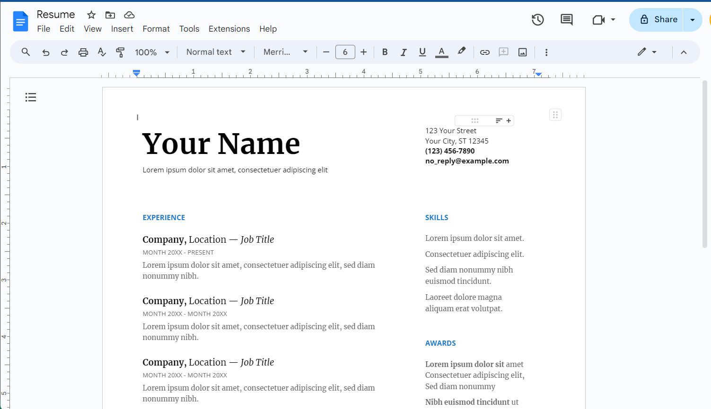
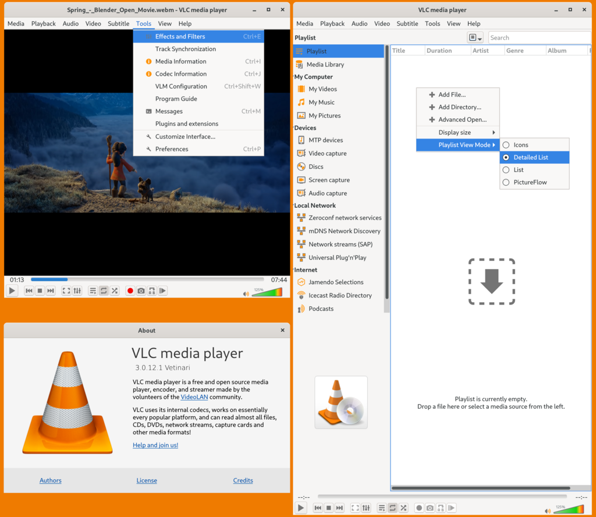
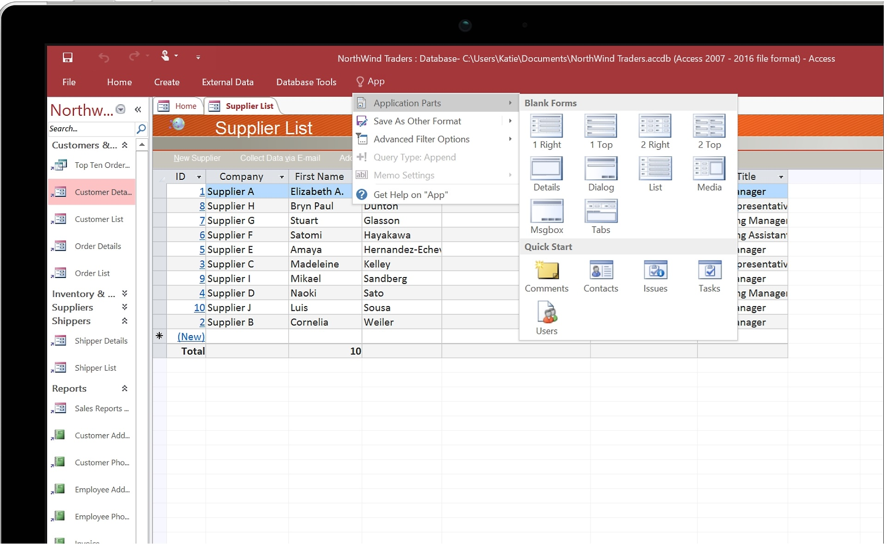

- [Download PDF](https://yasirbhutta.github.io/computer-basics/docs/software.pdf)
- To access the updated handouts, please click on the following link:
[https://yasirbhutta.github.io/computer-basics/docs/software.html](https://yasirbhutta.github.io/computer-basics/docs/software.html)
- [Slides: Software](https://docs.google.com/presentation/d/168Rt_k1ufYWGKpRvX1oRmu4173FPSfCfQ7PbZMGwAas/edit?usp=sharing)

- [Computer Basics: Software](#computer-basics-software)
  - [What is Software](#what-is-software)
  - [Types of Software](#types-of-software)
    - [1. System Software](#1-system-software)
    - [2. Application Software](#2-application-software)
  - [Open Source Software vs Proprietary Software](#open-source-software-vs-proprietary-software)
    - [Open Source Software (OSS)](#open-source-software-oss)
    - [Proprietary Software](#proprietary-software)
  - [True/False (Mark T for True and F for False)](#truefalse-mark-t-for-true-and-f-for-false)
  - [Multiple Choice (Select the best answer)](#multiple-choice-select-the-best-answer)
  - [Exercises](#exercises)
  - [Review Questions](#review-questions)
  - [References and Bibliography](#references-and-bibliography)

## What is Software

- Software is the set of programs( instructions) that tell a computer what to do.

**Software Silent Features:**

- A computer works according to the given instructions in the software.
- Software is logical part of a computer and cannot be touched.
- The hardware cannot perform any task without software. 
- It is copied from the disk into the main memory of the computer as and when required.

Command, Programs,Software

<ins class="adsbygoogle"
     style="display:block; text-align:center;"
     data-ad-layout="in-article"
     data-ad-format="fluid"
     data-ad-client="ca-pub-1602443888929206"
     data-ad-slot="6296238623"></ins>

## Types of Software

### 1. System Software

- System software is an program that controls the computer's hardware or that can be used to maintain the computer in some way so that it runs more efficiently.
- System software is a generic term referring to any computer software whose purpose is to help run the computer system
- Most of it is responsible directly for controlling, integrating, and managing the individual hardware components of a computer system.

Some examples of system software are:

1.1 **Operating system:** 

- The operating system is a software that controls and coordinates the computer hardware devices and runs other software and applications on a computer 
- It provides a foundation for applications to run and offers essential services, such as managing memory, processing tasks, handling input and output, and managing files and data. 
- It serves as the interface between hardware, application software, and the user.

Some common examples of operating systems are:

  1. **Windows (98,2000, XP, Vista, 7, 8, 10,11)** – Used in personal computers and enterprise environments.
  2. **macOS** – The primary operating system for Apple’s Mac computers.
  3. **Linux (Ubuntu)** – An open-source operating system commonly used for servers, personal computers, and embedded systems.
  4. **Android** – Used in smartphones, tablets, and some other mobile devices.

1.2 **Device Drivers:** 

- The communication between the operating system and hardware components is facilitated by device drivers.
(Sound Card, Monitor, VGA, Modem, CR-Rom Drive Etc)

1.3 **Utility Program:**

- A utility is a program that makes the computer system easier to use or performs highly specialized functions.
- Utilities are used to manage disks, troubleshoot hardware problems, and perform other tasks that the operating system itself may not be able to do.

**Examples:** File Compressor, Disk Scanner, Antivirus, Backup Utility, Disk Cleanup

<ins class="adsbygoogle"
     style="display:block; text-align:center;"
     data-ad-layout="in-article"
     data-ad-format="fluid"
     data-ad-client="ca-pub-1602443888929206"
     data-ad-slot="6296238623"></ins>

### 2. Application Software

Application software is any program that allows you to perform a specific task on your computer. There are many different types of application software available, each designed for a specific purpose. Here are some of the most common types:

* **Word processing software:** This type of software is used to create and edit text documents. Popular word processing applications include Microsoft Word, Apple Pages, and Google Docs.

Image source: [wikimedia.org](https://upload.wikimedia.org/wikipedia/de/3/36/Word_mac_16.27.png)
[Image of Apple Pages]

* **Spreadsheet software:** This type of software is used to create and manipulate spreadsheets, which are grids of cells used to store and organize data. Popular spreadsheet applications include Microsoft Excel, Apple Numbers, and Google Sheets.

Image source: [britannica.com](https://cdn.britannica.com/29/147629-050-71369707/Screenshot-Microsoft-Excel.jpg)

- **Presentation software:** This type of software is used to create presentations, which are slide shows that can be used to give talks or presentations. Popular presentation applications include Microsoft PowerPoint, Apple Keynote, and Google Slides.
  
[Image of Microsoft PowerPoint application software]
[Image of Apple Keynote application software]
[Image of Google Slides application software]

- **Multimedia software:** This type of software is used to create, edit, and play multimedia files, such as audio, video, and images. Popular multimedia applications include Adobe Photoshop, VLC media player, and Windows Media Player.
  
[Image of Adobe Photoshop application software]

[VLC Media Player](https://www.videolan.org/vlc/): This free and open-source media player can play virtually any audio or video format, making it a popular choice for users worldwide.

Image source: [wikipedia.org](https://en.wikipedia.org/wiki/VLC_media_player#/media/File:VLC_media_player_3.0.12_(released_in_2021-01).png)

- **Web browsers:** This type of software is used to access the internet. Popular web browsers include Google Chrome, Mozilla Firefox, and Apple Safari.
[Image of Google Chrome application software]
- [Google Chrome](https://www.google.com/intl/en_pk/chrome/): Used for web page browsing
[Image of Mozilla Firefox application software]

- **Database software:** This type of software is used to create and manage databases, which are collections of data that can be organized and accessed electronically. Popular database applications include Microsoft Access and MySQL.

- **Email clients:** This type of software is used to send and receive email. Popular email clients include Microsoft Outlook, Apple Mail, and Mozilla Thunderbird.

[Image of Microsoft Outlook application software]
[Image of Apple Mail application software]
[Image of Mozilla Thunderbird application software]

- **Games:** Games are a type of application software that is designed for entertainment purposes. There are many different types of games available, including puzzle games, action games, and strategy games.

- **Educational software:** This type of software is designed to help people learn. Educational software can be used for a variety of purposes, such as learning a new language, studying math, or preparing for a test.

- **Financial software:** This type of software is used to manage finances. Financial software can be used for a variety of purposes, such as tracking income and expenses, budgeting, and investing.

- **Creative software:** This type of software is used to create creative content, such as music, videos, and images. Creative software can be used for a variety of purposes, such as graphic design, video editing, and music production.
  
**Example:**

- [Microsoft 365](https://www.microsoft365.com/): Used for documentation, prepare spread sheets and presentation etc.
- [Corel Draw](https://www.coreldraw.com/en/): Corel Draw is an commercial software that used for picture drawing, editing and also used for publication.
Corel Draw.
- [Microsoft Team](https://teams.microsoft.com/): Used for Video, Audio and Text based chat. Other popular chatting software's are Microsoft Team, Google Meet, WhatsApp, [Zoom](https://zoom.us/) etc
  - [Microsoft Team Demo](https://teamsdemo.office.com/)
- Adobe Reader: Used to view adobe PDF files.
- [GIMP](https://www.gimp.org/): This free and open-source image manipulation software is a powerful alternative to Photoshop, making it a popular choice for hobbyists and professionals alike.
- [CapCut](https://www.capcut.com/): Free all-in-one video editor for everyone to create anything anywhere
- 

<ins class="adsbygoogle"
     style="display:block; text-align:center;"
     data-ad-layout="in-article"
     data-ad-format="fluid"
     data-ad-client="ca-pub-1602443888929206"
     data-ad-slot="6296238623"></ins>

## Open Source Software vs Proprietary Software

### Open Source Software (OSS)

- **Open Code:** The source code is publicly available for anyone to see, modify, and redistribute.
- **Collaborative Development:** Anyone can contribute to the software's development by fixing bugs, adding features, and improving functionality.
- **Cost-Effective:** Often free or significantly cheaper than proprietary software, reducing costs for individuals and organizations.
- **Transparency:** Openness of code builds trust and allows users to verify what the software does.
- **Security:** Large community involvement can lead to faster bug fixes and improved security.

**Examples:** Linux operating system, Firefox web browser, LibreOffice productivity suite, WordPress content management system.

### Proprietary Software

- **Closed Code:** The source code is kept secret, only accessible to the software's developer or owner.
- **Controlled Development:** Development is limited to the software company's employees or contracted developers.
- **Costly:** Usually licenses require purchase or subscription fees, potentially leading to higher overall costs.
- **Black Box:** Users trust the software to work as advertised without knowing how it does so.
- **Security:** May be slower to fix bugs as updates rely solely on the developer.

**Examples:** Microsoft Windows operating system, Adobe Photoshop editing software, Microsoft Office productivity suite, QuickBooks accounting software.

## True/False (Mark T for True and F for False)

-  Software is the physical part of a computer that you can touch. **True or False**
-  There are two main types of software: system software and application software. **True or False**
-  Hardware can function without software. **True or False**
-  Software is copied from the disk into the main memory of the computer when needed. **True or False**
-  System software controls the computer's hardware and maintains the computer's efficiency. **True or False**
-  A web browser is an example of system software. **True or False**
-  The operating system is the most important piece of system software. **True or False** 
-  Device drivers are used to scan for viruses and malware. **True or False**
-  Utility programs can help manage disks, troubleshoot problems, and perform tasks the operating system cannot. **True or False**
-  Application software is designed to perform specific tasks. **True or False**
-  Microsoft Word is an example of system software. **True or False**
-  Open-source application software is always free to use. **True or False**
-  Cloud-based software is stored and accessed online. **True or False**

<ins class="adsbygoogle"
     style="display:block; text-align:center;"
     data-ad-layout="in-article"
     data-ad-format="fluid"
     data-ad-client="ca-pub-1602443888929206"
     data-ad-slot="6296238623"></ins>

## Multiple Choice (Select the best answer)

> Which of the following is NOT an example of application software?

1. [ ]  Web browser
2. [ ]  Operating system
3. [ ]  Video editing software
4. [ ]  Spreadsheet software

> What are the advantages of using open-source application software?

1. [ ] Often free to use and modify, large community for support and development
2. [ ] Typically more secure and reliable than commercial software
3. [ ] Usually have more advanced features and functionality
4. [ ] None of the above

> What is the main difference between system software and application software?

1. [ ] System software is used for specific tasks, while application software is more general-purpose
2. [ ] System software interacts directly with hardware, while application software interacts with the user.
3. [ ] System software is free to use, while application software often requires a purchase
4. [ ] System software is always visible to the user, while application software can run in the background.

> Which of the following is NOT an example of system software?

1. [ ] Operating system
2. [ ] Word processing software
3. [ ] Device drivers
4. [ ] Antivirus software

> What is the primary function of an operating system?

1. [ ] To manage data files and folders
2. [ ] To provide a user interface for interacting with the computer
3. [ ] To control and allocate computer resources
4. [ ] To connect to the internet and browse websites

> What do device drivers do?

1. [ ] Translate instructions between the operating system and hardware components
2. [ ] Optimize system performance for specific applications
3. [ ] Detect and troubleshoot hardware problems
4. [ ] Secure the computer from unauthorized access

## Exercises

- Experiment with different types of free and open-source application software. Try a photo editing program, a video editing tool, or a music creation software. Share your experience with the class.

<ins class="adsbygoogle"
     style="display:block; text-align:center;"
     data-ad-layout="in-article"
     data-ad-format="fluid"
     data-ad-client="ca-pub-1602443888929206"
     data-ad-slot="6296238623"></ins>

## Review Questions

1. Explain the difference between hardware and software.
2. What is software and explain its different types.
3. What are the two main types of software? Briefly describe each one.
4. Why is software essential for a computer to function?
5. List three examples/types of system software and explain their roles.
6. What is the primary function of system software?
7. What are some benefits of using utility programs?
8. What is the difference between system software and application software?
9. Give examples of application software commonly used in different fields (e.g., education, business, entertainment).
10. Discuss the advantages and disadvantages of using open-source application software
11. Define software and differentiate between two main categories of software with specific examples for each category.
12. What is application software? Provide four examples of commonly used application software from various fields.

## References and Bibliography

- [Computer hardware and software - opentextbc.ca](https://opentextbc.ca/computerstudies/chapter/computer-hardware-and-software/)
- Open Source Guides: [https://opensource.guide/](https://opensource.guide/)
- Open Source Initiative: [https://opensource.org/](https://opensource.org/)
- Free Software Foundation: [https://www.fsf.org/](https://www.fsf.org/)

<!-- display square -->
<ins class="adsbygoogle"
     style="display:block"
     data-ad-client="ca-pub-1602443888929206"
     data-ad-slot="9845543342"
     data-ad-format="auto"
     data-full-width-responsive="true"></ins>
