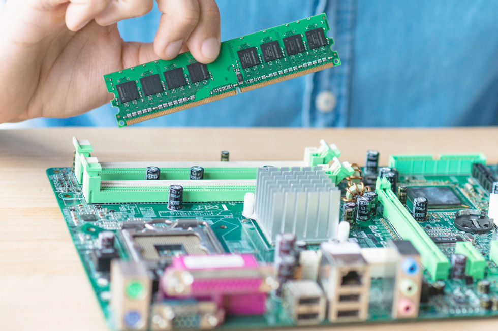
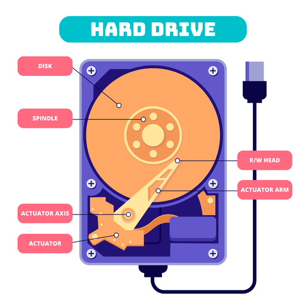
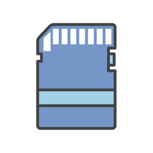

# Computer Basics: Computer Data Storage Devices

Connect with me: [Youtube](https://www.youtube.com/yasirbhutta) | [LinkedIn](https://www.linkedin.com/in/yasirbhutta/) | [WhatsApp Channel](https://whatsapp.com/channel/0029VaC3BC160eBZZSs3CW0c) | [Web](https://yasirbhutta.github.io/) | [Facebook](https://www.facebook.com/yasirbhutta786) | [Twitter](https://twitter.com/yasirbhutta)

- [Download PDF](https://yasirbhutta.github.io/computer-basics/docs/storage-devices.pdf)
- To access the updated handouts, please click on the following link:
[https://yasirbhutta.github.io/computer-basics/docs/storage-devices.html](https://yasirbhutta.github.io/computer-basics/docs/storage-devices.html)

## Data Storage Device

- A data storage device is a device for storing information (data).

**Computer data Storage:** Capability of the computer to remember data is called computer data storage or memory.

## Hierarchy of storage

- Primary Storage
- Secondary Storage

### Primary storage

#### Random Access Memory(RAM)

- It is also called main memory or Direct Access Memory.
- A program must be loaded into RAM before execution.
- It is the only one directly accessible to the CPU. CPU continuously reads instructions stored there and executes them.
- RAM is a volatile memory as the information or instructions stored in it will be lost if the power is switched off.
RAM

Image by [Freepik](https://www.freepik.com/free-photo/it-person-repairing-hardware-equipment-s_2944515.htm#query=ram%20primary%20memory&position=11&from_view=search&track=ais&uuid=e289623e-4318-4d74-a39d-29b1694c1ccd)

#### Processor Cache & Register

there are two more sub-layers of the primary storage, besides main large-capacity RAM:

**Processor Register:** are located inside the processor. Each register typically holds a word of data (often 32 or 64 bits). Registers are technically among the fastest of all forms of computer data storage.

**Processor Cache:** is an intermediate stage between ultra-fast registers and much slower main memory. The data and instructions that are most recently or most frequently used by CPU are stored in cache.

Image by [Pixabay](https://www.pexels.com/photo/pen-technology-computer-pc-40879/)

### Secondary Storage

- Secondary memory (or secondary storage) is the slowest and cheapest form from primary memory.
- It cannot be processed directly by the CPU. It must first be copied into primary storage (also known as RAM).
- Secondary memory devices include magnetic disks like hard disks and floppy disks ; optical disks such as CDROMs and DVD; and magnetic tapes.
  
**Reason To USE Storage Devices:**

- The main memory of a computer system is not permanent. This means that data and programs lost when computer is shut down or power is turned off.
- The main memory of computer has limited storage capacity.

**Imp. Functions of Storage Devices:**

- `Reading:` The process of copying data, instructions or information from storage medium to memory is called reading.
- `Writing:` The process of copying data, instructions or information from memory to storage medium is called writing.

#### Magnetic storage devices

- use `magnetic fields` to store data. These devices include hard disk drives (HDDs) and floppy disks.

##### Hard disk drives (HDDs)

- Hard disk is a type of magnetic disk.
- Several circular disks are coated with a magnetic material.
- Mostly fixed inside the system unit.
- Provides large capacity (250GB, 320GB, 500GB ,750GB, 1TB, 2TB and more.)
- It is primary media for storing data and programs.

Image by [Freepik]("https://www.freepik.com/free-vector/flat-design-hard-drive-illustration_25560978.htm">Freepik)

**See also:**

- [Magnetic storage - Wikipedia](https://en.wikipedia.org/wiki/Magnetic_storage)

#### Floppy Disk

- Floppy disks are a less common type of storage device
- It is magnetic disc medium.
- The capacity of floppy disks is 1.44 MB.
- They are used for copying or carrying data from one machine to the other.
- Floppies are commonly found in two sizes namely 5.1/4“ and 3.5”

Image by [Ivan Radic, CC BY 2.0 <https://creativecommons.org/licenses/by/2.0>, via Wikimedia Commons](https://commons.wikimedia.org/wiki/File:Floppy_disk_(back).jpg)

#### Flash memory devices

Flash memory devices use `electronic circuits` to store data. These devices include USB flash drives, solid-state drives (SSDs), and SD cards.

##### solid-state drive (SSD)

- A solid-state drive (SSD) is a new generation of storage device that replaces a traditional hard disk drive (HDD).
- SSDs use flash memory, which is much faster than the magnetic platters used in HDDs.
- This makes SSDs ideal for applications that require fast access to data, such as operating systems, applications, and games.

Image by Jacek Halicki, CC BY-SA 4.0 <https://creativecommons.org/licenses/by-sa/4.0>, via Wikimedia Commons
  
SSDs also have a number of other advantages over HDDs, including:

- They are more resistant to shocks and vibrations.
- They have a longer lifespan than HDDs.
- They are silent in operation.

As a result of these advantages, SSDs are becoming increasingly popular for use in laptops, desktops, and even servers.

Here are some of the things you can do with an SSD:

- Speed up your computer's boot time.
- Improve the performance of your applications.
- Make your computer more responsive.
- Increase the lifespan of your computer.
- Reduce noise pollution.

##### USB flash drive

- USB flash drives are small and portable, and they can be used to store a variety of data, including documents, photos, and music.
- Storage capacities can range from 8 GB to 2 TB with steady improvements in size and price per capacity.

Image by Freepik

##### SD cards

SD cards are a type of flash memory card that is used in digital cameras and other devices.

Image by [rawpixel.com](https://www.freepik.com/free-vector/chip_2921376.htm#query=sd%20card&position=4&from_view=search&track=ais&uuid=e68beed9-6211-4599-b0c9-0cd2bbb9d538) on Freepik

#### Optical storage devices

- Optical storage devices use `lasers` to store data.
- Optical storage devices are relatively `inexpensive` and `portable`.

Optical Disk uses laser technology to read and write data.

**Categories:**

- CDs
- DVDs
- Blu-ray Discs (BDs)

##### Compact Discs (CD)

- CDs are the oldest type of optical storage device and have a capacity of up to 700MB.
  
**Types:**
`CD-ROM:` Compact disk with read only memory
`CD-W:` Compact disk for write once and read many times(WORM).  It then becomes a read only disk.
`CD-RW:` Compact disk which you may read and rewrite many times.

##### Digital Video Disk(DVD)

- DVDs are of the same dimensions as compact discs (CDs), but store more than six times as much data. Allows up to 17 gigabytes of storage (from 4.7 GB to 17 GB).

**Types:*

`DVD ROM:` Digital Video Disk which is read only.
`DVD-W:` Digital Video Disk which can be written to one time.  It then becomes read only.
`DVD-RW:` Digital Video Disk which can be rewritten many time.

##### Blu-ray Discs (BDs)

-BDs have a capacity of up to 128GB.

## True/False (Mark T for True and F for False)

## Multiple Choice (Select the best answer)

## Exercises

## Review Questions

## References and Bibliography
