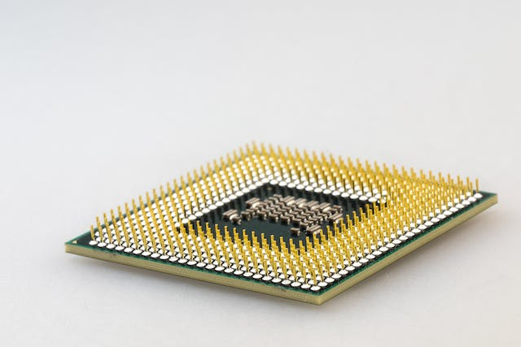
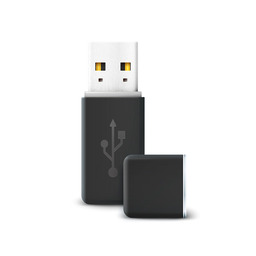

# Computer Basics: Computer Data Storage Devices

Connect with me: [Youtube](https://www.youtube.com/yasirbhutta) \| [LinkedIn](https://www.linkedin.com/in/yasirbhutta/) \| [WhatsApp Channel](https://whatsapp.com/channel/0029VaC3BC160eBZZSs3CW0c) \| [Web](https://yasirbhutta.github.io/) \| [Facebook](https://www.facebook.com/yasirbhutta786) \| [Twitter](https://twitter.com/yasirbhutta)

- [Download PDF](https://yasirbhutta.github.io/computer-basics/docs/storage-devices.pdf)
- To access the updated handouts, please click on the following link:
[https://yasirbhutta.github.io/computer-basics/docs/storage-devices.html](https://yasirbhutta.github.io/computer-basics/docs/storage-devices.html)

- [Computer Basics: Computer Data Storage Devices](#computer-basics-computer-data-storage-devices)
  - [Data Storage Device](#data-storage-device)
  - [Hierarchy of storage](#hierarchy-of-storage)
    - [Primary storage](#primary-storage)
      - [Random Access Memory(RAM)](#random-access-memoryram)
      - [Processor Cache \& Register](#processor-cache--register)
    - [Secondary Storage](#secondary-storage)
      - [Magnetic storage devices](#magnetic-storage-devices)
        - [Hard disk drives (HDDs)](#hard-disk-drives-hdds)
        - [Floppy Disk](#floppy-disk)
      - [Flash memory devices](#flash-memory-devices)
        - [solid-state drive (SSD)](#solid-state-drive-ssd)
        - [USB flash drive](#usb-flash-drive)
        - [SD cards](#sd-cards)
      - [Optical storage devices](#optical-storage-devices)
        - [Compact Discs (CD)](#compact-discs-cd)
        - [Digital Video Disk(DVD)](#digital-video-diskdvd)
        - [Blu-ray Discs (BDs)](#blu-ray-discs-bds)
  - [Additional topics](#additional-topics)
  - [Flash memory](#flash-memory)
  - [True/False (Mark T for True and F for False)](#truefalse-mark-t-for-true-and-f-for-false)
  - [Multiple Choice (Select the best answer)](#multiple-choice-select-the-best-answer)
  - [Exercises](#exercises)
  - [Review Questions](#review-questions)
  - [References and Bibliography](#references-and-bibliography)

## Data Storage Device

- A data storage device is a device for storing information (data).

**Computer data Storage:** Capability of the computer to remember data is called computer data storage or memory.

## Hierarchy of storage

- Primary Storage
- Secondary Storage

### Primary storage

#### Random Access Memory(RAM)

- It is also called main memory or Direct Access Memory.
- A program must be loaded into RAM before execution.
- It is the only one directly accessible to the CPU. CPU continuously reads instructions stored there and executes them.
- RAM is a volatile memory as the information or instructions stored in it will be lost if the power is switched off.
RAM

Image by [Freepik](https://www.freepik.com/free-photo/it-person-repairing-hardware-equipment-s_2944515.htm#query=ram%20primary%20memory&position=11&from_view=search&track=ais&uuid=e289623e-4318-4d74-a39d-29b1694c1ccd)

#### Processor Cache & Register

there are two more sub-layers of the primary storage, besides main large-capacity RAM:

**Processor Register:** are located inside the processor. Each register typically holds a word of data (often 32 or 64 bits). Registers are technically among the fastest of all forms of computer data storage.

**Processor Cache:** is an intermediate stage between ultra-fast registers and much slower main memory. The data and instructions that are most recently or most frequently used by CPU are stored in cache.

Image by [Pixabay](https://www.pexels.com/photo/pen-technology-computer-pc-40879/)

### Secondary Storage

- Secondary memory (or secondary storage) is the slowest and cheapest form from primary memory.
- It cannot be processed directly by the CPU. It must first be copied into primary storage (also known as RAM).
- Secondary memory devices include magnetic disks like hard disks and floppy disks ; optical disks such as CDROMs and DVD; and magnetic tapes.
  
**Reason To USE Storage Devices:**

- The main memory of a computer system is not permanent. This means that data and programs lost when computer is shut down or power is turned off.
- The main memory of computer has limited storage capacity.

**Imp. Functions of Storage Devices:**

- `Reading:` The process of copying data, instructions or information from storage medium to memory is called reading.
- `Writing:` The process of copying data, instructions or information from memory to storage medium is called writing.

#### Magnetic storage devices

- use `magnetic fields` to store data. These devices include hard disk drives (HDDs) and floppy disks.

##### Hard disk drives (HDDs)

- Hard disk is a type of magnetic disk.
- Several circular disks are coated with a magnetic material.
- Mostly fixed inside the system unit.
- Provides large capacity (250GB, 320GB, 500GB ,750GB, 1TB, 2TB and more.)
- It is primary media for storing data and programs.

Image by [Freepik]("https://www.freepik.com/free-vector/flat-design-hard-drive-illustration_25560978.htm">Freepik)

**See also:**

- [Magnetic storage - Wikipedia](https://en.wikipedia.org/wiki/Magnetic_storage)

##### Floppy Disk

- Floppy disks are a less common type of storage device
- It is magnetic disc medium.
- The capacity of floppy disks is 1.44 MB.
- They are used for copying or carrying data from one machine to the other.
- Floppies are commonly found in two sizes namely 5.1/4“ and 3.5”

Image by [Ivan Radic, CC BY 2.0 <https://creativecommons.org/licenses/by/2.0>, via Wikimedia Commons](https://commons.wikimedia.org/wiki/File:Floppy_disk_(back).jpg)

#### Flash memory devices

Flash memory devices use `electronic circuits` to store data. These devices include USB flash drives, solid-state drives (SSDs), and SD cards.

##### solid-state drive (SSD)

- A solid-state drive (SSD) is a new generation of storage device that replaces a traditional hard disk drive (HDD).
- SSDs use flash memory, which is much faster than the magnetic platters used in HDDs.
- This makes SSDs ideal for applications that require fast access to data, such as operating systems, applications, and games.

Image by Jacek Halicki, CC BY-SA 4.0 <https://creativecommons.org/licenses/by-sa/4.0>, via Wikimedia Commons
  
SSDs also have a number of other advantages over HDDs, including:

- They are more resistant to shocks and vibrations.
- They have a longer lifespan than HDDs.
- They are silent in operation.

As a result of these advantages, SSDs are becoming increasingly popular for use in laptops, desktops, and even servers.

Here are some of the things you can do with an SSD:

- Speed up your computer's boot time.
- Improve the performance of your applications.
- Make your computer more responsive.
- Increase the lifespan of your computer.
- Reduce noise pollution.

##### USB flash drive

- USB flash drives are small and portable, and they can be used to store a variety of data, including documents, photos, and music.
- Storage capacities can range from 8 GB to 2 TB with steady improvements in size and price per capacity.

Image by Freepik

##### SD cards

SD cards are a type of flash memory card that is used in digital cameras and other devices.

Image by [rawpixel.com](https://www.freepik.com/free-vector/chip_2921376.htm#query=sd%20card&position=4&from_view=search&track=ais&uuid=e68beed9-6211-4599-b0c9-0cd2bbb9d538) on Freepik

#### Optical storage devices

- Optical storage devices use `lasers` to store data.
- Optical storage devices are relatively `inexpensive` and `portable`.

Optical Disk uses laser technology to read and write data.

**Categories:**

- CDs
- DVDs
- Blu-ray Discs (BDs)

##### Compact Discs (CD)

- CDs are the oldest type of optical storage device and have a capacity of up to 700MB.
  
**Types:**

- `CD-ROM:` Compact disk with read only memory
- `CD-W:` Compact disk for write once and read many times(WORM).  It then becomes a read only disk.
- `CD-RW:` Compact disk which you may read and rewrite many times.

##### Digital Video Disk(DVD)

- The DVD (common abbreviation for Digital Video Disc or Digital Versatile Disc)
- DVDs are of the same dimensions as compact discs (CDs), but store more than six times as much data. Allows up to 17 gigabytes of storage (from 4.7 GB to 17 GB).

**Types:**

- `DVD ROM:` Digital Video Disk which is read only.
- `DVD-W:` Digital Video Disk which can be written to one time.  It then becomes read only.
- `DVD-RW:` Digital Video Disk which can be rewritten many time.

##### Blu-ray Discs (BDs)

-BDs have a capacity of up to 128GB.

## Additional topics

## Flash memory

Flash memory is a type of computer storage that combines the best of two worlds:

- **Non-volatile:** Like a hard drive, it retains data even when the power is off. This makes it ideal for storing important files, documents, and programs.
- **Rewritable:** Unlike a hard drive, you can erase and rewrite data on flash memory multiple times. This makes it useful for portable devices like USB drives and memory cards, where you frequently add, remove, or update files.

**How it works:**

* **Flash memory chips** are made up of tiny cells that store data using electrical charges.
* These cells use transistors called **floating-gate transistors**.
* The amount of charge in the floating gate determines whether a bit is stored as 0 or 1.

There are two main types of flash memory:

- **NAND flash:** This is the most common type, found in USB drives, memory cards, and solid-state drives (SSDs). It's faster for writing large amounts of data but has a limited number of erase cycles.
- **NOR flash:** This type is less common but offers faster read speeds and more erase cycles. It's often used for storing code that needs to be accessed quickly, such as the BIOS in a computer.

Here are some of the advantages of flash memory:

- **Portable:**  Due to its small size and lightweight design, it's perfect for mobile devices.
- **Durable:** Flash memory is more resistant to physical shock and vibration compared to hard drives.
- **Fast:** Flash memory can read and write data much faster than traditional hard drives.
- **Low power consumption:** Flash memory uses less power than hard drives, making it ideal for laptops and other battery-powered devices.

Overall, flash memory is a versatile and reliable storage solution for various electronic devices.

## True/False (Mark T for True and F for False)

1. Processor registers are the fastest form of computer storage. 
2. The CPU can directly access data stored in secondary storage. 
3. Secondary storage devices are more expensive than primary storage devices. 
4. Optical disks, like CDs and DVDs, can only be read, not written to. 
5. Solid-state drives (SSDs) are faster than traditional hard disk drives (HDDs). 
6. The main reason to use secondary storage devices is for permanent data storage. 
7. The acronym RAM stands for Random Access Memory. 
8. The acronym HDD stands for Hard Disk Drive. 
9. The acronym SSD stands for Solid-State Drive. 
10. The acronym CD-ROM stands for Compact Disc Read-Only Memory. 
11. The acronym DVD stands for Digital Video Disc. 

**Answer Key (True/False):**

1. True
2. False
3. True
4. False
5. True
6. True
7. True
8. True
9. True
10. True
11. True

## Multiple Choice (Select the best answer)

> Which of the following is NOT a secondary storage device?

1. [ ] Hard disk drive (HDD)
2. [ ] Solid-state drive (SSD)
3. [ ] Random Access Memory (RAM)
4. [ ] Floppy disk

> What is the main reason to use storage devices?

1. [ ] To increase the processing power of the CPU
2. [ ] To make computers more portable
3. [ ] To store data and programs permanently
4. [ ] To connect to the internet

> What is the capacity of a typical CD?

1. [ ] 8 GB to 2 TB
2. [ ] 1.44 MB
3. [ ] Up to 700MB
4. [ ] Up to 128GB

> Which of the following is NOT a type of optical storage device?

1. [ ] CD
2. [ ] DVD
3. [ ] Blu-ray Disc
4. [ ] Hard disk drive

> Which type of storage is directly accessible by the CPU and volatile, meaning information is lost when powered off?

1. [ ] Hard Disk Drive (HDD)
2. [ ] Solid-State Drive (SSD)
3. [ ] Random Access Memory (RAM)
4. [ ] Optical Disc

> What is the main purpose of secondary storage?

1. [ ] Provide temporary storage for actively used data and instructions
2. [ ] Hold large amounts of data permanently, even when the computer is off
3. [ ] Enhance the processing power of the CPU
4. [ ] Connect to the internet

> Which secondary storage device offers the fastest access speeds?

1. [ ] Hard Disk Drive (HDD)
2. [ ] Solid-State Drive (SSD)
3. [ ] USB Flash Drive
4. [ ] Optical Disc

> What are some factors to consider when choosing between RAM and SSD for your computer?

1. [ ] Cost, data access speed, storage capacity, and portability
2. [ ] Brand of the device, size of the computer case, and operating system used
3. [ ] Color of the device and whether it comes with a carrying case
4. [ ] None of the above

## Exercises

## Review Questions

- Explain the difference between primary and secondary storage.
- What are the advantages and disadvantages of using HDDs?
- Describe the different types of optical storage devices and their capacities.
- How has flash memory technology changed the way we store data?
- What is RAM (Random Access Memory)?
- What is an SSD?
- What are the advantages of SSDs over HDDs?
- What is SSD and Discuss the advantages of SSDs compared to Hard Disk Drives (HDDs) for use in personal computers.
- What is the difference between primary and secondary storage?
- Give examples of primary and secondary storage devices?
- What is the main purpose of secondary storage devices?
- Explain the function of optical storage devices in computer systems.
- What factors contribute to the increasing popularity of SSDs over HDDs?
- Differentiate between primary and secondary storage, providing examples of each type and their respective functions in a computer system.
- Explain the concept of optical storage devices and their utilization in computer systems. Provide examples and describe their capacities.
- How does flash memory technology revolutionize data storage compared to traditional magnetic storage? Discuss the benefits and applications of flash memory devices such as USB flash drives and solid-state drives (SSDs).

## References and Bibliography

Computer Basics: Computer Data Storage Devices. https://github.com/topics/data-storage
