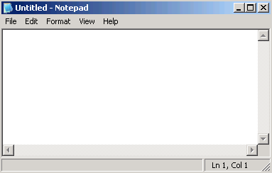

# Review Questions

## Computer Basics

1. What is a computer?
1. Write the shortcut keys for the following commands?
    - Copy
    - Paste
    - Cut
    - Undo
1. Explain the difference between the followings:
    - Copy and Move
1. How many bits are there in a byte?

### Hardware

1. What is a computer hardware?
1. Write note on secondary data storage devices?
1. Can you explain what a motherboard is and its components?
1. What is CPU and explain its different components?
1. Why we use input and output devices and explain the purpose of different input devices(at least 6)?
1. What is a USB port used for?
1. Why does my computer say “No boot device found” when I turn it on?
1. What’s the difference between primary storage and secondary storage?
1. What is the concept of cache memory?
1. Where does software get loaded into before being executed by the CPU?

### Software

1. Define Application Software and System Software? Enlist 10 application software’s.

### Operating Systems/Windows

1. What is the role of the operating system in a computer?
1. What is Desktop?
2. What is the difference between Folders and Files?
3. Write the procedure for creating new folder?
4. What is File Extension? Gives at least 3 examples of file extensions?
5. Write the name of different part of the following window?

1. What is Recycle Bin? Write the procedure for emptying it and restoring files from it?
1. What is screen saver? Write the steps to set screen saver.
1. Write any two methods for renaming a file or folder?
1. What is shortcut? Write the procedure for creating shortcut?

