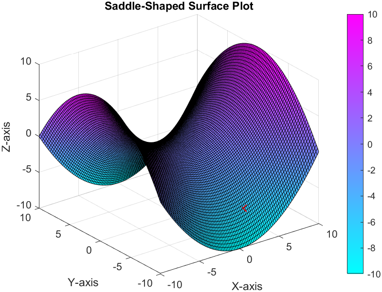

# [MATLAB for Beginners](https://yasirbhutta.github.io/matlab/): MATLAB Graphics

Connect with me: [Youtube](https://www.youtube.com/yasirbhutta) \| [LinkedIn](https://www.linkedin.com/in/yasirbhutta/) \| [WhatsApp Channel](https://whatsapp.com/channel/0029VaC3BC160eBZZSs3CW0c) \| [Web](https://yasirbhutta.github.io/) \| [Facebook](https://www.facebook.com/yasirbhutta786) \| [Twitter](https://twitter.com/yasirbhutta)

- [Download PDF](https://yasirbhutta.github.io/matlab/docs/graphics.pdf)
  
- To access the updated lecture notes, please click on the following link:
[https://yasirbhutta.github.io/matlab/docs/graphics.html](https://yasirbhutta.github.io/matlab/docs/graphics.html)

## 2D Plots

### Printing Labels

The xlabel() and ylabel() functions are used to label the x and y axes in a figure in MATLAB. The labels should describe the data that is being plotted on each axis.

The title() function is used to add a title to a figure in MATLAB. The title should provide a brief description of the plot.

**Example #:** Label the axes and add a title

```matlab
x = linspace(0, 10, 100);
y = sin(x);

plot(x, y);
xlabel('X-axis');
ylabel('Y-axis');
title('Sine Wave');
```

### Grid and Axex Box

The grid() function is used to add grid lines to a figure in MATLAB. Grid lines can help to make it easier to interpret the data in a plot.

### Entering Text in a Plot

**Example #:**

```matlab
years = [1990, 1995, 2000, 2005, 2010, 2015, 2020];
co2_emissions = [26.17, 26.61, 26.89, 27.46, 28.12, 29.08, 29.94]; 

plot(years,co2_emissions,"ro-");

title("Global CO2 Emissions from 1990 to 2020.");
xlabel("Years");
ylabel("CO2 Emissions (Billion metric tons per year");

grid on;
box off;

```

**See also:**

- [Video: Make Your MATLAB Plots More Informative with Titles and Axis Labels](https://youtu.be/IoTQAIWDBJk)
  
### Axis Control

he axis() function is used to set the limits of the axes in a figure in MATLAB. The axes are the horizontal and vertical lines that extend across the figure window.

### Axis Aspect Ration

### Multiple Plots

### Using plot Command

The plot() function is used to create a line plot in MATLAB. A line plot is a graphical representation of a set of data points connected by a line.

### Using hold Command

The hold function is used to prevent MATLAB from overwriting existing plots when creating new ones. By default, MATLAB overwrites existing plots when creating new ones. However, if you use the hold function before creating a new plot, MATLAB will add the new plot to the existing plot instead of overwriting it.

**Example #** Plotting multiple lines on the same graph

```matlab
x = linspace(0, 10, 100);
y1 = sin(x);
y2 = cos(x);

plot(x, y1, 'b');
hold on;
plot(x, y2, 'r');
hold off;
```

This will plot two lines on the same graph, one blue and one red. The hold on and hold off functions are used to prevent the second line from overwriting the first line.

### Using line Command

### Style Options

**Example #1:**

```matlab
x = 1:1:10;

y1 = sqrt(x.^2+1);
y2 = 2 * x + 20;
y3 = 3 * x + 3;

plot(x,y1,'r*:');
line(x,y2);
line(x,y3);
```

**Example #2:** Plotting Two Functions on the Same Graph in MATLAB

```matlab
x = 1:1:10;

y1 = sqrt(x.^2+1);
y2 = 2 * x + 20;


plot(x, y1, 'r', x, y2, 'bo');
axis([0 12 0 45]);
```

### LEGEND

The legend() function is used to create a legend for a figure in MATLAB. A legend is a key that explains which line or curve corresponds to which data set.

**Example #1:**

```matlab
% Real world data example
% Global average temperature data from NASA
% https://data.giss.nasa.gov/gistemp/graphs/

% Load the data
data = load('global_average_temperature.csv');

% Extract the years and temperatures
years = data(:, 1);
temperatures = data(:, 2);

% Create a line plot of the data
figure;
plot(years, temperatures);

% Add a legend
legend('Global average temperature');

% Set the axis labels and title
xlabel('Year');
ylabel('Temperature (°C)');
title('Global Average Temperature from 1880 to 2022');
```

### SUBPLOTS

**Example #1:** Visualizing Daily Temperature Data with Subplots in MATLAB

Download dataset `Daily Temperature (Dataset #2)` from [Datasets](../../datasets/index.md).

```matlab
% Specify the name of the CSV file
filename = 'ds2.csv';

% Read the data from the CSV file into a table variable
data = readtable(filename,'VariableNamingRule','preserve'); 

% Create the first subplot
subplot(1, 2, 1);
plot(data.dated, data.temperature);
title('Daily Temperatures');
xlabel('Date');
ylabel('Temperature (C)');

% Create the second subplot
subplot(1, 2, 2);
histogram(data.temperature);
title('Temperature Distribution');
xlabel('Temperature (C)');
ylabel('Frequency');

% Save the figure
saveas(gcf, 'daily_temperatures.png');
```

### area

### bar

**Example #1:** Plotting a bar graph

```matlab
x = categorical({'A', 'B', 'C'});
y = [10, 20, 30];

bar(x, y);
```

**Categorical Arrary:** categorical is a data type to store data with values from a finite set of discrete categories. For example, the syntax C = categorical({'R','G','B','B','G','B'}) creates a categorical array with six elements that belong to the categories R, G, or B.[^1]

Download dataset `Population by Country` from [Datasets](../../datasets/index.md).

**Example #2:** Population Distribution by Country using bar charts

```matlab
% Specify the name of the CSV file
filename = 'ds1.csv';

% Read the data from the CSV file into a table variable
data = readtable(filename,'VariableNamingRule','preserve'); 

% Convert the Country column to a categorical variable
x = categorical(data.Country);

% Generate a bar plot of the population data
bar(x,data.Population);

% Add a title and axis labels to the plot
title('Population by Country');
xlabel('Country');
ylabel('Population');
```

**See also:**

- [bar - MathWorks Help Center](https://www.mathworks.com/help/matlab/ref/bar.html)
- [Bar chart - statcan.gc.ca](https://www150.statcan.gc.ca/n1/edu/power-pouvoir/ch9/bargraph-diagrammeabarres/5214818-eng.htm)

### barh

**See also:**

### histogram

A histogram is a data visualization tool that shows the frequency distribution of numerical data. It is a type of bar graph that displays the number of data points that fall within each of a series of intervals called bins. The bins are usually specified as consecutive, non-overlapping intervals of a variable. The height of each bar in the histogram represents the number of data points that fall within that bin.


Image Source: [https://www150.statcan.gc.ca/n1/edu/power-pouvoir/ch9/histo/5214822-eng.htm](https://www150.statcan.gc.ca/n1/edu/power-pouvoir/ch9/histo/5214822-eng.htm)

Histograms are useful for visualizing the distribution of data, such as the distribution of heights of students in a class, the distribution of test scores, or the distribution of the time it takes to complete a task. They can also be used to compare the distributions of two or more datasets.

Here are some of the key features of a histogram:

- The bins are evenly spaced on the horizontal axis.
- The height of each bar is proportional to the number of data points in the corresponding bin.
- The total area of all the bars is equal to the total number of data points.
- The histogram does not show the individual data points.

**Example #1:** Plotting a histogram

```matlab
x = randn(1000, 1);
histogram(x);
```

**See also:**

- [histogram - MathWorks Help Center](https://www.mathworks.com/help/matlab/ref/matlab.graphics.chart.primitive.histogram.html)
- [Replace Discouraged Instances of hist and histc = Mathworks Help Center](https://www.mathworks.com/help/matlab/creating_plots/replace-discouraged-instances-of-hist-and-histc.html)

### rose

### pie

**Example #:1** Plotting a pie chart

```matlab
X = [10 20 30];

pie(X);
```

This will plot a pie chart with three slices, one for each value in the vector X. The size of each slice represents the proportion of that value to the total.

**Example #2** Visualizing Fruit Sales Distribution with Exploded Pie Chart

```matlab
% Define the fruit names and sales figures
fruit_names = ["Apples", "Oranges", "Bananas", "Grapes", "Strawberries"];
sales_figures = [120, 90, 150, 80, 60];

% Define the explode vector to offset the "Bananas" slice
explode = [0 0 1 0 0];

% Create the pie chart and label the slices
pie(sales_figures, explode, fruit_names);

% Set the title of the pie chart
title('Fruit Sales Pie Chart');
```

**See also:**

- [Video: Visualizing Fruit Sales Distribution with Exploded Pie Chart](https://youtu.be/5X5gelyCgr4?si=mLjZtwFRrdv7pEhG)

## 3D Plots

### plot3

### bar3

**Example #1** Create 3-D Bar Graph from Vector Data

```matlab
% Create a vector of values to plot.
z = [50 40 30 20 10];

% Plot the 3-D bar graph.
bar3(z);

% Set the axes labels.
xlabel('X Axis');
ylabel('Y Axis');
zlabel('Z Axis');

% Set the title.
title('My 3-D Bar Graph');
```

**See also:**

- [bar3 - MathWorks Help Center](https://www.mathworks.com/help/matlab/ref/bar3.html)

### bar3h

### pie3

**See also:**

- [pie3 - MathWorks Help Center](https://www.mathworks.com/help/matlab/ref/pie3.html)


### meshgrid

In MATLAB, the meshgrid function is used `to create two matrices from two vectors`. Each element of the first matrix represents one value from the first vector, and each element of the second matrix represents one value from the second vector. This is useful for `creating grids of data points`, which can then be used for plotting or other calculations.

**Example #1:**

```matlab
x = linspace(1,3,3);
y = linspace(2,10,5);
[X,Y] = meshgrid(x,y);
disp(X);
disp(Y);
```

**Explanation:**

1. linspace(1,3,3): This line creates a vector x with 3 equally spaced elements between 1 and 3 (inclusive). So, x = [1 2 3].
2. linspace(2,10,5): This line creates a vector y with 5 equally spaced elements between 2 and 10 (inclusive). So, y = [2 4 6 8 10].
3. [X,Y] = meshgrid(x,y): This line uses the meshgrid function to create two matrices X and Y from the vectors x and y.
   - Each element of X is a copy of the vector x. The number of rows in X is equal to the length of y (5), and the number of columns in X is equal to the length of x (3).
   - Each element of Y is a copy of the vector y. The number of rows in Y is equal to the length of y (5), and the number of columns in Y is equal to the length of x (3).

**Output:**

```output
X =

   1   2   3
   1   2   3
   1   2   3
   1   2   3
   1   2   3

Y =

   2   2   2
   4   4   4
   6   6   6
   8   8   8
  10  10  10
```

**Application of meshgrid:**

- Plotting surfaces: mesh(X,Y,Z) where Z is a function of X and Y

Calculus: In calculus, particularly in multivariable calculus, the concept of a surface is used when dealing with functions of two variables. The graph of a function of two variables (such as z = f(x, y)) can be thought of as a surface in three-dimensional space.

### mesh

**Example #1:**

```matlab
x = -3:0.1:3;
y = x;
[X,Y] = meshgrid(x);

F = X.^2 + Y.^3;
mesh(X,Y,F);
```

**Example #2:**

```matlab
x = linspace(0,10,20);
y = linspace(-5,5,30);

[X,Y] = meshgrid(x,y);

% Example function: Z = sin(x)*cos(y)
Z = sin(X).*cos(Y);

% Plot the mesh using the generated X, Y, and Z matrices
mesh(X, Y, Z);

% Customize the plot with labels, title, and colormap
xlabel('X');
ylabel('Y');
zlabel('Z');
title('Mesh Plot of sin(x)*cos(y)');
colormap('jet');
```
**colormap('jet'):** Set the colormap to 'jet' for a visually appealing gradient.

**Example #3:** Plot quadric surface with the equation yz=1

```matlab

% Define the grid
[x, y] = meshgrid(-10:0.1:10, -10:0.1:10);

% Define the height of the surface
z = 1./y;

% Create the surface plot
mesh(x, y, z);

% Set axis labels
xlabel('X-axis');
ylabel('Y-axis');
zlabel('Z-axis');

% Set the view for better visualization
view(45, 30);

% Title of the plot
title('Quadric Surface: yz = 1');

% Set color map
colormap("cool");

% Display a colorbar
colorbar;

```

**See also:**

- [mash - MathWorks Help Center](https://www.mathworks.com/help/matlab/ref/mesh.html)
- [colormap - MathWorks Help Center](https://www.mathworks.com/help/matlab/ref/colormap.html)

### surf

**Example #1:**

```matlab
x = -3:0.1:3;
y = x;
[X,Y] = meshgrid(x);

F = X.^2 + Y.^3;
surf(X,Y,F);
```
**Example #2:**

```matlab
x = -3:0.1:3;
y = x;
[X,Y] = meshgrid(x);

F=sqrt(X.^2 + Y.^2)
surf(X,Y,F);
```
**Example #3:** 3D Surface Plot with Gaussian Function

```matlab
% Create a grid of x and y values
[x, y] = meshgrid(-5:0.1:5, -5:0.1:5);

% Define a function for the surface (example: a 3D Gaussian)
z = exp(-(x.^2 + y.^2) / 5) .* sin(x) .* cos(y);

% Create the surf plot
figure;
surf(x, y, z);

% Customize the plot
title('3D Surface Plot with Gaussian Function');
xlabel('X-axis');
ylabel('Y-axis');
zlabel('Z-axis');
colormap('parula'); % You can change the colormap
colorbar; % Display colorbar

% Optionally, add additional features like grid and rotate the plot
grid on;
rotate3d on;
```

**Example #4:** Saddle-Shaped Surface Plot

```matlab
x = -10:0.2:10;
y = x;
% Define a grid of X and Y values
[X, Y] = meshgrid(x);

% Define a function for the surface (e.g., a saddle-shaped surface)
Z = 0.1 * (X.^2 - Y.^2);

% Create a 3D surface plot
surf(X, Y, Z);

% Add labels and a title
xlabel('X-axis');
ylabel('Y-axis');
zlabel('Z-axis');
title('Saddle-Shaped Surface Plot');

% Display a color bar and change the color.
colorbar;
colormap("cool");
```

**Output:**



**Example #5:** 3D surface plot of the cone

```matlab
x = -10:0.2:10;
y = x;

% Define a matrix of X and Y values
[X, Y] = meshgrid(x);

% Define the surface function for a cone
Z = sqrt(X.^2 + Y.^2);

% Create a 3D surface plot of the cone
surf(X, Y, Z);

% Add labels and a title
xlabel('X-axis');
ylabel('Y-axis');
zlabel('Z-axis');
title('Cone Surface Plot');

% Display a color bar and change the color.
colorbar;
colormap("cool");
```

**Example #6:** Create a 3D surface plot of the hyperboloid

```matlab
x = -10:0.2:10;
y = x;

% Define a matrix of X and Y values
[X, Y] = meshgrid(x);

% Define the surface function for a hyperboloid
Z = X.^2 + Y.^2 - 1;

% Create a 3D surface plot of the hyperboloid
surf(X, Y, Z);

% Add labels and a title
xlabel('X-axis');
ylabel('Y-axis');
zlabel('Z-axis');
title('Hyperboloid Surface Plot');

% Display a color bar and change the color.
colorbar;
colormap("cool");
```

**Example #7:** 3D Cone Using surf and meshgrid

This method involves creating two matrices, one for the radius of the cone at different heights and another for the angle. Then, you use meshgrid to combine these matrices into 3D grids and use surf to plot the surface.

```matlab
r = linspace(0, 1, 50);
th = linspace(0, 2*pi, 50);
[theta,z] = meshgrid(th,r);
radius = 1 - z;
x = radius .* cos(theta);
y = radius .* sin(theta);

surf(x, y, z);

title("3D cones");
xlabel("x axis");
ylabel("y axis");
zlabel("z axis")
```

**See also:**

- [surf - MathWorks Help Center](https://www.mathworks.com/help/matlab/ref/surf.html)

## Additional Topics

### contour and contour3

**Example #**

```matlab
[X,Y] = meshgrid(-2:.2:2,-2:.2:3);
Z = X.*exp(-X.^2-Y.^2);

contour(X,Y,Z);
colormap jet;
```

**Example #**

```matlab
[X,Y] = meshgrid([-2:.25:2]);
Z = X.*exp(-X.^2-Y.^2);
contour3(X,Y,Z,30)
surf(X,Y,Z)

view(-15,25);
colormap cool;
```

### Quadric Surface

**Example #** Plot quadric surface with the equation x^2 + 4*y^2

```matlab
% Generate meshgrid
[X, Y] = meshgrid(-2:0.1:2, -1:0.1:1);

% Calculate z values based on the function
Z = X.^2 + 4*Y.^2;

% Create the surface plot
surf(X, Y, Z);

% Set axis labels and title
xlabel('X');
ylabel('Y');
zlabel('Z');

title('Quadric Surface: x^2 + 4*y^2');

% Adjust lighting and shading for better visualization
lighting gouraud;
shading interp;

% Rotate the plot for a better view (optional)
view(45, 20);
```

## Plotting a cylinder

```matlab
% Define the cylinder parameters
[X, Y, Z] = cylinder(50, 20);

% Create surface plot
surf(X, Y, Z);
```

This code will create a cylinder with a height of 20 and a radius of 50. The cylinder function generates a 3D array of points that represent the surface of the cylinder. The surf function then plots the surface using these points.

**See also:**

- [sphere - MathWorks Help Center](https://www.mathworks.com/help/matlab/ref/sphere.html)

## True/False (Mark T for True and F for False)

- The MATLAB plot function plots data points as connected line segments. **True**
- The MATLAB bar function plots the relationship between two variables.  **False**
- The xlabel() and ylabel() functions are used to label the X-axis and Y-axis of the current plot, respectively. **True**.
- The clf() function clears the current plot. **True**
- The xlabel, ylabel, and title functions in MATLAB are used to add labels to a plot. **True**
- You can customize the appearance of a plot in MATLAB by specifying various properties like line color, line style, and marker type. **True**

## Multiple Choice (Select the best answer)

> Which of the following functions is used to create a plot of a line?

1. [x] plot()
2. [ ] stem()
3. [ ] bar()
4. [ ] pie()

> Which of the following functions is used to create a plot of a bar graph?

1. [ ] plot()
2. [ ] stem()
3. [x] bar()
4. [ ] pie()

> Which of the following functions is used to create a plot of a pie chart?

1. [ ] plot()
2. [ ] stem()
3. [ ] bar()
4. [x] pie()

> Which of the following is NOT a valid MATLAB graphics command?

1. [ ] plot()
2. [ ] subplot()
3. [x] log1pp()
4. [ ] title()

> What is the purpose of the title() function?

1. [ ] To label the axes of a plot
2. [ ] To create a new figure window
3. [x] To add a title to a plot
4. [ ] To change the color of a plot

> How can you create a subplot in MATLAB?

1. [x] Use the subplot() function.
2. [ ] Use the figure() function.
3. [ ] Use the plot() function.
4. [ ] Use the title() function.

> What is the difference between a bar plot and a histogram?

1. [x] A bar plot is used to compare categorical data, while a histogram is used to visualize continuous data.
2. [ ] A bar plot is used to represent frequencies, while a histogram is used to represent probabilities.
3. [ ] A bar plot is used to show the distribution of data, while a histogram is used to compare means.
4. [ ] A bar histogram is used to show the relationship between two variables, while a plot is used to show the distribution of a single variable.

> Which of the following is NOT a valid MATLAB graphics function?

1. [ ] plot()
2. [ ] bar()
3. [ ] pie()
4. [x] histrogram()
5. [ ] stem()

> Which of the following is the correct syntax for plotting a line graph of the function y = x^2?

1. [ ] plot(x, y=x^2)
2. [x] plot(x, x.^2)
3. [ ] plot(y, x^2)
4. [ ] plot(x^2, y)
5. [ ] plot(y^2, x)

> What is the purpose of the legend() function?

1. [ ] To label the x-axis of a graph
2. [ ] To label the y-axis of a graph
3. [ ] To add a title to a graph
4. [x] To add a legend to a graph
5. [ ] To change the color of a line on a graph

> What is the purpose of the xlabel() and ylabel() functions?

1. [x] To label the x-axis of a graph
2. [x] To label the y-axis of a graph
3. [ ] To add a title to a graph
4. [ ] To add a legend to a graph
5. [ ] To change the color of a line on a graph

> Which of the following commands would you use to change the title of the current figure to 'My Figure'?

1. [x] title('My Figure')
2. [ ] sets(gcf, 'Title', 'My Figure')
3. [ ] title(figure, 'My Figure')
4. [ ] sets(figure, 'Title', 'My Figure')

> What is the command to create a 2-D line plot of x and y vectors in MATLAB?

1. [x] plot(x,y)
2. [ ] line(x,y)
3. [ ] graph(x,y)
4. [ ] draw(x,y)

> What is the command to create a pie chart of a vector x in MATLAB? 

1. [ ] pie(x)
2. [ ] pie3(x)
3. [ ] piechart(x)
4. [x] pie(x) and pie3(x)

> Which MATLAB function is used to label the axes of a figure?

1. [ ] title()
2. [ ] legend()
3. [x] xlabel()
4. [x] ylabel()

> What is the command to show the box outline around the axes in MATLAB?

1. [ ] box off
2. [ ] box show
3. [x] box on
4. [ ] box hide

> What is the command to show the grid in a MATLAB figure?

1. [ ] box on
2. [x] grid on
3. [ ] grid off
4. [ ] box show
5. [ ] box hide

> Which MATLAB function is used to add text to a plot?

1. [x] text()
2. [ ] label()
3. [ ] title()
4. [ ] legend()

> How can you change the font color of the text in a plot?

1. [x] Use the color property of the text() function.
2. [ ] Use the Color property of the current axes.
3. [ ] Use the Color property of the figure window.
4. [ ] Use the Color property of the current figure.

**Code snippet:**

```matlab
x = 1:10;
y = 1:10;
plot(x, y);
text(6, 5, 'string', 'color', 'red');
```

> How can you position text relative to a specific data point in a plot?

1. [x] Use the x and y coordinates of the data point.
2. [ ] Use the DataPoints property of the text() function.
3. [ ] Use the handle property of the data point object.
4. [ ] Use the Position property of the text object.

> What is the primary purpose of the `hold` function in MATLAB plotting?

1. [ ] To clear the current plot window
2. [ ] To temporarily pause the execution of a plot command
3. [x] To prevent subsequent plot commands from overwriting existing plots
4. [ ] To adjust the scaling of the plot axes

> Which of the following statements correctly describes the behavior of the `hold` function when used in conjunction with the plot function?

1. [ ] The hold function must be called before the plot function for it to have any effect.
2. [ ] The hold function must be called after the plot function for it to have any effect.
3. [x] The hold function remains active until it is explicitly turned off using the hold off command.
4. [ ] The hold function only affects the current plot window and has no effect on subsequent plot windows.

> Which of the following scenarios would require the use of the `hold` function?

1. [ ] Plotting two different line graphs of separate data sets on the same axes
2. [ ] Plotting multiple curves representing different functions in the same plot window
3. [ ] Creating a scatter plot of data points along with a trend line
4. [x] All of the above

> What are the two basic arguments required for the `plot()` function?

1. [x] x-coordinates and y-coordinates
2. [ ] x-axis label and y-axis label
3. [ ] figure window and axes labels
4. [ ] title and legend

> What is the default line style used by the `plot()` function?

1. [x] Solid line (-)
2. [ ] Dashed line (--)
3. [ ] Dotted line (:)
4. [ ] Dot-dash line (- -)

> What is the default line color used by the `plot()` function?

1. [ ] Blue
2. [ ] Red
3. [ ] Green
4. [x] Black

> Which line style is represented by the string '-.'?

1. [ ] Solid line
2. [ ] Dashed line
3. [ ] Dotted line
4. [x] Dash-dotted line

> What is the purpose of using different line styles in a plot?

1. [ ] To make the plot more visually appealing
2. [ ] To distinguish between different data sets in a plot
3. [ ] To increase the readability of the plot
4. [x] All of the above

> How would you set the line style of a plot to be dashed?

1. [x] plot(x, y, '--')
2. [ ] line(x, y, '--')
3. [ ] get(plot(x, y), 'LineStyle', '--')
4. [ ] style(plot(x, y), '--')

> How would you create a plot with two lines, one solid and one dashed?

1. [ ] plot(x1, y1, '-', x2, y2, '--')
2. [ ] line(x1, y1, '-', x2, y2, '--')
3. [ ] figure(plot(x1, y1), 'LineStyle', '-'), plot(x2, y2), 'LineStyle', '--')
4. [ ] style(plot(x1, y1), '-'), plot(x2, y2), 'LineStyle', '--')

> What is the default marker style for a line plot in MATLAB?

1. [x] No marker
2. [ ] Circle (o)
3. [ ] Plus sign (+)
4. [ ] Asterisk (*)

> How can you add a colorbar to a surface plot created with surf in MATLAB?
1. [ ] Using the color function
2. [ ] Using the colorbar function
3. [ ] By specifying a colormap argument in surf
4. [ ] Both b and c

> When generating a surface plot with surf, which of the following options provides information about the color values used?
1. [ ] The function arguments within surf
2. [ ] The axis labels automatically generated
3. [ ] The legend displayed by default
4. [ ] The colorbar function specifically designed for this purpose

> What is the purpose of the meshgrid() function when creating 3D plots in MATLAB?
1. [ ] It generates a grid of points for plotting 2D data.
2. [ ] It generates a mesh for 3D surface plots.
3. [ ] It creates a color map for 3D plots.
4. [ ] It calculates the gradient of a function.

> Which function is used to customize the appearance of a 3D plot, such as changing colors?
1. [ ] colorplot
2. [ ] customize3D
3. [ ] colormap
4. [ ] plot3D

> Which function in MATLAB is used to add labels and titles to a 3D plot?
1. [ ] xlabel(), ylabel(), zlabel(), title()
2. [ ] legend()
3. [ ] text()
4. [ ] annotation()

> Which MATLAB function is used to create 3D histograms or bar plots?
1. [ ] hist()
2. [ ] bar3()
3. [ ] histogram()
4. [ ] bar()

> Which function is used to create multiple 3D plots in the same figure window?
1. [ ] subplot()
2. [ ] figure()
3. [ ] hold()
4. [ ] plot3()

## Exercises

- Write the MATLAB code to create a surf plot of the function f(x, y) = sin(x) + cos(y) over the domain [-5, 5] in both the x and y directions and vectors have 100 values?
- Write a MATLAB script that generates a 3D surface plot of a saddle-shaped surface using the provided code as a reference. The script should include the following:
  - Define a vector x with values ranging from -10 to 10 in increments of 0.2.
  - Create a grid of X and Y values using the meshgrid() function.
  - Define a function for the surface using the provided formula Z = 0.1 * (X.^2 - Y.^2).
  - Generate a 3D surface plot using the surf() function.
  - Add appropriate labels and a title to the plot.
  - Display a color bar and change the colormap to "cool".

## Review Questions

- What is the syntax for adding text to a plot using the text() function?
- What is the purpose of the `plot()` function in MATLAB?
- What is the purpose of the `grid()` function in MATLAB?
- What is the purpose of the `axis()` function in MATLAB?
- What is the purpose of the `xlabel()` and `ylabel()` functions in MATLAB?
- What is the purpose of the `title()` function in MATLAB?
- What is the purpose of the `legend()` function in MATLAB?
- What are some of the different line styles that can be used in MATLAB?
- What are some of the different marker styles that can be used in MATLAB?
- Explain the difference between the plot3, and surf functions in MATLAB for visualizing 3D data.
- Write the basic syntax for creating a 3D plot using plot3 in MATLAB.
- How can you create a surface plot using the surf function in MATLAB? 
- Generate a 3D plot of a mathematical function of two variables (e.g., z = x^2 + y^2).
- Visualize 3D data from a file (e.g., CSV, MAT) in MATLAB using appropriate functions.
- What is the difference between the hold on and hold off functions in MATLAB?
- What functions in MATLAB can be used to create 3D plots?
- How can you plot a 3D surface from a set of x, y, and z data points?
- What is the purpose of the meshgrid() function when creating 3D plots?
- Describe the process of creating a 3D histogram or bar plot in MATLAB.
- Create a 3D surface plot of the equation z = sin(x)cos(y) for x and y values ranging from -pi to pi.
- How do you add labels and titles to a 3D plot in MATLAB?
- Explain how to use the colorbar function to add a color legend to a 3D surface plot created with surf
- How do you use the line function in MATLAB?

**Answer:**

The line function is used to create a line plot in MATLAB. The syntax for the line function is as follows:

```matlab
line(x, y)
```

where x is a vector of x-coordinates and y is a vector of y-coordinates.

- How do you plot a line in MATLAB using `plot` function?

**Answer:**

To plot a line in MATLAB, you can use the plot() function. The plot() function takes two vectors as arguments: the x-values and the y-values. For example, the following command will plot a line with x-values from 1 to 10 and y-values from 1 to 10:

```matlab
x = 1:10;
y = 1:10;
plot(x, y);
```

- How do you change the color of a line in MATLAB?

**Answer:**

To change the color of a line in MATLAB, you can use the Color property. For example, the following command will change the color of the line to red:

```matlab
x = 1:10;
y = 1:10;
plot(x, y, 'Color', 'red');
```

- How do you add a `title` to a figure in MATLAB?

Answer:

To add a title to a figure in MATLAB, you can use the title() function. For example, the following command will add the title "My Line Plot" to the figure:

```matlab
x = 1:10;
y = 1:10;
plot(x, y);
title('My Line Plot');
```

- How do you add labels to the axes in a figure in MATLAB?

**Answer:**

To add labels to the axes in a figure in MATLAB, you can use the xlabel() and ylabel() functions. For example, the following commands will add the labels "X-Axis" and "Y-Axis" to the x-axis and y-axis, respectively:

```matlab
x = 1:10;
y = 1:10;
plot(x, y);
xlabel('X-Axis');
ylabel('Y-Axis');
```

- How do you add a grid to a figure in MATLAB

**Answer:**

To add a grid to a figure in MATLAB, you can use the grid() function. For example, the following command will add a grid to the figure:

```matlab
x = 1:10;
y = 1:10;
plot(x, y);
grid on;
```

- What is the difference between a 2D and 3D plot in MATLAB?

**Answer:**

A 2D plot is used to visualize data that has two dimensions, such as height and weight. A 3D plot is used to visualize data that has three dimensions, such as height, weight, and depth.

- What does the hold function do in MATLAB?

## References and Bibliography

- [MATLAB Graphics](https://www.mathworks.com/help/matlab/graphics.html)
- [MATLAB: Plotting - tutorialspoint](https://www.tutorialspoint.com/matlab/matlab_plotting.htm)
- [Statistics: Power from Data! - Statistics Canada](https://www150.statcan.gc.ca/n1/edu/power-pouvoir/toc-tdm/5214718-eng.htm)
- [Quadric Surfaces - LibreText](https://math.libretexts.org/Bookshelves/Calculus/Calculus_(OpenStax)/12%3A_Vectors_in_Space/12.06%3A_Quadric_Surfaces)
- [MATLAB Function Reference - northwestern.edu](http://www.ece.northwestern.edu/local-apps/matlabhelp/techdoc/ref/func_b41.html)

- [^1:] [Categorical Arrays - MathWorks Help Center](https://www.mathworks.com/help/matlab/categorical-arrays.html)