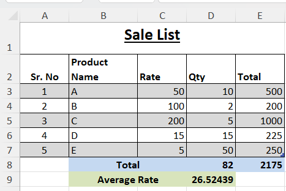

# Ms Excel - Sale Invoice

- [Download PDF](assign1.pdf)
    
Please prepare both sheets as per samples given below:

## Sheet 1

## Sheet 2

## Guidelines for assignment

- Apply merge for `Sale List`, using wrap text for `Product Name`, add borders around the entire table.
- Use `SUM` function to compute total
- Use `AVERAGE` function to compute average
- Format the sheets as per template
- Record the video to both sheets with voice and explain the sheets
- Upload the video in Ms Team assignment