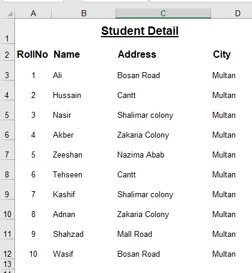

# Ms Excel - Assignment 1

Please prepare both sheets as per samples given below:

## Sheet 1

## Sheet 2

## Guidelines for assignment

- Use SUM function to compute total
- Use AVERAGE function to compute average
- Format the sheets as per template
- Record the video to both sheets with voice and explain the sheets
- Upload the video in Ms Team assignment