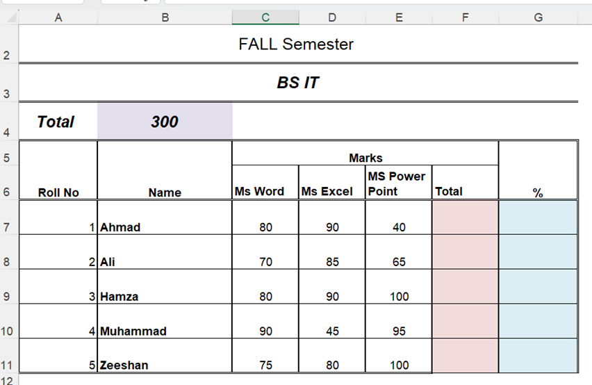

# Ms Excel - Assignment 2

Connect with me: [Youtube](https://www.youtube.com/yasirbhutta) \| [LinkedIn](https://www.linkedin.com/in/yasirbhutta/) \| [WhatsApp Channel](https://whatsapp.com/channel/0029VaC3BC160eBZZSs3CW0c) \| [Web](https://yasirbhutta.github.io/) \| [Facebook](https://www.facebook.com/yasirbhutta786) \| [Twitter](https://twitter.com/yasirbhutta)

- [Download PDF](assign2.pdf)  
  
Please prepare worksheet as per samples given below:

## Sheet 1

- Apply merge and center for `FALL Semester` and `BS IT`, use wrap text for `MS PowerPoint`, add borders around the entire table
- Use SUM function to compute `Total`
- use the formula for calculation of `Percentage (%)`
- Format the worksheet as per template
- Record the video to both sheets with voice and explain the sheets
- Upload the video in Ms Team assignment