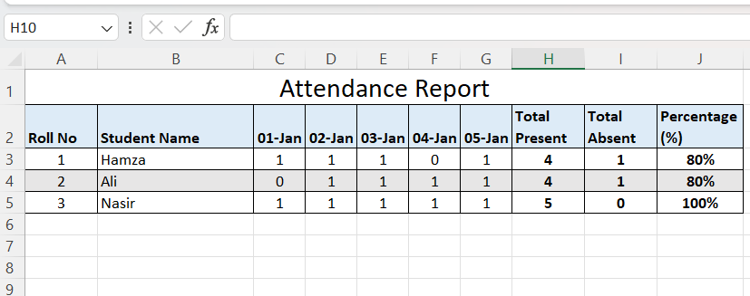

# Ms Excel - Assignment 3

- [Download PDF](assign3.pdf)  
  
Please prepare worksheet as per samples given below:

## Sheet 1

- Apply merge and center for `Attendance Report`, use wrap text for `Total Present`, `Total Absent` and `Percentage (%)`, add borders around the entire table.
- Use `Sum` function to compute `Total Present`
- Use `CountIF` function to compute `Total Absent`
- use the formula for calculation of `Percentage (%)`
- Format the worksheet as per template
- Record the video to both sheets with voice and explain the sheets
- Upload the video in Ms Team assignment or Google Class

## Explore More Excel Topics




<ins class="adsbygoogle"
     style="display:block"
     data-ad-format="autorelaxed"
     data-ad-client="ca-pub-1602443888929206"
     data-ad-slot="7879511511"></ins>
