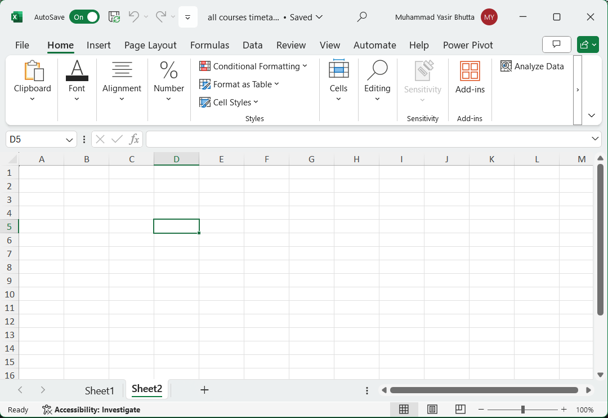

# Microsoft Excel: Basics

Connect with me: [Youtube](https://www.youtube.com/yasirbhutta) \| [LinkedIn](https://www.linkedin.com/in/yasirbhutta/) \| [WhatsApp Channel](https://whatsapp.com/channel/0029VaC3BC160eBZZSs3CW0c) \| [Web](https://yasirbhutta.github.io/) \| [Facebook](https://www.facebook.com/yasirbhutta786) \| [Twitter](https://twitter.com/yasirbhutta)

- [Download PDF](https://yasirbhutta.github.io/ms-excel/docs/basics.pdf)
- To access the updated handouts, please click on the following link:
[https://yasirbhutta.github.io/ms-excel/docs/basics.html](https://yasirbhutta.github.io/ms-excel/docs/basics.html)
- [Youtube Playlist to learn excel](https://youtube.com/playlist?list=PLKYRx0Ibk7Vh3MomITbYSF5I-NGTW5s7f&si=TBb3FDR21BnlJO9r)
- [Slides](https://docs.google.com/presentation/d/1rB0PnP-Rbw28GiBKTSv_GgFTMSA71BnSIlUpGi9GfH4/)

- [Microsoft Excel: Basics](#microsoft-excel-basics)
  - [Module 1: Introduction to Excel](#module-1-introduction-to-excel)
  - [Microsoft Excel](#microsoft-excel)
  - [Excel Mobile App:](#excel-mobile-app)
  - [Enter data manually in worksheet cells](#enter-data-manually-in-worksheet-cells)
  - [Managing Sheet](#managing-sheet)
    - [Insert a new worksheet](#insert-a-new-worksheet)
    - [Rename a worksheet](#rename-a-worksheet)
    - [Delete a worksheet](#delete-a-worksheet)
    - [Reorder sheets](#reorder-sheets)
    - [Hide or unhide sheets](#hide-or-unhide-sheets)
    - [Change sheet tab color](#change-sheet-tab-color)
    - [Duplicate sheet](#duplicate-sheet)
    - [Move sheet](#move-sheet)
  - [Excel for Android touch guide](#excel-for-android-touch-guide)
  - [Excel for Android phones: Animated tips](#excel-for-android-phones-animated-tips)
  - [Online Courses and Trainings - Microsoft Excel](#online-courses-and-trainings---microsoft-excel)
  - [True/False (Mark T for True and F for False)](#truefalse-mark-t-for-true-and-f-for-false)
  - [Multiple Choice (Select the best answer)](#multiple-choice-select-the-best-answer)
  - [Review Questions](#review-questions)
  - [Exercises](#exercises)
  - [References and Bibliography](#references-and-bibliography)

## Module 1: Introduction to Excel

- What is Excel?
- When to use a spreadshe
- The Excel workbook and worksheet
- Navigating around Excel
- Entering and editing data

## Microsoft Excel

Microsoft Excel is an electronic spreadsheet program developed by Microsoft. It’s widely used for storing, organizing, and manipulating data. 

Microsoft Excel can be used to

- perform mathematical calculations
- serve as powerful data management tools  
- create different charts and graphs
- retrieve data from external data sources and use it in worksheets

Microsoft Excel: Interface

## Excel Mobile App: 

1. **Worksheets and Workbooks:**

- **Workbooks**

- A Microsoft Excel workbook is a file that contains one or more worksheets that you can use to organize various kinds of related information.

- **Worksheets**
  - The primary document that you use in Excel to store and work with data. Also called a spreadsheet.
  - A worksheet is always stored in a workbook.
  - A worksheet consists of cells that are organized into columns and rows.
  - By default, Microsoft Excel provides one worksheet in a workbook.
  - Calculations can be made based on data from multiple worksheets.
  - Each Worksheet has a tab.
  - To activate a particular sheet, you can click on its respective tab.

- **Columns & Rows**
  - Each column and row of a worksheet has a unique name
  - Each column carries a letter of the alphabet as its name while a row is numbered
  - A worksheet consist of 16384 columns and more than one million rows.[^1]

- **Cells**
  - Cell is the intersection of a column & a row.
  - An active cell is the cell in which you can enter and edit data.

2. **Cell References**:
   - Cells are identified by their **cell references**, which combine the column letter and row number (e.g., A3, B6, AA345).
   - You can store various types of data in cells, including numbers, text, dates, times, and Boolean values.

3. **Formulas and Functions**:
   - **Formulas** allow you to perform calculations using data from other cells. Start a formula by typing an equal sign (=) in the cell where you want the result.
   - Formulas can include cell references and built-in **functions** (predefined calculations). Functions simplify complex tasks, such as finding averages, sums, or specific information in large tables of data.

4. **Features**:
   - Excel offers powerful features, including:
     - **Calculation capabilities**: Perform arithmetic, statistical, and financial calculations.
     - **Graphing tools**: Create charts and graphs to visualize data.
     - **Pivot tables**: Analyze and summarize data from large datasets.
     - **Visual Basic for Applications (VBA)**: A macro programming language for automating tasks.

5. **Integration**:
   - Excel is part of the **Microsoft 365 suite**, which includes other productivity tools like Word, PowerPoint, and Outlook.

**Microsoft Excel's availability:**

1. **Desktop Version 💻**:
   - **Microsoft Excel** is available as a desktop application for both **Windows** and **Mac** operating systems.
   - Users can install Excel on their personal computers or workstations to create, edit, and analyze spreadsheets.

2. **Mobile Version 📱**:
   - **Microsoft Excel** is also available as a **mobile app** for smartphones and tablets.
   - You can download the Excel app from app stores (such as **Google Play Store** for Android devices or the **Apple App Store** for iOS devices).
   - The mobile app allows you to view, edit, and collaborate on Excel files while on the go.

3. **Online Version (Excel Online) 🌐**:
   - **Excel Online** is the web-based version of Excel.
   - It runs in a web browser (such as **Microsoft Edge**, **Google Chrome**, or **Mozilla Firefox**).
   - Users can access Excel Online through their **Microsoft OneDrive** or **Microsoft 365** accounts.
   - Excel Online provides basic spreadsheet functionality and allows collaboration with others in real time.
   - [Microsoft 365 for the web](https://www.microsoft365.com/)

<ins class="adsbygoogle"
     style="display:block; text-align:center;"
     data-ad-layout="in-article"
     data-ad-format="fluid"
     data-ad-client="ca-pub-1602443888929206"
     data-ad-slot="6296238623"></ins>

## Enter data manually in worksheet cells

[Video: How to: Enter data manually in worksheet cells \| Microsoft Excel](https://youtu.be/r84zUXFUIfc?si=2YuAmqRKU31S9Y4-)

**Number as Text**

- A single quote (or an apostrophe) is used to signify Text in Excel. 
- A number entered with the leading apostrophe is treated as Text and (generally) cannot be used in calculations.

**Enter a dates or a time in a cell**

- On the worksheet, click a cell.
- Type a date or time as follows:
  - To enter a date, use a slash mark or a hyphen to separate the parts of a date; for example, type 9/5/2002 or 5-Sep-2002.
  - To enter a time that is based on the 12-hour clock, enter the time followed by a space, and then type a or p after the time; for example, 9:00 p.
  
> **Tip:** To enter the current time, press CTRL+SHIFT+; (semicolon).

**See also:**

- [Control Automatic Data Conversions in Excel](https://youtu.be/ZaL8KlQWIPI)

## Managing Sheet

[Video: How to Manage Worksheets in excel](https://youtu.be/4_WTHBDiAe0)

### Insert a new worksheet

- To view your sheets, tap the bottom left button on the toolbar.
  

- To create a new sheet, tap the **+ icon** at the bottom of the screen

### Rename a worksheet

1. To view your sheets, tap the bottom left button on the toolbar.
2. Then select the sheet you want to rename and tap on sheet tab again to open a context menu.
3. Tap **'rename'**
4. enter a new name

or

 To rename the sheet, double-tap on the tab and enter a new name.

### Delete a worksheet

1. To view your sheets, tap the bottom left button on the toolbar.
2. Then select the sheet you want to delete and tap on sheet tab again to open a context menu.
3. Tap **'Delete sheet'**
4. Tap **OK Button**

### Reorder sheets

- To reorder sheets, tap and hold the sheet tab at the bottom of the screen and drag it to a new position.

### Hide or unhide sheets

1. To view your sheets, tap the bottom left button on the toolbar.
2. Then select the sheet you want to hide and tap on sheet tab again to open a context menu.
3. A context menu will appear with the option to hide or unhide a sheet.
4. Tap **Hide**, to hide the sheet.

### Change sheet tab color

1. To view your sheets, tap the bottom left button on the toolbar.
2. Then select the sheet you want to change sheet tab color and tap on sheet tab again to open a context menu.
3. Tap **Color**, to change the sheet tab color.

### Duplicate sheet

To duplicate a sheet in Excel mobile app, you can follow these steps:

1. To view your sheets, tap the bottom left button on the toolbar.
2. A context menu will appear with the option to Duplicate.
3. Tap **Duplicate** to create a copy of the sheet.

### Move sheet

**See also:**

- [Hide or Unhide worksheets - Microsoft Support](https://support.microsoft.com/en-au/office/hide-or-unhide-worksheets-69f2701a-21f5-4186-87d7-341a8cf53344)

## [Excel for Android touch guide](https://support.microsoft.com/en-au/office/excel-for-android-touch-guide-aef977da-6adf-4724-b054-8ca4bb1d7afb)

## [Excel for Android phones: Animated tips](https://support.microsoft.com/en-us/office/excel-for-android-phones-animated-tips-25aedb34-2379-4429-90ad-3fffc9cbee3b)

## Online Courses and Trainings - Microsoft Excel

- [Excel video training - Microsoft Support](https://support.microsoft.com/en-us/office/excel-video-training-9bc05390-e94c-46af-a5b3-d7c22f6990bb)
- [Microsoft Training](https://support.microsoft.com/en-us/training)

<ins class="adsbygoogle"
     style="display:block; text-align:center;"
     data-ad-layout="in-article"
     data-ad-format="fluid"
     data-ad-client="ca-pub-1602443888929206"
     data-ad-slot="6296238623"></ins>




## True/False (Mark T for True and F for False)

- A workbook is a collection of worksheets. **True**
- Rows are numbered from 1 to 1,048,576. **True**
- A worksheet is the intersection of a row and a column. **False**
- The active cell is the cell that is currently selected. **True**
- Excel is a powerful tool for data analysis. **True**
  
## Multiple Choice (Select the best answer)

- [Microsoft Excel Quiz: Basics](../quizzes/excel-basics-quiz.md)

> What type of data can be stored in an Excel cell?

1. [ ] Numbers
2. [ ] Text
3. [ ] Dates
4. [x] All of the above

> What is a workbook?

1. [x] A collection of worksheets
2. [ ] A single spreadsheet
3. [ ] A cell in a spreadsheet
4. [ ] A formula in a spreadsheet

>What is a worksheet?

1. [ ]  A collection of workbooks
2. [x]  A single spreadsheet
3. [ ]  A cell in a spreadsheet
4. [ ]  A formula in a spreadsheet

>What are rows in a spreadsheet?

1. [x] Horizontal divisions of the spreadsheet
2. [ ] Vertical divisions of the spreadsheet
3. [ ] Individual cells in the spreadsheet
4. [ ] Formulas in the spreadsheet

> What are columns in a spreadsheet?

1. [ ]  Horizontal divisions of the spreadsheet
2. [x]  Vertical divisions of the spreadsheet
3. [ ]  Individual cells in the spreadsheet
4. [ ]  Formulas in the spreadsheet

> What is a cell in a spreadsheet?

1. [ ]  A collection of workbooks
2. [ ]  A single spreadsheet
3. [x]  The intersection of a row and column
4. [ ]  A formula in a spreadsheet

> What is the address of a cell?

1. [ ]  The name of the workbook
2. [ ]  The name of the worksheet
3. [x]  The letter of the column and the number of the row
4. [ ]  The formula in the cell

> What is the term used for a single page in an Excel workbook?

1. [ ] workbook
2. [x] worksheet
3. [ ] row
4. [ ] column

> What is the unique identifier for a cell in a worksheet?

1. [ ] workbook
2. [ ] worksheet
3. [ ] row
4. [x] cell address

> What are rows and columns?

1. [x] Rows are horizontal divisions of a worksheet, and columns are vertical divisions of a worksheet.
2. [ ] Rows are vertical divisions of a worksheet, and columns are horizontal divisions of a worksheet.
3. [ ] Both rows and columns are horizontal divisions of a worksheet.
4. [ ] Both rows and columns are vertical divisions of a worksheet.

> How many columns are there in an Excel worksheet by default?

1. [ ] 256
2. [ ] 512
3. [ ] 1,048,576
4. [x] 16,384

> How many rows are there in an Excel worksheet by default?

1. [ ] 256
2. [ ] 512
3. [x] 1,048,576
4. [ ] 16,384

> In Excel, how many worksheets are there in a default workbook?

1. [x] 1
2. [ ] 3
3. [ ] 5
4. [ ] 10

Which of the following is displayed at the top of the Excel window and shows the current workbook name?
A) Title Bar
B) Formula Bar
C) Status Bar
D) Ribbon

Answer: A) Title Bar

Which of the following is the default file extension for Excel workbooks?
A) .docx
B) .xlsx
C) .xls
D) .csv

Answer: B) .xlsx

What do you see in the 'Name Box' in Excel?
A) The formula entered in the active cell
B) The address of the active cell (e.g., A1, B2)
C) The name of the current worksheet
D) The total count of cells in the worksheet

Answer: B) The address of the active cell (e.g., A1, B2)

What does the Formula Bar display in Excel?

A) The content of the active cell
B) The names of all worksheets in a workbook
C) A list of all available formulas
D) The format of the selected cell

Answer: A) The content of the active cell

How can you cancel an entry after typing in a cell but before pressing Enter?
A) Press the 'Esc' key
B) Press 'Ctrl + Z'
C) Right-click and select 'Undo'
D) Press 'Delete'

Answer: A) Press the 'Esc' key

How do you manually enter a date in an Excel cell?
A) Type the date in the format 'dd/mm/yyyy'
B) Type the date in any format, and Excel will convert it
C) Use the 'Insert' tab to select a date
D) Type the date as 'Today'

Answer: A) Type the date in the format 'dd/mm/yyyy'

What is the shortcut key to enter the current date in a cell in Excel?
A) Ctrl + Shift + D
B) Ctrl + ;
C) Alt + D
D) Ctrl + T

Answer: B) Ctrl + ;

What is the shortcut key to enter the current time in a cell in Excel?
A) Ctrl + Shift + T
B) Ctrl + Shift + ;
C) Alt + T
D) Shift + ;

Answer: B) Ctrl + Shift + ;

Which of the following can you enter into a cell in Excel?
A) Text
B) Numbers
C) Formulas
D) All of the above

Answer: D) All of the above

How do you move to the next cell after entering data in Excel?
A) Press the 'Tab' key
B) Press the 'Enter' key
C) Use the arrow keys
D) All of the above

Answer: D) All of the above

Which of the following is the correct method to enter a formula into a cell?
A) Type the formula and press Enter
B) Type the formula starting with '=' and press Enter
C) Double-click the cell and type the formula
D) Right-click the cell and select 'Insert Formula'

Answer: B) Type the formula starting with '=' and press Enter

How do you move data from one cell to another in Excel?
A) Cut the data with Ctrl + X, then paste it with Ctrl + V in a new cell
B) Click and drag the data to a new cell
C) Copy and paste the data
D) All of the above

Answer: D) All of the above

What happens if you enter data that exceeds the cell width in Excel?
A) The data will overflow into adjacent empty cells
B) The data is automatically resized to fit the cell
C) The data will be hidden from view
D) An error message is displayed

Answer: A) The data will overflow into adjacent empty cells

What happens when you press 'Ctrl + Z' in Excel?
A) It redoes the last action
B) It deletes the current data
C) It undoes the last action
D) It saves the current workbook

Answer: C) It undoes the last action

## Review Questions

1. What is the difference between worksheet and Workbook?
2. What is a workbook in Excel?
3. What is a worksheet in Excel?
4. What are some of the benefits of using Excel workbooks and worksheets?
5. What is Active cell and explain the purpose of Name Box in MS Excel?
6. What are the key components of an Excel worksheet, and how do they contribute to organizing and analyzing data within a workbook?
7. Explain the process of adding, deleting, and renaming worksheets in an Excel workbook. How can these actions be beneficial in managing and organizing data?

## Exercises

1. How do you insert a new worksheet into a workbook?
2. How do you delete a worksheet from a workbook?
3. How do you rename a worksheet?
4. How do you hide a worksheet?
5. How do you unhide a worksheet?

## References and Bibliography

[^1]: [Excel specifications and limits](https://support.microsoft.com/en-us/office/excel-specifications-and-limits-1672b34d-7043-467e-8e27-269d656771c3)
