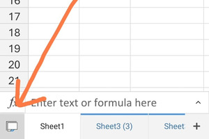

# Microsoft Excel - Microsoft 365

## Microsoft Excel: Basics

[Download PDF](https://yasirbhutta.github.io/ms365-mobile-app/excel/docs/basics.pdf)

**To access the updated handouts, please click on the following link:**
[https://yasirbhutta.github.io/ms365-mobile-app/excel/docs/basics.html](https://yasirbhutta.github.io/ms365-mobile-app/excel/docs/basics.html)

## Module 1: Introduction to Excel

- What is Excel?
- When to use a spreadsheet
- The Excel workbook and worksheet
- Navigating around Excel
- Entering and editing data

## Microsoft Excel

Microsoft Excel can be used to

- perform mathematical calculations
- serve as powerful data management tools  
- create different charts and graphs
- retrieve data from external data sources and use it in worksheets

## Excel Mobile App: Interface

## Workbooks

A Microsoft Excel workbook is a file that contains one or more worksheets that you can use to organize various kinds of related information.

## Worksheets

- The primary document that you use in Excel to store and work with data. Also called a spreadsheet.
- A worksheet is always stored in a workbook.
- A worksheet consists of cells that are organized into columns and rows.
- By default, Microsoft Excel provides one worksheet in a workbook.
- Calculations can be made based on data from multiple worksheets.
- Each Worksheet has a tab.
- T0 activate a particular sheet, you can click on its respective tab.

### Columns & Rows

- Each column and row of a worksheet has a unique name
- Each column carries a letter of the alphabet as its name while a row is numbered
- A worksheet consist of 16384 columns and more than one million rows.[^1]

### Cells

- Cell is the intersection of a column & a row.
- An active cell is the cell in which you can enter and edit data.
- Each cell also has a unique address.
- The address of any cell is the combination of its column letter and row number.

## Enter data manually in worksheet cells

### Number as Text

- A single quote (or an apostrophe) is used to signify Text in Excel. 
- A number entered with the leading apostrophe is treated as Text and (generally) cannot be used in calculations.

### Enter a dates or a time in a cell

- On the worksheet, click a cell.
- Type a date or time as follows:
  - To enter a date, use a slash mark or a hyphen to separate the parts of a date; for example, type 9/5/2002 or 5-Sep-2002.
  - To enter a time that is based on the 12-hour clock, enter the time followed by a space, and then type a or p after the time; for example, 9:00 p.
  
**Tip:** To enter the current time, press CTRL+SHIFT+; (semicolon).

[Video Tutorial: How to: Enter data manually in worksheet cells | Microsoft Excel](https://youtu.be/r84zUXFUIfc?si=2YuAmqRKU31S9Y4-)

## Managing Sheet

### Insert a new worksheet

- To view your sheets, tap the bottom left button on the toolbar.
  

- To create a new sheet, tap the **+ icon** at the bottom of the screen

### Rename a worksheet

1. To view your sheets, tap the bottom left button on the toolbar.
2. Then select the sheet you want to rename and tap on sheet tab again to open a context menu.
3. Tap **'rename'**
4. enter a new name

or

 To rename the sheet, double-tap on the tab and enter a new name.

### Delete a worksheet

1. To view your sheets, tap the bottom left button on the toolbar.
2. Then select the sheet you want to delete and tap on sheet tab again to open a context menu.
3. Tap **'Delete sheet'**
4. Tap **OK Button**

### Reorder sheets

- To reorder sheets, tap and hold the sheet tab at the bottom of the screen and drag it to a new position.

### Hide or unhide sheets

1. To view your sheets, tap the bottom left button on the toolbar.
2. Then select the sheet you want to hide and tap on sheet tab again to open a context menu.
3. A context menu will appear with the option to hide or unhide a sheet.
4. Tap **Hide**, to hide the sheet.

### Change sheet tab color

1. To view your sheets, tap the bottom left button on the toolbar.
2. Then select the sheet you want to change sheet tab color and tap on sheet tab again to open a context menu.
3. Tap **Color**, to change the sheet tab color.

### Duplicate sheet

To duplicate a sheet in Excel mobile app, you can follow these steps:

1. To view your sheets, tap the bottom left button on the toolbar.
2. A context menu will appear with the option to Duplicate.
3. Tap **Duplicate** to create a copy of the sheet.

### Move sheet

## [Excel for Android touch guide](https://support.microsoft.com/en-au/office/excel-for-android-touch-guide-aef977da-6adf-4724-b054-8ca4bb1d7afb)

## [Excel for Android phones: Animated tips](https://support.microsoft.com/en-us/office/excel-for-android-phones-animated-tips-25aedb34-2379-4429-90ad-3fffc9cbee3b)

## Online Courses and Trainings - Microsoft Excel

- [Excel video training - Microsoft Support](https://support.microsoft.com/en-us/office/excel-video-training-9bc05390-e94c-46af-a5b3-d7c22f6990bb)
- [Microsoft Training](https://support.microsoft.com/en-us/training)

## True/False (Mark T for True and F for False)

- A workbook is a collection of worksheets.
- Rows are numbered from 1 to 1,048,576.
- A worksheet is the intersection of a row and a column.
- The active cell is the cell that is currently selected.
- Excel is a powerful tool for data analysis.
- A workbook is a collection of rows and columns.
  

## Multiple Choice (Select the best answer)

What type of data can be stored in an Excel cell?

(a) Numbers
(b) Text
(c) Dates
(d) All of the above

What is a workbook?

(a) A collection of worksheets
(b) A single spreadsheet
(c) A cell in a spreadsheet
(d) A formula in a spreadsheet

What is a worksheet?

(a) A collection of workbooks
(b) A single spreadsheet
(c) A cell in a spreadsheet
(d) A formula in a spreadsheet

What are rows in a spreadsheet?

(a) Horizontal divisions of the spreadsheet
(b) Vertical divisions of the spreadsheet
(c) Individual cells in the spreadsheet
(d) Formulas in the spreadsheet

What are columns in a spreadsheet?

(a) Horizontal divisions of the spreadsheet
(b) Vertical divisions of the spreadsheet
(c) Individual cells in the spreadsheet
(d) Formulas in the spreadsheet

What is a cell in a spreadsheet?

(a) A collection of workbooks
(b) A single spreadsheet
(c) The intersection of a row and column
(d) A formula in a spreadsheet

What is the address of a cell?

(a) The name of the workbook
(b) The name of the worksheet
(c) The letter of the column and the number of the row
(d) The formula in the cell

What is the term used for a single page in an Excel workbook?
(a) workbook
(b) worksheet
(c) row
(d) column

What is the unique identifier for a cell in a worksheet?
(a) workbook
(b) worksheet
(c) row
(d) cell address

What are rows and columns?

(a) Rows are horizontal divisions of a worksheet, and columns are vertical divisions of a worksheet.
(b) Rows are vertical divisions of a worksheet, and columns are horizontal divisions of a worksheet.
(c) Both rows and columns are horizontal divisions of a worksheet.
(d) Both rows and columns are vertical divisions of a worksheet.

How many columns are there in an Excel worksheet by default?
A) 256
B) 512
C) 1,048,576
D) 16,384

How many rows are there in an Excel worksheet by default?
A) 256
B) 512
C) 1,048,576
D) 16,384

In Excel, how many worksheets are there in a default workbook?

a) 1
b) 3
c) 5
d) 10

## Exercises

## Review Questions

1. What is the difference between worksheet and Workbook?
2. What is Active cell and explain the purpose of Name Box in MS Excel?

## References

[^1]: [Excel specifications and limits](https://support.microsoft.com/en-us/office/excel-specifications-and-limits-1672b34d-7043-467e-8e27-269d656771c3)

## Social Links

- [WhatsApp Channel](https://whatsapp.com/channel/0029VaC3BC160eBZZSs3CW0c)
- [Web](https://yasirbhutta.github.io/)
- [Youtube](https://www.youtube.com/yasirbhutta)
- [Facebook](https://www.facebook.com/yasirbhutta786)
- [Twitter](https://twitter.com/yasirbhutta)
