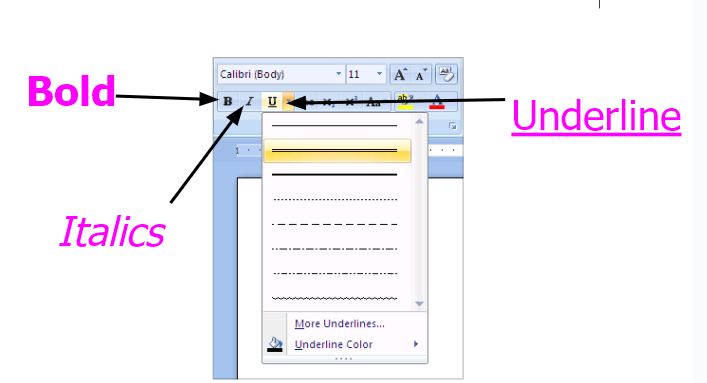
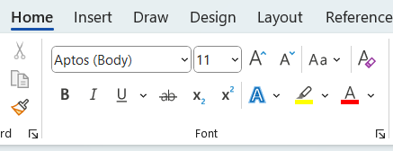
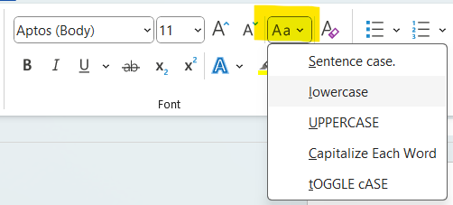
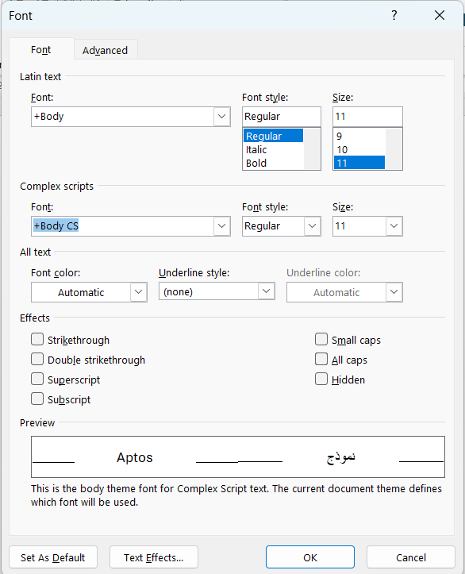

# Microsoft Word: Character Formatting \| Microsoft 365

Connect with me: [Youtube](https://www.youtube.com/yasirbhutta) \| [LinkedIn](https://www.linkedin.com/in/yasirbhutta/) \| [WhatsApp Channel](https://whatsapp.com/channel/0029VaC3BC160eBZZSs3CW0c) \| [Web](https://yasirbhutta.github.io/) \| [Facebook](https://www.facebook.com/yasirbhutta786) \| [Twitter](https://twitter.com/yasirbhutta)

- [Download PDF](https://yasirbhutta.github.io/ms-word/docs/character-formatting.pdf)  
- To access the updated handouts, please click on the following link:
[https://yasirbhutta.github.io/ms-word/docs/character-formatting.html](https://yasirbhutta.github.io/ms-word/docs/character-formatting.html)
- [Slides: Character Formatting](https://docs.google.com/presentation/d/1JP1pVsfH7LCQFsPPylfEDseQY_CEZGdzHc2RC2dRBpg/edit?usp=sharing)

## Formatting
- The process of defining the appearance of a document is called formatting. It includes the following options:
  - Changing the font and font size of text
  - Applying boarder and shadings
  - Adding picture and graphics etc.

**Types Of Formatting:** 

There are three types of formatting:

1. Character Formatting
  - A type of formatting that is applied to an individual character is called Character Formatting.
  - Important character formatting are typeface, font size , font color, font style and character spacing etc.
2. Paragraph Formatting
   - A type of formatting that is applied to a complete paragraph is called Paragraph formatting.
   - Paragraph is a collection of text that ends with Enter key.
   - Word inserts a new paragraph in the document wherever the user presses the Enter key.
   - **Example:** Text Alignment, Indentation, Line space , Bullets and Numbering
3. Page Formatting
   - Page formatting: The formatting applied on page is called page formatting.
   - It includes the following: Page Size, Margins, Page Orientation, Headers and Footer
  
## 1. CHARACTER FORMATTING
### 1.1. Font
- The appearance of text in the document is called font or typeface.
- Fonts are used to make the text of different styles and sizes.
Fonts by Category
http://www.fontpool.com/categories/
Change the Font
### 1.2 Font Size
- Size of text is document is called Font Size.
- Font size is measured in points.
- There are `72` points in an inch.

**Change Font Size**
- Click on the Arrow sign of Font Size in Font group

OR

Keyboard shortcut for Grow Font: **CTRL+SHIFT + >**
Keyboard shortcut for Shrink Font: **CTRL+SHIFT + <**

### 1.3. Font Style
- Font Style is used to bold, Italicize and underline the text.

**Change Font Style:**
- On the **Home** tab, in the **Font** group, click **Font Style**

**Underline words, but not the spaces between them:**
- Select the text that you want to underline. 
- On the Home tab, click the Font Dialog Box Launcher, and then click the Font tab. 
- In the Underline style box, click `Words only`.
### 1.4. Font Color
- Font color is used to change the color of the text.

**Change Font Color:**
- On the Home tab, in the Font group, click Font Color

### 1.5. Text Highlight Color
- Make text look like it was marked with highlighter pen

**Text Highlight Color:**
- On the **Home** tab, in the **Font** group, click **Text Highlight** Color

### 1.6. Subscript
- Create small letters below the text baseline

H2O
Change Subscript
- On the **Home** tab, in the **Font** group, click **Subscript**
  

OR
- Keyboard shortcut: **CTRL+=**

### 1.7. Superscript
●	Create small letters above the line of text.

5th
**Change Superscript:**
- On the **Home** tab, in the **Font** group, click **Superscript**

OR
- Keyboard shortcut: **CTRL+Shift++** 
- 
### 1.8. Strikethrough
- Draw a line through the middle of the selected text.

**Apply Strikethrough:**

- On the Home tab, in the Font group, click Strikethrough

### 1.9. Character Case
- The character  in which text is written is called case of the text.
- Capital letters are called upper case letters.
- Small letters are call lower case letters.

**Sentence case:** It changes the first  character of sentence to upper case and all other characters to the lower case.
**lower case:** it changes all characters to lowercase
**UPPER CASE:** IT CHANGES ALL CHARACTERS TO UPPER CASE.	
**Capitalize Each Word:** It Changes The First Characters Of Each Word To Uppercase And All Other Characters To Lowercase.
**tOGGLE cASE:** iT sWITCHES uPPERCASE tO lOWERCASE aND vICE vERSA.

Character Case
- Select the text
- Press **Shift + F3** until the required case is achieved.
OR 
- Select the text
- **Home tab > Font group > Change Case**

# 1.10. Clear Formatting

- Clear formatting command clear all the formatting from the selection and leave only plain text.

**Clear Formatting:**
- On the **Home** tab, in the **Font** group, click **Clear All Formatting**

OR

Press **Ctrl + Spacebar** to clear character formatting (such as bold, font, and font size) from selected text 2.

# 1.11. Using Font Dialog Box

- The font dialog box can be used to apply different formatting option on the text

Font Dialog Box
- Click on the Arrow sign of Font group

OR

Keyboard shortcut: **CTRL+D**

 
Font Dialog Box

#### 1.11.1. Character Spacing
- The distance between two characters is called character spacing.
- It can be specified in two ways:
  - Character Spacing is used to increase or decrease distance between characters.
  - Kerning automatically adjusts the distance between characters.

**Character Spacing:**
- Select the text that you want to change. 
- On the Home tab, click the Font Dialog Box Launcher, and then click the **Advanced** tab.
- In the Spacing box, click **Expanded** or **Condensed**, and then specify how much space you want in the By box.

Character spacing
Changing Character Spacing

### 1.12. Mini Toolbar
- When we select text, we can show or hide a handy, miniature, semitransparent toolbar called the Mini toolbar
●	To use toolbar, click any of the available command.

### 1.13. Format Painter
- The Format Painter is a tool that is used to copy formats from existing text and apply it to other text in the document.
Format Painter
- Select the text or graphic that has the formatting that you want to copy. 
- On the Home tab, in the Clipboard group, click Format Painter.

- Select the text or graphic that you want to format. 
- To stop formatting, press **ESC**.
**Important:**    Double-click the Format Painter button if you want to change the format of multiple selections in your document.

**Copying Formatting using Keyboard:**
•	Select the text already formatted
•	Press **CTRL+SHIFT+C**
•	Select the text to apply format.
•	Press **CTRL+SHIFT+V**

## Key Terms

Font
Font size
Font style
Character spacing
Kerning
Mini toolbar
Format painter

## True/False (Mark T for True and F for False)

1. Bold and italic are considered the same type of character formatting.
2. Character spacing refers to the distance between lines of text in a paragraph.
3. The format painter tool allows you to copy formatting from one text section and apply it to another. 
4. Clearing formatting removes all character styles/formatting and returns the text to its default settings.
5. Strikethrough formatting is used to highlight important text.

**Answer Key (True/False):**
1. False
2. False
3. True
4. True
5. False

## Multiple Choice (Select the best answer)

> Which of the following is NOT a type of formatting in Microsoft Word?
1. [ ] Character formatting
2. [ ] Paragraph formatting
3. [ ] Document formatting
4. [ ] Page formatting

> Which keyboard shortcut can be used to increase the font size?
1. [ ] CTRL+F
2. [ ] CTRL+SHIFT+>
3. [ ] ALT+S
4. [ ] CTRL+B

> What does the Font Style option in Microsoft Word allow you to do?
1. [ ] Change the font color
2. [ ] Change the font size
3. [ ] Bold, italicize, or underline text
4. [ ] Adjust line spacing

> Which command is used to change the color of text in Microsoft Word?
1. [ ] Font Size
2. [ ] Font Style
3. [ ] Font Color
4. [ ] Text Highlight Color

> What is the purpose of the Subscript feature in Microsoft Word?
1. [ ] To create small letters above the line of text
2. [ ] To draw a line through the middle of selected text
3. [ ] To create small letters below the text baseline
4. [ ] To change the font case

> How can you access the Font Dialog Box in Microsoft Word?
1. [ ] Click on the Arrow sign of Font group
2. [ ] Press CTRL+D
3. [ ] Both a and b
4. [ ] None of the above

> What is the function of the Mini Toolbar in Microsoft Word?
1. [ ] To provide access to frequently used commands
2. [ ] To change the page size
3. [ ] To show or hide formatting marks
4. [ ] To insert page breaks

> Which of the following is NOT a component of character formatting?
1. [ ] Font style
2. [ ] Paragraph alignment
3. [ ] Font color
4. [ ] Font size

> What unit is used to measure font size in Microsoft Word documents?
1. [ ] Pixels
2. [ ] Points
3. [ ] Inches
4. [ ] Millimeters

> What is the result of pressing Shift + F3 on selected text in Microsoft Word?
1. [ ] It applies subscript formatting.
2. [ ] It changes the case of the text.
3. [ ] It applies superscript formatting.
4. [ ] It clears all formatting.

> Which feature would you use to make text look like it was marked with a highlighter pen?
1. [ ] Font Color
2. [ ] Text Highlight Color
3. [ ] Font Style
4. [ ] Clear Formatting

## Fill in the Blanks
1. The process of customizing the appearance of a document, including fonts and colors, is called __________.
2. A small toolbar that appears when you select text, offering formatting options, is called the __________. 
3. The _____________ tool lets you copy formatting from one text section and apply it elsewhere.
4. Clearing formatting removes all character styles, returning the text to its _____________ settings. 

**Answer Key (Fill in the Blanks):**
1. formatting
2. mini toolbar
3. format painter
4. default

## Exercises

- Format a selected text in Microsoft Word to make it bold and underline.
- Change the font size of a paragraph to 14 points.
- Apply subscript to the text "H2O".
- Copy formatting from one sentence to another using the Format Painter tool.

## Review Questions

- What is formatting?
- Briefly explain the difference between character formatting and paragraph formatting.
- What is the purpose of using subscript and superscript formatting?
- How can you access the Font dialog box to explore more character formatting options?
- Describe the difference between character formatting, paragraph formatting, and page formatting.
- What are the common font styles used in document editing? How do you apply them?
- Explain the function of the "Clear Formatting" command in Microsoft Word.
- Describe the steps to access and use the Font Dialog Box in Microsoft Word.

## References and Bibliography

[1] “Word: Formatting Text,” GCFGlobal.org. [https://edu.gcfglobal.org/en/word/formatting-text/1/](https://edu.gcfglobal.org/en/word/formatting-text/1/)
[2] “Format your Word document,” support.microsoft.com. [https://support.microsoft.com/en-us/office/format-your-word-document-fb9ef2d6-e2ad-4721-abc1-55f88864617f](https://support.microsoft.com/en-us/office/format-your-word-document-fb9ef2d6-e2ad-4721-abc1-55f88864617f)

‌
‌

  