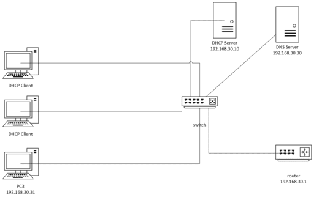

# Cisco Packet Tracer

Connect with me: [Youtube](https://www.youtube.com/yasirbhutta) \| [LinkedIn](https://www.linkedin.com/in/yasirbhutta/) \| [WhatsApp Channel](https://whatsapp.com/channel/0029VaC3BC160eBZZSs3CW0c) \| [Web](https://yasirbhutta.github.io/) \| [Facebook](https://www.facebook.com/yasirbhutta786) \| [Twitter](https://twitter.com/yasirbhutta)

- [Download PDF](https://yasirbhutta.github.io/tools/docs/cisco-packet-tracer.pdf)
- To access the updated handouts, please click on the following link:
[https://yasirbhutta.github.io/tools/docs/cisco-packet-tracer.html](https://yasirbhutta.github.io/tools/docs/cisco-packet-tracer.html)

- [How to configure DHCP server](#1-how-to-configure-dhcp-server-in-packet-tracer)
- [How to configure DNS server](#2-how-to-configure-dns-server-in-packet-tracer)
- [Configure DHCP on the Router](#6-optional-configure-dhcp-on-the-router)
- [Connecting Two LANs with a Router: A Step-by-Step Guide](#3-connecting-two-lans-with-a-router-a-step-by-step-guide)

## Lab Task 1: Basic PC-to-PC Communication

Objective: Create a simple network where two PCs communicate with each other.

Steps:

1. Drag two PCs onto the workspace.
2. Drag a Switch and place it between the two PCs.
3. Use Copper Cross-over cables to connect each PC to the switch.
4. Click on PC1, go to the Desktop tab, and assign the following IP address:

```cmd
IP: 192.168.1.1

Subnet Mask: 255.255.255.0
```

Do the same for PC2 with:

```cmd
IP: 192.168.1.2

Subnet Mask: 255.255.255.0
```

5. Test connectivity by opening a command prompt on PC1 and using the ping command to ping PC2.

Learning Outcome: Understand basic IP addressing and connectivity testing using the ping command.

## Lab Task 2: Connecting Multiple PCs using a Switch

Objective: Build a small network with multiple PCs communicating via a switch.

Steps:

1. Drag four PCs and one Switch (2960 Switch) onto the workspace.
2. Use Copper Straight-Through cables to connect each PC to the switch.
3. Assign the following IP addresses and subnet masks:


```cmd
PC1: 192.168.1.1 / 255.255.255.0

PC2: 192.168.1.2 / 255.255.255.0

PC3: 192.168.1.3 / 255.255.255.0

PC4: 192.168.1.4 / 255.255.255.0
```

4. Test connectivity by pinging each PC from another (e.g., from PC1, ping PC2, PC3, and PC4).

Learning Outcome: Understand how a switch enables communication between multiple devices on the same network.


## 1. How to configure DHCP server in Packet Tracer

Configuring a DHCP (Dynamic Host Configuration Protocol) server in Cisco Packet Tracer allows you to automate the assignment of IP addresses to devices on your network. Below is a step-by-step guide to setting up a DHCP server using Packet Tracer's built-in server functionality. This guide assumes you have a basic understanding of networking concepts and Packet Tracer's interface.

### **1. Set Up Your Network Topology**

Before configuring the DHCP server, you need to set up a basic network topology. Here's a simple example:

- **Devices Needed:**
  - 1 Router
  - 1 Switch
  - 1 Server
  - Multiple PCs (clients)

### **Steps:**

1. **Open Packet Tracer:**
   - Launch Cisco Packet Tracer on your computer.

2. **Add Devices to the Workspace:**
   - From the device list at the bottom, drag and drop the following devices onto the workspace:
     - **Router:** e.g., 2911 Router
     - **Switch:** e.g., 2960 Switch
     - **Server:** e.g., Generic Server
     - **PCs:** Add as many as needed (e.g., 2 PCs)

3. **Connect the Devices:**
   - Use **Copper Straight-Through** cables to connect devices:
     - **Router to Switch:** Connect the router's GigabitEthernet0/0 interface to the switch's FastEthernet0/1 port.
     - **Switch to Server:** Connect the switch's FastEthernet0/2 port to the server's FastEthernet0 port.
     - **Switch to PCs:** Connect each PC's FastEthernet0 port to the switch's FastEthernet0/3, FastEthernet0/4, etc.

   

### **2. Configure the Router**

The router will act as the default gateway for your network.

#### **Steps:**

1. **Access the Router's CLI:**
   - Click on the router.
   - Go to the **CLI** tab.

2. **Enter Configuration Mode:**
   ```plaintext
   Router> enable
   Router# configure terminal
   ```

3. **Configure the Interface Connected to the Switch:**
   ```plaintext
   Router(config)# interface GigabitEthernet0/0
   Router(config-if)# ip address 192.168.1.1 255.255.255.0
   Router(config-if)# no shutdown
   Router(config-if)# exit
   ```

4. **Enable DHCP on the Router (Optional):**
   - If you prefer to use the router as a DHCP server, you can skip to [Configuring DHCP on the Router](#appendix-a-configuring-dhcp-on-the-router) Otherwise, proceed to configure the dedicated server.

5. **Exit Configuration Mode:**
   ```plaintext
   Router(config)# exit
   Router# write memory
   ```

### **3. Configure the Server as a DHCP Server**

Using Packet Tracer's built-in server functionality is straightforward.

#### **Steps:**

1. **Access the Server:**
   - Click on the **Server** device.
   - Go to the **Config** tab or **Services** tab (depending on Packet Tracer version).

2. **Configure the Server's IP Address:**
   - Ensure the server has a static IP address within the network range.
   - Example Configuration:
     - **IP Address:** 192.168.1.10
     - **Subnet Mask:** 255.255.255.0
     - **Default Gateway:** 192.168.1.1

   

3. **Set Up DHCP Service:**
   - Navigate to the **Services** tab.
   - Click on **DHCP** from the left-hand menu.
   - Click **Add** to create a new DHCP pool.

4. **Configure DHCP Pool Parameters:**
   - **Default Gateway:** 192.168.1.1
   - **DNS Server:** You can use a public DNS server like 8.8.8.8 or specify your own.
   - **Start IP Address:** 192.168.1.100
   - **Subnet Mask:** 255.255.255.0
   - **Max Number of Users:** Set according to the number of devices (e.g., 50)

   

5. **Save the Configuration:**
   - Ensure all settings are correctly entered.
   - The DHCP server is now ready to assign IP addresses to clients.

### **4. Configure Client PCs to Use DHCP**

Ensure that client devices are set to obtain their IP addresses automatically.

#### **Steps:**

1. **Access a PC:**
   - Click on a **PC** device.
   - Go to the **Desktop** tab.
   - Click on **IP Configuration**.

2. **Set IP Configuration to DHCP:**
   - Select **DHCP**.
   - The PC should automatically receive an IP address from the DHCP server.

   

3. **Verify IP Address:**
   - After a few seconds, the PC should display an IP address within the DHCP pool range (e.g., 192.168.1.100).
   - Repeat this step for all client PCs.

### **5. Verify DHCP Functionality**

Ensure that DHCP is correctly assigning IP addresses to all clients.

#### **Steps:**

1. **Check IP Addresses on PCs:**
   - Each PC should have a unique IP address within the specified DHCP pool.
   - The **Default Gateway** should be set to the router's IP (192.168.1.1).
   - The **DNS Server** should be as configured (e.g., 8.8.8.8).

2. **Ping Test:**
   - From a PC, open the **Command Prompt** (Desktop > Command Prompt).
   - Ping the default gateway to ensure connectivity.
     ```plaintext
     ping 192.168.1.1
     ```
   - You should receive replies indicating successful communication.

3. **Check DHCP Server Lease Table:**
   - On the **Server**, go to the **Services** tab.
   - Click on **DHCP**.
   - Review the list of leased IP addresses to ensure all clients are receiving addresses.

   

### **6. Optional: Configure DHCP on the Router**

If you prefer to use the router as your DHCP server instead of a dedicated server, follow these steps:

### **Steps:**

1. **Access the Router's CLI:**
   - Click on the **Router** device.
   - Go to the **CLI** tab.

2. **Enter Configuration Mode:**
   ```plaintext
   Router> enable
   Router# configure terminal
   ```

3. **Create a DHCP Pool:**
   ```plaintext
   Router(config)# ip dhcp pool LAN
   Router(dhcp-config)# network 192.168.1.0 255.255.255.0
   Router(dhcp-config)# default-router 192.168.1.1
   Router(dhcp-config)# dns-server 8.8.8.8
   Router(dhcp-config)# exit
   ```

4. **Exclude Addresses (Optional):**
   - To prevent the router from assigning certain IP addresses (e.g., for the router itself or servers), use the `ip dhcp excluded-address` command.
   ```plaintext
   Router(config)# ip dhcp excluded-address 192.168.1.1 192.168.1.10
   Router(config)# exit
   Router# write memory
   ```

5. **Configure Clients to Use DHCP:**
   - As previously described, set each PC to obtain an IP address automatically.

6. **Verify DHCP Assignments:**
   - Check the IP addresses on the PCs and perform connectivity tests as described earlier.

## **Troubleshooting Tips**

- **No IP Address Assigned:**
  - Ensure that the DHCP server is connected to the correct network.
  - Verify that the DHCP service is enabled and properly configured on the server or router.
  - Check that clients are set to obtain IP addresses automatically.

- **IP Address Conflicts:**
  - Ensure that the DHCP pool does not overlap with any statically assigned IP addresses.
  - Use the `ip dhcp excluded-address` command on routers to exclude specific IP ranges.

- **Connectivity Issues:**
  - Verify all device interfaces are up (`no shutdown` on router interfaces).
  - Check cable connections and ensure devices are properly connected to the switch.

## **Conclusion**

Configuring a DHCP server in Packet Tracer simplifies network management by automating IP address assignments. Whether you choose to use a dedicated server or configure the router to handle DHCP duties, the process involves setting up the DHCP pool parameters and ensuring clients are set to receive IP addresses automatically. By following the steps outlined above, you can efficiently set up and verify a DHCP server in your simulated network environment.

## 2. How to configure DNS server in Packet Tracer

To configure a DNS server in Cisco Packet Tracer, follow these steps:

### Step 1: Add Devices
1. **Add a DNS Server**: Drag a server from the network devices list and place it on the workspace.
2. **Add a PC**: Drag a PC to the workspace.
3. **Add a Router and Switch**: Add a router and a switch to connect the DNS server and the PC.

### Step 2: Connect the Devices
1. **Connect the devices** using the appropriate cables (copper straight-through or crossover, depending on the type of connection).
2. Make sure the server, PC, and router are all connected through the switch.

### Step 3: Assign IP Addresses
1. **Assign IP addresses** to each device manually or use DHCP for automatic IP assignment.

   - **DNS Server**: 
     - Click on the DNS Server.
     - Go to the **Desktop tab**, click on **IP Configuration**, and assign a static IP address (e.g., 192.168.1.2).
   
   - **PC**: 
     - Click on the PC.
     - Go to the **Desktop tab**, click on **IP Configuration**, and assign an IP address (e.g., 192.168.1.3) with the appropriate subnet mask and default gateway (e.g., 192.168.1.1 for the router).

### Step 4: Configure DNS Server
1. **Click on the DNS Server**.
2. Go to the **Services tab** and select **DNS**.
3. **Turn on the DNS service** by clicking the **ON** button.
4. **Add DNS records**:
- **Record #1:**
   - Enter the domain name (e.g., `www.example.com`).
   - Enter the corresponding IP address (e.g., 192.168.1.3).
   - Click on **Add** to add the `A Record`.
 - **Record #2:**
   - Enter the domain name (e.g., `gudgk.edu.pk`).
   - Enter the corresponding IP address (e.g., 192.168.1.8).
   - Click on **Add** to add the `A Record`.

### Step 5: Configure PC to Use DNS
1. **Go to the PC** and open the **Desktop tab**.
2. Open the **IP Configuration**.
3. In the **DNS Server** field, enter the IP address of the DNS server (e.g., 192.168.1.2).

### Step 6: Test the DNS Configuration
1. **Go to the PC** and open the **Command Prompt** from the **Desktop tab**.
2. Type the following command to test if the DNS resolution works:
   ```
   ping www.example.com
   ```
3. If the DNS server is correctly configured, the PC will be able to resolve the domain name to the IP address and respond to the ping.

## Task #3:
To create the network diagram in Cisco Packet Tracer based on the whiteboard image, follow these steps:

Devices and IPs:


1. Router:

IP Address: 192.168.30.1


2. DHCP Server:

IP Address: 192.168.30.10

Assign IP addresses from the range 192.168.30.160 onwards


3. DNS Server:

IP Address: 192.168.30.30

4. PC1 and PC2 (DHCP Clients):

Connected to a switch, both configured as DHCP clients to obtain IPs dynamically.

5. PC3:

Static IP: 192.168.30.31

6. Switch:

All PCs, DHCP, and DNS servers are connected through this switch.


Steps in Cisco Packet Tracer:

1. Add devices:

Drag a Router, Switch, 3 PCs, DHCP Server, and DNS Server onto the workspace.

2. Configure the Router:

Go to the Router -> Config tab, assign the IP address 192.168.30.1 to the appropriate interface (e.g., GigabitEthernet0/0).

3. Configure the DHCP Server:

Set the IP address of the DHCP Server to 192.168.30.10.

Go to the Services tab and configure DHCP. Set the start IP range to 192.168.30.160.

4. Configure the DNS Server:

Assign the IP address 192.168.30.30 to the DNS server.

In the Services tab, configure DNS with any domain names you want to resolve.

- Add five DNS entries by filling out the fields as follows:

| **Domain Name**        | **IP Address**        |
|------------------------|-----------------------|
| example.com            | 192.168.30.50         |
| site.local             | 192.168.30.60         |
| network.internal       | 192.168.30.70         |
| appserver.company      | 192.168.30.80         |
| database.service       | 192.168.30.90         |

5. Configure the PCs:

PC1 and PC2: Go to each PC, and in the IP Configuration tab, set the IP configuration to DHCP.

PC3: Manually configure its IP address to 192.168.30.31 in the Static IP section.


6. Connect all devices:

Use cables to connect the devices to the switch (PCs, DHCP, DNS Server).

Connect the switch to the router.

7. Test connectivity:

- Once the network is built, test the network by pinging the router from each PC, and check DHCP functionality on PC1 and PC2.

8. Test DNS Resolution:
9. From PC1, PC2, or PC3, use the Command Prompt (CLI) to test the DNS resolution by pinging the domain names (e.g., ping example.com). If DNS is properly configured, it will resolve the domain name to the associated IP address.

To check connectivity between PCs in different subnets as represented in your diagram, you can perform the following tasks:

## Task #4: Connect PCs with different subnet

### Step 1: Assign IP Addresses

Make sure that all the PCs are configured with the IP addresses shown in the diagram:

PC1: 192.168.2.10

PC2: 192.168.2.11

PC3: 192.168.1.10

PC4: 192.168.1.11


### Step 2: Ping Test within the Same Subnet

1. Ping between PC1 and PC2 (same subnet: 192.168.2.x):

From PC1, open the terminal and run:

ping 192.168.2.11

From PC2, run:

ping 192.168.2.10


2. Ping between PC3 and PC4 (same subnet: 192.168.1.x):

From PC3, open the terminal and run:

ping 192.168.1.11

From PC4, run:

ping 192.168.1.10


### Step 3: Ping Test Across Different Subnets

1. Ping between PC1 (192.168.2.10) and PC3 (192.168.1.10):

From PC1, run:

ping 192.168.1.10

From PC3, run:

ping 192.168.2.10


2. Ping between PC2 (192.168.2.11) and PC4 (192.168.1.11):

From PC2, run:

ping 192.168.1.11

From PC4, run:

ping 192.168.2.11


> **Tips:** A router or Layer 3 switch is configured for routing between subnets.

By completing these tasks, you can check the connectivity between PCs in the same and different subnets.

## 3. Connecting Two LANs with a Router: A Step-by-Step Guide

Connecting two Local Area Networks (LANs) using a router allows devices on different networks to communicate with each other.

**Network Diagram**

```
[LAN 1] ------ [Router] ------ [LAN 2]
```
### Equipment Needed
1. **Router**: A device that forwards data packets between networks.
2. **Two LANs**: Each can consist of switches and devices (like PCs).
3. **Ethernet Cables**: To connect the router to the switches or devices.

### Step-by-Step Guide

Connecting two Local Area Networks (LANs) using a router in Cisco Packet Tracer involves several steps, including configuring the router and the devices within each LAN. Here’s a detailed guide to help you set up this connection:

#### Step 1: Open Cisco Packet Tracer
1. Launch Cisco Packet Tracer on your computer.

#### Step 2: Add Devices
1. **Add a Router:** Drag and drop a router (e.g., a 2911 router) onto the workspace.
2. **Add Switches:** Drag and drop two switches (e.g., 2960 switches) onto the workspace.
3. **Add PCs:** Add at least one PC to each switch (e.g., PC1 on Switch1 and PC2 on Switch2).

#### Step 3: Connect Devices
1. **Connect the PCs to the Switches:**
   - Use the **Connections** tool (cable icon) and select **Copper Straight-Through** cable.
   - Connect **PC1** to **Switch1** (e.g., FastEthernet 0/1).
   - Connect **PC2** to **Switch2** (e.g., FastEthernet 0/1).

2. **Connect the Switches to the Router:**
   - Use the **Copper Straight-Through** cable.
   - Connect **Switch1** to the router's **GigabitEthernet 0/0** port.
   - Connect **Switch2** to the router's **GigabitEthernet 0/1** port.

#### Step 4: Configure the Router
1. **Access the Router CLI:**
   - Click on the router and go to the **CLI** tab.
   - Press `Enter` to access the command line interface.

2. **Enter Global Configuration Mode:**
```bash
Router> enable
Router# configure terminal
```

**optional to show interfaces**

```bash
Router# show interfaces
```
3. **Configure Interfaces:**
   - For **FastEthernet 0/0** (connecting to LAN1):
```bash
Router(config)# interface GigabitEthernet0/0 # Gi0/0 or G0/0 would refer to GigabitEthernet0/0.
Router(config-if)# ip address 192.168.1.1 255.255.255.0  # Assigning IP address
Router(config-if)# no shutdown  # Activating the interface
```

   - For **GigabitEthernet 0/1** (connecting to LAN2):
  
```bash
Router(config)# interface GigabitEthernet0/1 # Gi0/1 or G0/1 would refer to GigabitEthernet0/1.
Router(config-if)# ip address 192.168.2.1 255.255.255.0  # Assigning IP address
Router(config-if)# no shutdown  # Activating the interface
```
#### Step 5: Configure the PCs
1. **Configure PC1 (in LAN1):**
   - Click on **PC1** and go to the **Desktop** tab.
   - Click on **IP Configuration** and set:
     - **IP Address:** `192.168.1.2`
     - **Subnet Mask:** `255.255.255.0`
     - **Default Gateway:** `192.168.1.1`

2. **Configure PC2 (in LAN2):**
   - Click on **PC2** and go to the **Desktop** tab.
   - Click on **IP Configuration** and set:
     - **IP Address:** `192.168.2.2`
     - **Subnet Mask:** `255.255.255.0`
     - **Default Gateway:** `192.168.2.1`

#### Step 7: Test Connectivity
1. **Ping Between PCs:**
   - Open the command prompt on **PC1** and type:
```bash
ping 192.168.2.2  # This pings PC2 in LAN2
```
   - You should receive replies if everything is configured correctly.

#### Step 8: Save Configuration
1. **Save the Router Configuration:**
```bash
Router# write memory
```

2. **Save the Switch Configuration (if applicable):**
```bash
Switch# write memory
```

### Additional Notes
- **Routing:** If you need to enable routing between the two LANs, ensure the router has routing enabled, which is typically the case by default.

### Conclusion
By following these steps, you can successfully connect two LANs using a router in Cisco Packet Tracer. This setup allows devices from one LAN to communicate with devices on another LAN, demonstrating the fundamental concept of routing in computer networks. If you have any further questions or need additional details, feel free to ask!


## Router Configuration with Two Subnets

Objective: Create two networks with different subnets and connect them using a router.

Steps:

1. Drag two Switches and a Router onto the workspace.
2. Connect two PCs to Switch 1 and two PCs to Switch 2 using Copper Straight-Through cables.
3. Connect Switch 1 to the Router’s GigabitEthernet 0/0 interface and Switch 2 to the Router’s GigabitEthernet 0/1 interface.
4. Assign the following IP addresses and subnet masks:

PCs connected to Switch 1:

PC1: 192.168.1.2 / 255.255.255.0
PC2: 192.168.1.3 / 255.255.255.0


PCs connected to Switch 2:

PC3: 192.168.2.2 / 255.255.255.0
PC4: 192.168.2.3 / 255.255.255.0

5. Configure the router’s interfaces:

Interface Gig0/0: 192.168.1.1 / 255.255.255.0
Interface Gig0/1: 192.168.2.1 / 255.255.255.0


6. Test connectivity by pinging across subnets (e.g., PC1 to PC3).


Learning Outcome: Learn basic router configuration to enable communication between different subnets.

## How to Configure VLANS

Using Cisco Packet Tracer, we can set up a VLAN configuration step-by-step. Let’s create a simple network with two VLANs for two different departments: **Sales** and **Engineering**. This example will guide you through configuring VLANs on a Cisco switch.

### Scenario
- We’ll create two VLANs: VLAN 10 for Sales and VLAN 20 for Engineering.
- We'll connect two PCs for each VLAN to the switch and assign them to the appropriate VLAN.
- We’ll also assign IP addresses to each PC so they can communicate within their VLAN but not across VLANs (without routing).

---

### Step-by-Step Guide

#### 1. **Open Cisco Packet Tracer and Set Up Devices**
   - Open Cisco Packet Tracer.
   - Drag and drop a **2960 switch** onto the workspace.
   - Add **four PCs** (two for Sales and two for Engineering).
   - Connect each PC to the switch using **Copper Straight-Through** cables.

#### 2. **Assign PC Ports on the Switch**
   - Connect the PCs to specific switch ports:
     - PC0 (Sales) to **Switch Port FastEthernet0/1**
     - PC1 (Sales) to **Switch Port FastEthernet0/2**
     - PC2 (Engineering) to **Switch Port FastEthernet0/3**
     - PC3 (Engineering) to **Switch Port FastEthernet0/4**

#### 3. **Configure VLANs on the Switch**
   - Click on the switch, then go to the **CLI** tab to access the command-line interface.
   - Enter **configuration mode** to create the VLANs.

     ```plaintext
     enable
     configure terminal
     ```

   - Create VLAN 10 for Sales:

     ```plaintext
     vlan 10
     name Sales
     ```

   - Create VLAN 20 for Engineering:

     ```plaintext
     vlan 20
     name Engineering
     ```

   - Exit VLAN configuration mode:

     ```plaintext
     exit
     ```

#### 4. **Assign Switch Ports to VLANs**
   - Now, assign the ports connected to Sales PCs to **VLAN 10** and Engineering PCs to **VLAN 20**.

   - Assign FastEthernet0/1 and FastEthernet0/2 to VLAN 10:

     ```bash
     # FastEthernet0/1 is often abbreviated as Fa0/1
     interface FastEthernet0/1 
     switchport mode access
     switchport access vlan 10
     exit

     interface FastEthernet0/2
     switchport mode access
     switchport access vlan 10
     exit
     ```

   - Assign FastEthernet0/3 and FastEthernet0/4 to VLAN 20:

     ```plaintext
     interface FastEthernet0/3
     switchport mode access
     switchport access vlan 20
     exit

     interface FastEthernet0/4
     switchport mode access
     switchport access vlan 20
     exit
     ```

```bash
Switch# write memory
```
#### 5. **Configure IP Addresses for Each PC**
   - Now, assign IP addresses to each PC according to the VLAN they belong to.

   - **For Sales PCs (VLAN 10):**
     - PC0: IP Address **192.168.10.1**, Subnet Mask **255.255.255.0**
     - PC1: IP Address **192.168.10.2**, Subnet Mask **255.255.255.0**

   - **For Engineering PCs (VLAN 20):**
     - PC2: IP Address **192.168.10.20**, Subnet Mask **255.255.255.0**
     - PC3: IP Address **192.168.10.21**, Subnet Mask **255.255.255.0**

   - To set IP addresses, click on each PC, go to the **Desktop** tab, and select **IP Configuration**. Enter the IP address and subnet mask accordingly.

To check the VLAN configuration on a Cisco switch, you can use the following commands in **privileged EXEC mode**:

**Show VLANs**

   - This command displays all VLANs configured on the switch, including VLAN IDs, names, and ports assigned to each VLAN.

   ```plaintext
   show vlan brief
   ```

   **Output Example**:
   ```plaintext
   VLAN Name                             Status    Ports
   ---- -------------------------------- --------- ----------------
   1    default                          active    Fa0/1, Fa0/2
   10   Sales                            active    Fa0/3, Fa0/4
   20   Engineering                      active    Fa0/5, Fa0/6
   ```

#### 6. **Test Connectivity**
   - Now, test connectivity within each VLAN.
   - Open the **Command Prompt** on each PC and use the `ping` command to test connectivity:

     - From PC0, ping PC1 (both in VLAN 10) using:
       ```plaintext
       ping 192.168.10.2
       ```
       It should succeed.

     - From PC2, ping PC3 (both in VLAN 20) using:
       ```plaintext
       ping 192.168.10.20
       ```
       This should also succeed.

   - Try pinging across VLANs, such as from PC0 to PC2. The ping should fail because VLANs are isolated, and devices in different VLANs can’t communicate without a router or Layer 3 device.

---

### Summary
This setup demonstrates how to create and assign VLANs on a Cisco switch using Cisco Packet Tracer. Each VLAN can only communicate within its own network segment, providing network segmentation and increased security.


## Configure a Web Server

To configure a web server using Cisco Packet Tracer, follow these steps:

### Step 1: Open Cisco Packet Tracer

Launch Cisco Packet Tracer and open a new workspace.

### Step 2: Add Devices

- **Add a PC:** From the device list, select a PC and place it on the workspace.
- **Add a Server:** Select a server device and place it on the workspace.
- **Add a Switch:** Place a switch to connect the devices.

### Step 3: Connect the Devices

Use a copper straight-through cable to connect:

- PC to the Switch.
- Server to the Switch.

### Step 4: Configure the Server (Web Server)

1. Click on the Server to open its configuration panel.

2. Go to the Desktop tab and select IP Configuration.

Assign an IP address to the server, e.g., 192.168.1.2.

Set the subnet mask, e.g., 255.255.255.0.

Leave the default gateway blank for now if it's a simple setup.

3. Go to the Services tab.

4. Click on HTTP and turn on the HTTP service (it’s usually on by default).

Optionally, turn on the HTTPS service for secure connections.

### Step 5: Configure the PC

1. Click on the PC to open its configuration panel.
   
2. Go to the Desktop tab and select IP Configuration.

Assign an IP address, e.g., 192.168.1.3.

Use the same subnet mask as the server, e.g., 255.255.255.0.

Set the default gateway to 192.168.1.1 (if required for external routing).

### Step 6: Test Connectivity

1. Ping the Server from the PC:

Go to the PC’s Desktop, open the Command Prompt, and type:

ping 192.168.1.2

If the ping is successful, the connection is working.

### Step 7: Access the Web Server

1. On the PC, open the Web Browser from the Desktop tab.

2. In the URL bar, enter the server's IP address, e.g., http://192.168.1.2.

3. The web browser should display the default web page hosted by the Packet Tracer server.

### Step 8: (Optional) Customize Web Content

1. In the Services tab of the server, under HTTP, you can modify the content of the web page (e.g., index.html) by editing the file.

2. This allows you to serve custom content to clients accessing the web server.

### Step 9: Save Your Work

Once everything is working, save your project for future reference.

## Upload a custom index.html page on a web server

This basic configuration sets up a web server in Cisco Packet Tracer for a small network.

To upload a custom index.html page on a web server in Cisco Packet Tracer, follow these steps:

### Step 1: Open the Server Configuration

1. Click on the Server that you want to configure in the workspace.
2. Go to the Services tab.

## Step 2: Navigate to the HTTP Service

1. In the Services tab, select HTTP from the list of services on the left side.
2. In the HTTP section, you'll see the list of default files such as index.html.

### Step 3: Upload or Edit the index.html Page

1. Under Files, locate index.html.

You can either edit this file directly or upload your own HTML file.

2. To edit the existing index.html:

Click on the file name (index.html) and a text editor will appear where you can modify the contents of the web page.

Replace the default HTML content with your custom HTML code.

3. To upload a new index.html:

Click the Upload button (if available) and browse for the index.html file from your computer (this option is not always available depending on the version of Packet Tracer you're using).

### Step 4: Save the Changes

Once you've edited or uploaded the HTML file:

1. Click Save to ensure your changes are applied.
2. The updated index.html will now be hosted on the web server.

### Step 5: Access the Web Page from a PC

1. On the PC, open the Web Browser from the Desktop tab.
2. Enter the IP address of the server in the URL field, e.g., http://192.168.1.2.
3. The browser should now display your custom index.html page.

This process allows you to customize the web content served by the server in Cisco Packet Tracer.

## Configure a DNS server to redirect a domain name

To configure a DNS server in Cisco Packet Tracer to redirect a domain name (e.g., www.example.com) to a specific website hosted on a web server, follow these steps:

### Step 1: Set up Devices

Ensure you have the following devices already placed and connected in Cisco Packet Tracer:

1. PC (to access the website)
2. Web Server (hosting the website)
3. DNS Server
4. Switch (to connect all devices)
5. Router (optional, if simulating a more complex network)

### Step 2: Configure the Web Server

1. Click on the Web Server and go to the Desktop tab.
2. Click on IP Configuration and assign an IP address (e.g., 192.168.1.2), subnet mask (e.g., 255.255.255.0), and default gateway if required.
3. Go to the Services tab and make sure the HTTP service is turned on (under HTTP).

### Step 3: Configure the DNS Server

1. Click on the DNS Server and go to the Desktop tab.
2. Open IP Configuration and assign an IP address to the DNS server (e.g., 192.168.1.1), subnet mask (e.g., 255.255.255.0), and default gateway if necessary.
3. Go to the Services tab and click on DNS in the list of services on the left.
4. Turn on the DNS service if it is not already enabled.
5. Add a new A (Address) Record:

Under Name, enter the domain name you want to use (e.g., www.example.com).

Under Address, enter the IP address of the web server (e.g., 192.168.1.2).

Click Add to add this DNS entry.

### Step 4: Configure the PC

1. Click on the PC and go to the Desktop tab.
2. Open IP Configuration and assign an IP address to the PC (e.g., 192.168.1.3), subnet mask (e.g., 255.255.255.0), and default gateway (e.g., 192.168.1.254).
3. In the DNS Server field, enter the IP address of the DNS server (e.g., 192.168.1.1).

### Step 5: Test the DNS Configuration

1. On the PC, go to the Desktop tab and open the Command Prompt.
2. Test the DNS resolution by typing:

```
ping www.example.com
```

This should resolve to the IP address of the web server (192.168.1.2).

3. To access the website, open the Web Browser on the PC and type the domain name (e.g., http://www.example.com) in the URL field.

You should be redirected to the website hosted on the web server.

### Step 6: Save the Configuration

After verifying that everything works, save your Packet Tracer project.

This setup allows you to configure a DNS server that resolves a domain name to the IP address of a web server, effectively redirecting the domain to the website.


## **Appendices**

### **Appendix A: Configuring DHCP on the Router**

To configure a **DHCP (Dynamic Host Configuration Protocol) server** in Cisco Packet Tracer, follow these steps:

### Step 1: Add Devices to the Network
1. **Open Cisco Packet Tracer**.
2. Add a **server** device (from the "End Devices" section) and a **router** or **switch** to the workspace.
3. Add a **PC** or any other device that will obtain its IP address via DHCP.

### Step 2: Configure the DHCP Server
1. **Click on the Server**.
2. In the **Physical** tab, ensure the correct module (if required) is installed.
3. Switch to the **Config** tab.
4. On the left menu, select **DHCP**.
5. **Turn on the DHCP service** by toggling the button to "ON."
6. Under **Pool Name**, enter a name for the pool (e.g., "DHCP_Pool").
7. Enter the following details:
   - **Default Gateway**: The IP address of the router or switch that will be used as the default gateway.
   - **DNS Server**: The DNS server address, or leave it as default.
   - **Start IP Address**: The first IP address in the range you want to assign to devices.
   - **Subnet Mask**: The appropriate subnet mask for the network.
   - **Max Users**: The number of devices that can receive an IP address from the DHCP pool.

For example:
- **Pool Name**: `DHCP_Pool`
- **Default Gateway**: `192.168.1.1`
- **DNS Server**: `8.8.8.8` (or any DNS server)
- **Start IP Address**: `192.168.1.10`
- **Subnet Mask**: `255.255.255.0`
- **Max Users**: `50`

### Step 3: Configure Router or Switch for DHCP (Optional)
If you're using a **router** to provide DHCP addresses, you need to configure the router to relay DHCP requests:

1. **Click on the Router**.
2. Go to the **CLI** tab.
3. Enter the following commands to configure a DHCP pool on the router:
   ```plaintext
   Router> enable
   Router# configure terminal
   Router(config)# ip dhcp pool DHCP_Pool
   Router(dhcp-config)# network 192.168.1.0 255.255.255.0
   Router(dhcp-config)# default-router 192.168.1.1
   Router(dhcp-config)# dns-server 8.8.8.8
   Router(dhcp-config)# exit
   Router(config)# ip dhcp excluded-address 192.168.1.1 192.168.1.9
   ```

### Step 4: Configure PCs to Obtain IP Automatically
1. **Click on the PC**.
2. Go to the **Desktop** tab and select **IP Configuration**.
3. Ensure the **DHCP** option is selected.

### Step 5: Test the Network
1. After configuration, you should see the **PC** receiving an IP address from the DHCP server.
2. You can verify this by going back to the **IP Configuration** window of the PC, where the automatically assigned IP address will be displayed.

This is how you can configure a DHCP server in Cisco Packet Tracer! Let me know if you need any further details.


## === additional

Here are additional beginner-friendly Cisco Packet Tracer lab tasks that introduce essential networking concepts:

Lab Task 24: Basic Router Configuration

Objective: Configure basic router settings such as hostname, passwords, and interfaces.

Steps:

1. Create a network with a Router and a PC connected to the router.


2. Configure the router’s hostname and passwords:

Router> enable
Router# configure terminal
Router(config)# hostname MyRouter
Router(config)# enable secret cisco123
Router(config)# line console 0
Router(config-line)# password console123
Router(config-line)# login
Router(config-line)# exit
Router(config)# line vty 0 4
Router(config-line)# password vty123
Router(config-line)# login
Router(config-line)# exit


3. Configure the router interface with an IP address:

Router(config)# interface gig0/0
Router(config-if)# ip address 192.168.1.1 255.255.255.0
Router(config-if)# no shutdown


4. Configure the PC with an IP address in the same network (e.g., 192.168.1.2) and test connectivity by pinging the router.


Learning Outcome: Learn how to set up a router's basic settings, such as passwords and IP configurations, and establish basic network connectivity.


---

Lab Task 25: Configuring a Switch

Objective: Set up a switch with basic configurations, including VLANs and interface settings.

Steps:

1. Create a network with a Switch and two PCs.


2. Configure the switch’s hostname and enable port security:

Switch> enable
Switch# configure terminal
Switch(config)# hostname MySwitch
Switch(config)# interface range fa0/1 - 2
Switch(config-if-range)# switchport mode access
Switch(config-if-range)# switchport port-security
Switch(config-if-range)# switchport port-security maximum 1
Switch(config-if-range)# switchport port-security violation shutdown


3. Create a VLAN and assign interfaces to it:

Switch(config)# vlan 10
Switch(config-vlan)# name Sales
Switch(config)# interface fa0/1
Switch(config-if)# switchport access vlan 10
Switch(config-if)# exit
Switch(config)# interface fa0/2
Switch(config-if)# switchport access vlan 10


4. Assign IP addresses to the PCs in the same VLAN and test connectivity using the ping command.


Learning Outcome: Understand how to configure a switch for basic VLAN and port security settings.


---

Lab Task 26: Static Routing Configuration

Objective: Configure static routes between two routers.

Steps:

1. Create a network with two routers, two switches, and four PCs.


2. Assign IP addresses to each network segment:

Router 1 (Gig0/0): 192.168.1.1 / 255.255.255.0

Router 1 (Gig0/1): 192.168.2.1 / 255.255.255.0

Router 2 (Gig0/0): 192.168.2.2 / 255.255.255.0

Router 2 (Gig0/1): 192.168.3.1 / 255.255.255.0


3. Configure static routes on both routers:

On Router 1:

Router1> enable
Router1# configure terminal
Router1(config)# ip route 192.168.3.0 255.255.255.0 192.168.2.2

On Router 2:

Router2> enable
Router2# configure terminal
Router2(config)# ip route 192.168.1.0 255.255.255.0 192.168.2.1


4. Test connectivity between the PCs in different networks using the ping command.


Learning Outcome: Learn how to configure static routing to enable communication between different networks.


---

Lab Task 27: Basic DHCP Configuration

Objective: Set up a DHCP server on a router to dynamically assign IP addresses to client devices.

Steps:

1. Create a network with a Router, Switch, and three PCs.


2. Configure the router’s DHCP settings:

Router> enable
Router# configure terminal
Router(config)# ip dhcp excluded-address 192.168.1.1 192.168.1.10
Router(config)# ip dhcp pool MYPOOL
Router(config-dhcp)# network 192.168.1.0 255.255.255.0
Router(config-dhcp)# default-router 192.168.1.1
Router(config-dhcp)# dns-server 8.8.8.8


3. Configure the router interface:

Router(config)# interface gig0/0
Router(config-if)# ip address 192.168.1.1 255.255.255.0
Router(config-if)# no shutdown


4. On each PC, configure the network settings to use DHCP and check that the PCs receive IP addresses from the router automatically.


Learning Outcome: Understand how to configure a router to act as a DHCP server and provide dynamic IP addresses to clients.


---

Lab Task 28: Configuring PAT (Port Address Translation)

Objective: Configure PAT to allow multiple internal devices to access the internet using a single public IP address.

Steps:

1. Create a network with a Router, Switch, and three PCs. Connect the router to the internet cloud (or simulate a WAN connection).


2. Assign private IP addresses to the PCs:

PC1: 192.168.1.2 / 255.255.255.0

PC2: 192.168.1.3 / 255.255.255.0

PC3: 192.168.1.4 / 255.255.255.0


3. On the router, configure the internal and external interfaces:

Router> enable
Router# configure terminal
Router(config)# interface gig0/0
Router(config-if)# ip address 192.168.1.1 255.255.255.0
Router(config-if)# no shutdown
Router(config-if)# exit
Router(config)# interface gig0/1
Router(config-if)# ip address 10.0.0.1 255.255.255.0
Router(config-if)# no shutdown


4. Configure NAT with PAT on the router:

Router(config)# ip nat inside source list 1 interface gig0/1 overload
Router(config)# access-list 1 permit 192.168.1.0 0.0.0.255
Router(config)# interface gig0/0
Router(config-if)# ip nat inside
Router(config-if)# exit
Router(config)# interface gig0/1
Router(config-if)# ip nat outside


5. Test by pinging external IP addresses from the PCs to verify that NAT is working.


Learning Outcome: Understand how to configure PAT for multiple internal devices to access external networks using one public IP.


---

Lab Task 29: Configuring ACL (Access Control List)

Objective: Configure an ACL to restrict access to certain parts of the network.

Steps:

1. Create a network with a Router, Switch, and two PCs.


2. Assign IP addresses:

PC1: 192.168.1.2 / 255.255.255.0

PC2: 192.168.1.3 / 255.255.255.0


3. Configure the router interface:

Router> enable
Router# configure terminal
Router(config)# interface gig0/0
Router(config-if)# ip address 192.168.1.1 255.255.255.0
Router(config-if)# no shutdown


4. Create an ACL to block traffic from PC1 (192.168.1.2) but allow traffic from PC2:

Router(config)# access-list 100 deny ip host 192.168.1.2 any
Router(config)# access-list 100 permit ip any any
Router(config)# interface gig0/0
Router(config-if)# ip access-group 100 in


5. Test by trying to ping the router from both PCs. Only PC2 should be able to successfully ping.


Learning Outcome: Understand how to configure basic ACLs to control network traffic and enforce security policies.


---

Lab Task 30: Basic OSPF Configuration

Objective: Configure OSPF on multiple routers to allow dynamic routing between different networks.

Steps:

1. Create a network with three routers and three PCs, each connected to a different router.


2. Assign IP addresses to each network segment:

Router 1: `192.168.1


Here are more Cisco Packet Tracer lab tasks specifically focused on firewalls and web servers:

Lab Task 18: Basic Firewall Configuration

Objective: Configure a basic firewall to allow HTTP traffic to a web server and block all other traffic.

Steps:

1. Create a network with the following components:

Router

Firewall

Web Server

Two PCs


2. Assign the following IP addresses:

Web Server: 192.168.2.2 / 255.255.255.0

Internal Network (PCs): 192.168.1.x / 255.255.255.0

Firewall Interfaces:

Inside (to PCs): 192.168.1.1

Outside (to Web Server): 192.168.2.1


3. On the firewall, configure access rules:

Allow HTTP (port 80) traffic from the internal network to the web server.

Block all other traffic by default.

Example ACL:

Firewall> enable
Firewall# configure terminal
Firewall(config)# access-list 100 permit tcp 192.168.1.0 0.0.0.255 host 192.168.2.2 eq 80
Firewall(config)# access-list 100 deny ip any any
Firewall(config)# interface inside
Firewall(config-if)# ip access-group 100 in


4. Test by accessing the web server from a PC using its web browser and typing the web server's IP. Other protocols like ping should be blocked.


Learning Outcome: Understand how to configure basic firewall rules to allow HTTP traffic while blocking other traffic.


---

Lab Task 19: Configuring Firewall with NAT (Network Address Translation)

Objective: Configure a firewall to use NAT to translate private IPs into public IPs while allowing external access to a web server.

Steps:

1. Create a network with:

Router

Firewall

Web Server

Two Internal PCs


2. IP Addresses:

Internal Network (PCs): 192.168.1.x / 255.255.255.0

Web Server: 192.168.2.2 / 255.255.255.0

Router (External Network): 10.0.0.1 / 255.255.255.0

Firewall Inside: 192.168.1.1

Firewall DMZ: 192.168.2.1

Firewall Outside: 10.0.0.2


3. On the firewall, configure NAT to allow the internal PCs to access the web server and external networks:

Enable NAT on the inside and outside interfaces.

Use a static NAT translation for the web server so that external users can access it.


Firewall> enable
Firewall# configure terminal
Firewall(config)# interface inside
Firewall(config-if)# ip nat inside
Firewall(config-if)# exit
Firewall(config)# interface outside
Firewall(config-if)# ip nat outside
Firewall(config-if)# exit
Firewall(config)# ip nat inside source static 192.168.2.2 10.0.0.2


4. Verify that the internal PCs can access the internet through NAT and that external users can access the web server using its public IP (10.0.0.2).


Learning Outcome: Learn how to use NAT in a firewall to allow both internal and external communication, including web server access.


---

Lab Task 20: Implementing DMZ (Demilitarized Zone) with Firewall

Objective: Set up a DMZ using a firewall to host a web server, ensuring it can be accessed from the internet but is isolated from the internal network.

Steps:

1. Network components:

Router

Firewall

Web Server in the DMZ

Two PCs in the internal network


2. Assign IP addresses:

Web Server (DMZ): 192.168.100.2 / 255.255.255.0

Internal Network (PCs): 192.168.1.x / 255.255.255.0

Firewall:

Inside: 192.168.1.1

DMZ: 192.168.100.1

Outside: 10.0.0.2


3. On the firewall, configure the following zones:

Inside: The internal network.

DMZ: Where the web server is placed.

Outside: The internet.


4. Set up firewall rules:

Allow traffic from Outside to the DMZ for HTTP (port 80) only.

Allow traffic from Inside to Outside for all traffic.

Deny direct traffic from the Inside network to the DMZ.

Example:

Firewall> enable
Firewall# configure terminal
Firewall(config)# access-list 101 permit tcp any host 192.168.100.2 eq 80
Firewall(config)# access-list 102 permit ip 192.168.1.0 0.0.0.255 any
Firewall(config)# access-list 103 deny ip 192.168.1.0 0.0.0.255 192.168.100.0 0.0.0.255
Firewall(config)# interface outside
Firewall(config-if)# ip access-group 101 in
Firewall(config-if)# interface inside
Firewall(config-if)# ip access-group 102 in
Firewall(config-if)# ip access-group 103 in


5. Test by:

Accessing the web server from the outside network.

Ensuring that internal PCs cannot directly access the DMZ.

Internal PCs should be able to access the internet.


Learning Outcome: Understand how to use a firewall to configure a DMZ that isolates the internal network from publicly accessible servers.


---

Lab Task 21: Web Server Load Balancing using Firewalls

Objective: Configure load balancing between multiple web servers using a firewall to distribute traffic.

Steps:

1. Network setup:

Router

Firewall

Two Web Servers

Two PCs in the internal network.


2. IP Addresses:

Web Server 1: 192.168.2.2 / 255.255.255.0

Web Server 2: 192.168.2.3 / 255.255.255.0

Internal Network (PCs): 192.168.1.x / 255.255.255.0

Firewall Inside: 192.168.1.1

Firewall DMZ: 192.168.2.1

Firewall Outside: 10.0.0.2


3. On the firewall, configure load balancing using a method like round-robin or weighted distribution:

Set up a virtual IP for the web servers (e.g., 192.168.2.10).

Distribute traffic between the two web servers.


Firewall> enable
Firewall# configure terminal
Firewall(config)# ip nat inside source static tcp 192.168.2.2 80 10.0.0.2 80
Firewall(config)# ip nat inside source static tcp 192.168.2.3 80 10.0.0.2 80


4. Test by accessing the virtual IP from a client and ensuring that traffic alternates between the two web servers.


Learning Outcome: Learn how to configure load balancing on firewalls to distribute traffic to multiple servers and ensure high availability.


---

Lab Task 22: Configuring a Firewall with IPS (Intrusion Prevention System)

Objective: Set up a firewall with an IPS to detect and block malicious traffic.

Steps:

1. Network setup:

Router

Firewall with IPS

Web Server

Internal PCs


2. Assign IP addresses:

Web Server: 192.168.2.2 / 255.255.255.0

Internal Network (PCs): 192.168.1.x / 255.255.255.0

Firewall Inside: 192.168.1.1

Firewall Outside: 192.168.2.1


3. On the firewall, enable the IPS and configure basic rules to monitor incoming traffic to the web server for common attacks (e.g., SQL injection, DDoS, etc.).

Firewall> enable
Firewall# configure terminal
Firewall(config)# ips signature-definition attack-type sql-injection
Firewall(config)# ips signature action deny
Firewall(config)# ips signature enable


4. Simulate an attack on the web server (e.g., using Packet Sniffer or ping flood) and verify that the firewall IPS detects and blocks the attack.


Learning Outcome: Understand how to configure and use IPS on a firewall to protect against common network attacks.


---

Lab Task 23: Configuring Web Content Filtering with Firewall

Objective: Set up a firewall to block access to specific websites or content types.

Steps:

1. Create


Here are more Cisco Packet Tracer lab tasks for beginners that involve slightly advanced concepts and more hands-on practice:

Lab Task 12: Configuring and Verifying SSH on a Router

Objective: Secure access to the router using SSH instead of Telnet.

Steps:

1. Create a simple network with a Router, Switch, and PC.


2. Assign an IP address to the router's GigabitEthernet interface connected to the switch:

Router> enable
Router# configure terminal
Router(config)# interface gig0/0
Router(config-if)# ip address 192.168.1.1 255.255.255.0
Router(config-if)# no shutdown


3. Set up SSH on the router:

Router(config)# hostname MyRouter
Router(config)# ip domain-name example.com
Router(config)# crypto key generate rsa
Router(config)# username admin privilege 15 secret password123
Router(config)# line vty 0 4
Router(config-line)# login local
Router(config-line)# transport input ssh
Router(config-line)# exit
Router(config)# ip ssh version 2


4. On the PC, go to the Desktop tab and open the Command Prompt. Use the following command to SSH into the router:

ssh -l admin 192.168.1.1

Enter the password when prompted.


5. Verify successful SSH access by entering show ip interface brief on the router.


Learning Outcome: Understand how to secure remote access to a router using SSH instead of Telnet.


---

Lab Task 13: Configuring a Web Server and DNS Server

Objective: Set up a web server and a DNS server to allow clients to access a website using a domain name.

Steps:

1. Drag a Router, Switch, Web Server, DNS Server, and two PCs onto the workspace.


2. Assign IP addresses to the devices as follows:

Web Server: 192.168.1.2

DNS Server: 192.168.1.3

PC1: 192.168.1.4

PC2: 192.168.1.5


3. Configure the DNS Server:

Open the DNS server, go to the Services tab, and enable the DNS service.

Add a new A record:

Name: mywebsite.com

Address: 192.168.1.2


4. Configure the Web Server:

Open the web server, go to the Services tab, and enable the HTTP service.


5. On PC1 and PC2, configure the DNS settings to point to the DNS server:

IP Address: 192.168.1.4 (PC1) and 192.168.1.5 (PC2)

Default Gateway: 192.168.1.1

DNS Server: 192.168.1.3


6. Open a web browser on PC1 or PC2 and type http://mywebsite.com. The webpage should load successfully.


Learning Outcome: Learn how to configure DNS and web servers for clients to access websites using domain names.


---

Lab Task 14: Configuring EtherChannel

Objective: Configure EtherChannel to increase bandwidth and provide redundancy between switches.

Steps:

1. Drag two Switches onto the workspace and connect them with four Ethernet cables (e.g., Fa0/1, Fa0/2, Fa0/3, Fa0/4).


2. Configure EtherChannel on both switches using the Port-Channel Interface:

On Switch 1:

Switch1> enable
Switch1# configure terminal
Switch1(config)# interface range fa0/1 - 4
Switch1(config-if-range)# channel-group 1 mode active
Switch1(config-if-range)# exit
Switch1(config)# interface port-channel 1
Switch1(config-if)# switchport mode trunk

On Switch 2:

Switch2> enable
Switch2# configure terminal
Switch2(config)# interface range fa0/1 - 4
Switch2(config-if-range)# channel-group 1 mode active
Switch2(config-if-range)# exit
Switch2(config)# interface port-channel 1
Switch2(config-if)# switchport mode trunk


3. Verify the EtherChannel configuration using the following command on both switches:

Switch# show etherchannel summary


Learning Outcome: Learn how to configure EtherChannel to increase the bandwidth between two switches and provide redundancy.


---

Lab Task 15: Configuring HSRP (Hot Standby Router Protocol)

Objective: Configure HSRP to provide redundancy for a default gateway.

Steps:

1. Create a network with two Routers, one Switch, and two PCs. Connect both routers to the switch.


2. Assign IP addresses to the routers and PCs:

Router 1 (Gig0/0): 192.168.1.1 / 255.255.255.0

Router 2 (Gig0/0): 192.168.1.2 / 255.255.255.0

PCs: IP addresses in the range 192.168.1.x / 255.255.255.0, default gateway 192.168.1.3


3. Configure HSRP on both routers:

On Router 1:

Router1> enable
Router1# configure terminal
Router1(config)# interface gig0/0
Router1(config-if)# standby 1 ip 192.168.1.3
Router1(config-if)# standby 1 priority 110
Router1(config-if)# standby 1 preempt
Router1(config-if)# standby 1 version 2
Router1(config-if)# exit

On Router 2:

Router2> enable
Router2# configure terminal
Router2(config)# interface gig0/0
Router2(config-if)# standby 1 ip 192.168.1.3
Router2(config-if)# standby 1 priority 90
Router2(config-if)# standby 1 preempt
Router2(config-if)# standby 1 version 2
Router2(config-if)# exit


4. Test by shutting down the primary router (Router 1) and checking if Router 2 takes over as the default gateway.


Learning Outcome: Understand how to configure HSRP for gateway redundancy, ensuring network uptime.


---

Lab Task 16: Configuring BGP (Border Gateway Protocol)

Objective: Set up basic BGP routing between two autonomous systems (AS).

Steps:

1. Create a network with two Routers in different AS networks (e.g., AS 100 and AS 200).


2. Assign IP addresses to the routers:

Router 1: 192.168.1.1 / 255.255.255.0

Router 2: 192.168.2.1 / 255.255.255.0


3. Configure BGP on both routers:

On Router 1:

Router1> enable
Router1# configure terminal
Router1(config)# router bgp 100
Router1(config-router)# neighbor 192.168.2.1 remote-as 200
Router1(config-router)# network 192.168.1.0 mask 255.255.255.0

On Router 2:

Router2> enable
Router2# configure terminal
Router2(config)# router bgp 200
Router2(config-router)# neighbor 192.168.1.1 remote-as 100
Router2(config-router)# network 192.168.2.0 mask 255.255.255.0


4. Verify BGP routing by pinging from Router 1 to Router 2 and checking the BGP routes with the command:

Router# show ip bgp


Learning Outcome: Learn the basics of configuring BGP for communication between two different autonomous systems.


---

Lab Task 17: Configuring a DMZ (Demilitarized Zone) with a Firewall

Objective: Create a DMZ using a router and firewall to separate public servers from internal networks.

Steps:

1. Set up a network with a Router, Firewall, Web Server, and two PCs.


2. Assign the following IP addresses:

Public Web Server: 192.168.100.2 / 255.255.255.0

Internal Network (PCs): 192.168.1.x / 255.255.255.0

Firewall interfaces: Internal: 192.168.1.1, External (DMZ): 192.168.100.1


3. Configure the firewall to allow web traffic (HTTP) to the web server but block any other traffic to the internal network.


4. Test by accessing the web server from an external PC while ensuring internal


Here are more beginner-level lab tasks to practice in Cisco Packet Tracer:

Lab Task 6: Configuring VLANs (Virtual LANs)

Objective: Create multiple VLANs to segment network traffic.

Steps:

1. Drag a Switch and connect four PCs to the switch using Copper Straight-Through cables.


2. Configure two VLANs on the switch:

VLAN 10: For PC1 and PC2

VLAN 20: For PC3 and PC4


3. Assign IP addresses to the PCs as follows:

PC1 and PC2: 192.168.10.x / 255.255.255.0

PC3 and PC4: 192.168.20.x / 255.255.255.0


4. Go to the switch CLI and configure the VLANs:

Switch> enable
Switch# configure terminal
Switch(config)# vlan 10
Switch(config-vlan)# name Sales
Switch(config-vlan)# exit
Switch(config)# vlan 20
Switch(config-vlan)# name HR
Switch(config-vlan)# exit
Switch(config)# interface range fa0/1 - 2
Switch(config-if-range)# switchport mode access
Switch(config-if-range)# switchport access vlan 10
Switch(config-if-range)# exit
Switch(config)# interface range fa0/3 - 4
Switch(config-if-range)# switchport mode access
Switch(config-if-range)# switchport access vlan 20


5. Test communication within each VLAN (PC1 should ping PC2, and PC3 should ping PC4).


Learning Outcome: Learn how to segment traffic using VLANs to increase network security and performance.


---

Lab Task 7: Inter-VLAN Routing

Objective: Configure a router to allow communication between two VLANs.

Steps:

1. Use the same setup as in Lab Task 6 (with two VLANs on the switch).


2. Add a Router and connect it to the switch using a Copper Straight-Through cable.


3. Configure a Router-on-a-Stick:

On the router, configure subinterfaces:


Router> enable
Router# configure terminal
Router(config)# interface gig0/0
Router(config-if)# no shutdown
Router(config-if)# exit
Router(config)# interface gig0/0.10
Router(config-subif)# encapsulation dot1Q 10
Router(config-subif)# ip address 192.168.10.1 255.255.255.0
Router(config-subif)# exit
Router(config)# interface gig0/0.20
Router(config-subif)# encapsulation dot1Q 20
Router(config-subif)# ip address 192.168.20.1 255.255.255.0
Router(config-subif)# exit


4. On the PCs, configure the default gateways as:

PC1 and PC2: 192.168.10.1

PC3 and PC4: 192.168.20.1


5. Test communication between VLANs by pinging PC3 from PC1.


Learning Outcome: Understand how to use a router to enable communication between VLANs.


---

Lab Task 8: Configuring a Wireless Network

Objective: Set up a simple wireless network with a router and wireless clients.

Steps:

1. Drag a Wireless Router and connect a PC to it using Copper Straight-Through cable.


2. Drag two Laptop PCs onto the workspace and configure them for wireless communication.


3. Click on the wireless router, go to the Config tab, and set the following:

SSID: MyNetwork

Security Mode: WPA2-PSK

Password: mypassword


4. On the laptops, go to the Desktop tab, open PC Wireless settings, and connect to the network "MyNetwork" using the password "mypassword."


5. Assign IP addresses via DHCP on the wireless router:

IP address range: 192.168.0.100 - 192.168.0.200
Subnet Mask: 255.255.255.0
Default Gateway: 192.168.0.1


6. Test connectivity between the wireless devices using the ping command.


Learning Outcome: Learn how to set up and configure a basic wireless network with security features.


---

Lab Task 9: Network Address Translation (NAT)

Objective: Configure NAT on a router to allow private IP addresses to communicate with the outside world.

Steps:

1. Create a simple network with a Router, Switch, and PCs. Add another Router to act as the outside world.


2. Assign IP addresses to the devices:

Inside network (connected to Router 1): 192.168.1.x / 255.255.255.0

Outside network (connected to Router 2): 10.0.0.x / 255.255.255.0


3. Configure NAT on Router 1:

Router1> enable
Router1# configure terminal
Router1(config)# interface gig0/0
Router1(config-if)# ip address 192.168.1.1 255.255.255.0
Router1(config-if)# no shutdown
Router1(config-if)# exit
Router1(config)# interface serial0/0/0
Router1(config-if)# ip address 10.0.0.1 255.255.255.0
Router1(config-if)# no shutdown
Router1(config)# ip nat inside source list 1 interface serial0/0/0 overload
Router1(config)# access-list 1 permit 192.168.1.0 0.0.0.255
Router1(config)# interface gig0/0
Router1(config-if)# ip nat inside
Router1(config-if)# exit
Router1(config)# interface serial0/0/0
Router1(config-if)# ip nat outside
Router1(config-if)# exit


4. Configure the second router and ensure the networks can communicate using NAT.


Learning Outcome: Understand how NAT allows private IP addresses to communicate with external networks by translating them into public IP addresses.


---

Lab Task 10: Access Control Lists (ACLs)

Objective: Configure ACLs to control access to certain parts of the network.

Steps:

1. Create a network with a Router, Switch, and two PCs.


2. Assign IP addresses:

PC1: 192.168.1.2 / 255.255.255.0

PC2: 192.168.1.3 / 255.255.255.0


3. Configure the router to deny PC2 access to the network:

Router> enable
Router# configure terminal
Router(config)# access-list 1 deny 192.168.1.3
Router(config)# access-list 1 permit any
Router(config)# interface gig0/0
Router(config-if)# ip access-group 1 in
Router(config-if)# exit


4. Test connectivity by pinging from PC1 and PC2. PC1 should be able to ping, but PC2 should be denied.


Learning Outcome: Learn how to use ACLs to control network traffic and implement basic security policies.


---

Lab Task 11: Simple OSPF Configuration

Objective: Set up OSPF routing between two routers.

Steps:

1. Drag two Routers and connect them via a serial link. Connect each router to its own LAN with Switches and PCs.


2. Assign IP addresses to all devices in different subnets.


3. Configure OSPF on both routers:

Router1> enable
Router1# configure terminal
Router1(config)# router ospf 1
Router1(config-router)# network 192.168.1.0 0.0.0.255 area 0
Router1(config-router)# exit

Do the same for Router 2, adjusting the network command for its subnet.


4. Test connectivity by pinging across the routers.


Learning Outcome: Understand basic dynamic routing using OSPF.


---

These lab tasks cover a range of fundamental networking concepts like VLANs, wireless networks, NAT, ACLs, and dynamic routing protocols like OSPF. By completing them, you will develop a strong foundation in network configuration and management.

Here are some simple Cisco Packet Tracer lab tasks for beginners to get started with basic network concepts:


---

Lab Task 5: Basic Static Routing Between Two Routers

Objective: Configure two routers to enable communication between two different networks using static routing.

Steps:

1. Create two separate LANs (with a router, switch, and two PCs in each LAN).


2. Connect the two routers using a serial link.


3. Assign IP addresses to the PCs, routers, and serial interfaces (use two different subnets for each LAN and a third subnet for the serial link).


4. Configure static routes on both routers:

On Router 1:

Router(config)# ip route 192.168.2.0 255.255.255.0 10.0.0.2

On Router 2:

Router(config)# ip route 192.168.1.0 255.255.255.0 10.0.0.1


5. Test connectivity by pinging from a PC in one network to a PC in the other.


Learning Outcome: Learn how to configure static routes on routers for inter-network communication.


---

These lab tasks will help beginners understand the basics of networking using Cisco Packet Tracer, including IP addressing, switching, routing, and dynamic configuration.

